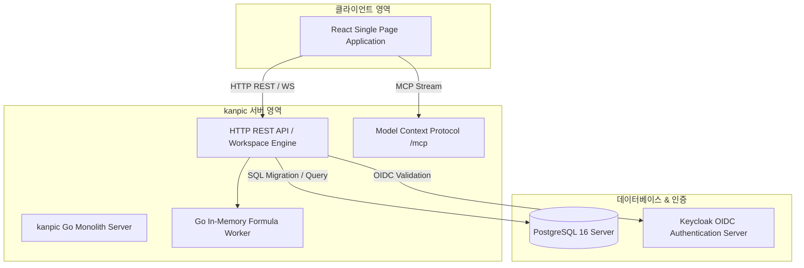
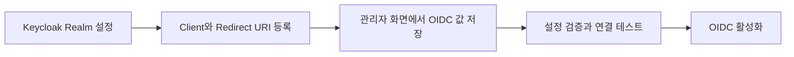

# kanpic 관리자 가이드 (System Administrator Manual)

- **제품명**: kanpic 데이터 협업 플랫폼  
- **시스템 버전**: v0.18.0
- **문서 버전**: v1.0  
- **최종 수정일**: 2026년 8월 2일
- **문서 분류**: 시스템 관리자 및 DevOps 엔지니어용 통합 운영 매뉴얼 (System Administrator Manual)  

---

## 1. 개요 및 시스템 아키텍처

본 문서는 **kanpic 플랫폼**의 설치, 배포, 보안 설정, Keycloak OIDC 통합, 데이터베이스 마이그레이션 및 일상 운영 관리를 담당하는 시스템 관리자를 위한 기술 가이드입니다.



---

## 2. 배포 및 아키텍처 특성

kanpic은 인프라 복잡도를 극소화하고 폐쇄망 환경에서의 안정성을 극대화하기 위해 **Redis-Free 인메모리 단일 바이너리/컨테이너** 아키텍처를 채택하고 있습니다.

- **Embedded Assets**: React 프론트엔드 정적 파일(`web/dist`), CA 인증서, 타임존 데이터, DDL 마이그레이션 SQL 파일이 Go 바이너리 내부(`embed.FS`)에 집적되어 별도의 외부 파일 의존성이 없습니다.
- **Server-Authoritative Storage**: PostgreSQL 16을 유일한 영구 저장소로 활용하며, 모든 워크북 변경사항은 JSONB 형태의 델타 변경 이력으로 기록됩니다.

---

## 3. 관리자 콘솔 (`/admin`) 및 주요 관리 기능

관리자 계정으로 로그인 후 상단 프로필 메뉴의 **[관리자 콘솔]** 또는 `/admin` 경로로 이동하여 시스템 전반을 관리할 수 있습니다.

```
+-----------------------------------------------------------------------------------+
| [kanpic Admin] 대시보드 | 사용자 관리 | API키 관리 | 시스템 설정 | 마이그레이션 이력 |
+-----------------------------------------------------------------------------------+
| System Overview                                                                   |
| +---------------------+  +---------------------+  +---------------------+        |
| | 활성 워크북 수      |  | 등록 사용자 수      |  | DB 커넥션 상태      |        |
| | 128 개              |  | 45 명               |  | Active: 8 / Max: 50 |        |
| +---------------------+  +---------------------+  +---------------------+        |
|                                                                                   |
| 등록된 API 키 감사 목록                                                           |
| +-------------------------------------------------------------------------------+ |
| | Key ID      | 소유자      | 생성일      | 권한 스코프 | 상태   | 조치         | |
| | live_sk_8f  | admin       | 2026-07-01  | mcp.use     | 활성   | [폐기]       | |
| +-------------------------------------------------------------------------------+ |
+-----------------------------------------------------------------------------------+
```

### 3.1 사용자 및 권한 관리
- 사용자 계정 생성, 비활성화, 비밀번호 강제 초기화 기능 제공.
- 관리자 권한(`admin`) 및 일반 사용자 권한(`user`) 부여.

### 3.2 개인 API 키 통제 및 회전 (Key Rotation)
- `/admin` 콘솔에서 발급된 모든 Personal API Key 목록을 조회하고, 보안 위협 발생 시 즉시 **[폐기(Revoke)]** 또는 **[회전(Rotate)]**을 집행할 수 있습니다.

---

## 4. OIDC / Keycloak 연동 설정

kanpic은 기업용 SSO 구축을 위해 Keycloak과의 OIDC PKCE 인증을 지원합니다.



### 4.1 관리자 화면 설정 명세

| 설정 키 | 기본값 | 설명 |
| :--- | :--- | :--- |
| `auth.oidc.enabled` | `false` | 검증과 연결 시험을 마친 뒤 SSO 로그인 활성화 |
| `auth.oidc.issuer_url` | 빈 값 | Keycloak Realm Issuer URL |
| `auth.oidc.client_id` | `kanpic` | OIDC Client ID |
| `auth.oidc.client_secret` | 빈 값 | Public Client는 비우고 Confidential Client만 입력하는 비밀 설정 |
| `auth.oidc.scopes` | `openid, profile, email` | 요청할 OIDC scope 목록 |
| `auth.oidc.admin_roles` | `kanpic-admin` | 관리자 권한으로 인정할 Keycloak role 목록 |
| `auth.oidc.ca_pem` | 빈 값 | 폐쇄망 사설 CA 인증서 PEM 비밀 설정 |
| `server.public_url` | 빈 값 | 리버스 프록시 외부 주소. 비우면 요청 Host 사용 |

각 저장·수정·삭제는 설정 스냅샷 revision을 생성합니다. **전체 검증**으로 필수값과 타입을 확인한 뒤 **연결 테스트**로 Issuer discovery와 PostgreSQL 상태를 시험합니다. 문제가 생기면 설정 버전 목록에서 이전 revision을 복원할 수 있습니다. 서버 시작에 필요한 환경 변수는 `POSTGRES_DSN` 하나이며, bootstrap 로그인 보호가 필요할 때만 `BOOTSTRAP_ADMIN_ID`와 `BOOTSTRAP_ADMIN_PASSWORD`를 함께 추가합니다.

---

## 5. 사내 AI Gateway 설정과 안전 정책

관리자 콘솔의 **사내 AI Gateway 간편 연결** 카드에서 OpenAI 호환 `/v1` Gateway를 설정합니다. 설정값은 환경 변수가 아니라 PostgreSQL의 관리 설정으로 저장되며, 다른 설정과 동일하게 변경 revision, 검증, 연결 테스트와 이전 버전 복원을 지원합니다.

| 설정 키 | 기본값 | 설명 |
| :--- | :--- | :--- |
| `ai.enabled` | `false` | 검증과 연결 테스트가 끝난 뒤 AI 도우미 활성화 |
| `ai.gateway_url` | 빈 값 | 사내 vLLM 또는 OpenAI 호환 Gateway URL |
| `ai.model` | `kanpic-default` | 요청에 사용할 배포 모델 이름 |
| `ai.api_key` | 빈 값 | Gateway Bearer API Key 비밀 설정 |
| `ai.ca_pem` | 빈 값 | 폐쇄망 사설 CA 인증서 PEM 비밀 설정 |
| `ai.timeout_seconds` | `30` | Gateway 요청 제한 시간 |
| `ai.max_input_cells` | `200` | 한 계획에 전달할 선택 범위 최대 셀 수 |
| `ai.max_changes` | `100` | 한 계획에서 허용할 최대 변경 셀 수 |

**전체 검증**은 URL·모델·타입·제한값과 CA PEM을 검사하고, **연결 테스트**는 Gateway의 `GET /v1/models`를 호출합니다. API Key와 CA 원문은 비밀 설정으로 저장되며 조회 응답에 다시 노출되지 않습니다. 완전 폐쇄망에서는 `ai.gateway_url`을 사내 vLLM 또는 사내 LLM Gateway 주소로 지정하면 외부 인터넷 연결 없이 동작합니다.

서버는 셀 내용을 신뢰할 수 없는 데이터로 취급하고 사용자가 선택한 범위의 비어 있지 않은 셀만 Gateway에 전달합니다. 수식 생성·오류 수정 응답은 `=`로 시작하는 수식만, 데이터 정제 응답은 JSON 스칼라 값 또는 명시적 셀 비우기만 허용합니다. 범위 요약·수식 설명·이상치 탐지는 항상 읽기 전용이며, 발견 항목은 선택 범위의 서버 셀 스냅샷과 결합해 표시합니다. 선택 범위 밖 변경·발견 항목, 중복 좌표, 객체·배열·null 값과 최대 변경 수 초과는 서버가 거부합니다. 실제 쓰기는 사용자가 미리보기를 승인한 뒤에만 실행되며 계획 당시 워크북 버전과 각 셀의 이전 값을 다시 확인합니다. 모든 계획·승인·Undo는 멱등 키, revision, 모델명, 도구명과 결과를 `ai_actions`, `ai_action_events`, `audit_logs`에 보존합니다.

---

## 6. Model Context Protocol (MCP) 서버 연동

kanpic은 AI 에이전트 및 LLM이 스프레드시트 데이터를 안전하게 제어할 수 있도록 `/mcp` HTTP JSON-RPC 2.0 표준 엔드포인트를 제공합니다.

### 6.1 MCP 스코프 및 인증
- MCP 요청은 HTTP Header `Authorization: Bearer <API_KEY>`를 통과해야 합니다.
- 해당 API 키는 `mcp.use` 스코프 권한을 보유해야 `/mcp` 엔드포인트를 호출할 수 있습니다.
- 조건부 서식 조회·평가는 `format.read`, 생성·변경·삭제는 `format.write`를 추가로 검사합니다. 같은 기능은 REST와 `spreadsheet.conditional_format.*` MCP 도구에서 동일한 저장소와 revision 계약을 사용합니다.
- 공개 AI 설정 조회는 `spreadsheet.ai.config.get`, 계획·조회·승인·Undo는 `spreadsheet.ai.action.plan|list|get|approve|undo`로 제공합니다. 모든 호출에 `ai.use`가 필요하고 계획은 `range.read`, 수식 생성·오류 수정 승인은 `formula.write`, 데이터 정제 승인과 Undo는 `range.write`를 추가로 검사합니다. 설명·요약·이상치 탐지는 승인할 수 없습니다.
- 워크북 자동화는 `spreadsheet.automation.list|get|create|update|delete|test|run|webhook.invoke|run.list|run.undo`로 제공합니다. 정의 조회·검증·이력에는 `automation.read`, 생성·수정·삭제에는 `automation.write`, 실행·Undo에는 `automation.run`, 웹훅 전달에는 `automation.webhook.invoke`가 필요합니다. 검증은 `range.read`, 값 설정·지우기와 Undo는 `range.write`, 수식 실행은 `formula.write`를 추가 검사합니다. 웹훅 MCP 호출도 개인 API 키 인증이 필수입니다.

### 6.2 워크북 자동화 실행 정책

관리자 콘솔의 **워크북 자동화 실행 정책** 카드는 자동화 전체 활성화와 실행 한도를 관리합니다. 설정은 다른 관리자 설정처럼 PostgreSQL에 저장되고 CRUD, revision 이력, 이전 버전 복원, 전체 검증과 실제 저장소 연결 테스트를 지원합니다.

| 설정 키 | 기본값 | 유효 범위 | 설명 |
| :--- | ---: | ---: | :--- |
| `automation.enabled` | `false` | boolean | 실제 수동·셀 변경·예약 자동화 실행 허용. 정의 CRUD와 쓰기 없는 검증은 계속 가능 |
| `automation.max_cells_per_run` | `1000` | 1~10,000 | 한 실행이 변경할 수 있는 최대 셀 수 |
| `automation.max_runs_per_hour` | `100` | 1~10,000 | 워크북 하나에서 최근 1시간 동안 시작할 수 있는 실행 수 |
| `automation.scheduler_poll_seconds` | `15` | 5~300 | PostgreSQL에서 실행 예정 자동화를 확인하는 주기(초) |

**정책 검증**은 값 유형과 범위를 검사합니다. **저장소 준비 상태 테스트**는 자동화가 활성화된 경우 PostgreSQL의 예약 및 웹훅 감사 컬럼을 실제로 조회해 최신 마이그레이션까지 적용됐는지 확인합니다. 운영 활성화 전에는 낮은 한도로 수동 실행과 Undo를 확인한 다음 셀 변경·일정·웹훅 트리거를 켜는 것을 권장합니다. 확인 주기는 서버 재시작 없이 다음 스케줄러 tick부터 반영됩니다.

자동화 정의는 이름별 유일성과 revision 기반 낙관적 잠금을 사용하며 삭제는 soft delete로 처리됩니다. 실행은 기준 워크북 버전, 작업 정의, 변경 전 셀 스냅샷, 예약 기준 시각, 실제 셀 작업 및 Undo 작업 ID를 `automation_runs`에 보존합니다. 수동·웹훅 재시도는 사용자·자동화·멱등 키로, 셀 변경 재전송은 원본 `operation_id`로, 예약 실행은 자동화와 `scheduled_for` 조합으로 중복 제거합니다. 웹훅 payload 원문은 보존하지 않고 API 키 UUID, SHA-256과 byte 수만 저장합니다. 다중 인스턴스가 같은 예약을 조회해도 서버 권위 셀 작업과 PostgreSQL 유일 제약으로 한 번만 반영됩니다. 실행은 정확한 기준 버전 및 셀 스냅샷이 일치할 때만 적용되고, 성공·변경 없음·실패·Undo는 구조화 로그와 감사 로그에서 추적할 수 있습니다.

---

## 7. DB 마이그레이션 & 백업 복구 (Backup & Disaster Recovery)

### 7.1 자동 DDL 마이그레이션 (`migrations/`)
kanpic 서버 기동 시 `migrations/` 내의 DDL SQL 파일(`001_initial.sql` ~ `017_webhook_automations.sql`)을 자동 순차 실행하여 스키마를 최신 상태로 유지합니다. `015_automations.sql`은 자동화 정의·revision·soft delete를 저장하는 `automations`와 실행 스냅샷·상태·작업·Undo·멱등 정보를 저장하는 `automation_runs`를 추가합니다. `016_scheduled_automations.sql`은 다음 실행 시각, 예약 기준 시각, `skipped` 상태, due 조회 인덱스와 예약 중복 방지 유일 인덱스를 추가합니다. `017_webhook_automations.sql`은 웹훅 trigger 상태, 호출 API 키 참조, payload digest·크기와 키별 조회 인덱스를 추가합니다.

### 7.2 백업 및 복구 명령어 (pg_dump)

```bash
# PostgreSQL 백업 수행 (폐쇄망 환경)
docker exec -t kanpic-postgres pg_dump -U kanpic_user -d kanpic_db -F c -b -v -f /backups/kanpic_dump_$(date +%Y%m%d).bak

# 복구 수행
docker exec -i kanpic-postgres pg_restore -U kanpic_user -d kanpic_db -v /backups/kanpic_dump_20260731.bak
```

---

## 8. 보안 및 컴플라이언스 (Security Checklists)

> [!IMPORTANT]
> **운영 서버 보안 체크리스트**  
> 1. 기본 관리자 계정의 초기 비밀번호 변경 필수  
> 2. 관리자 설정의 OIDC Client Secret은 화면에 재노출하지 말고 설정 변경·복원 권한을 관리자에게만 부여
> 3. PostgreSQL TLS 1.3 통신 적용 및 8080 포트 리버스 프록시(Nginx/HAProxy) SSL 오프로딩 적용
