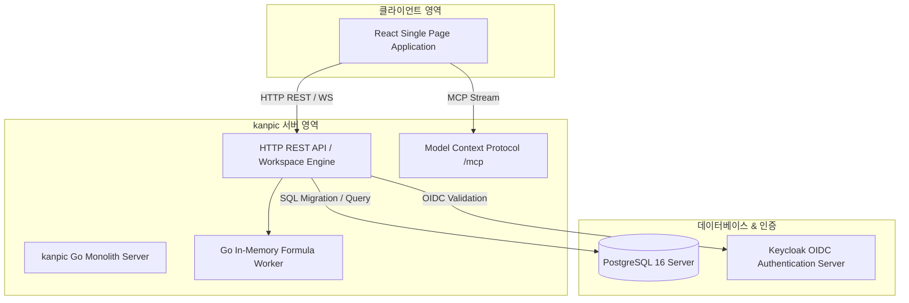

# kanpic 관리자 가이드 (System Administrator Manual)

- **제품명**: kanpic 데이터 협업 플랫폼  
- **시스템 버전**: v0.13.0
- **문서 버전**: v1.0  
- **최종 수정일**: 2026년 8월 2일
- **문서 분류**: 시스템 관리자 및 DevOps 엔지니어용 통합 운영 매뉴얼 (System Administrator Manual)  

---

## 1. 개요 및 시스템 아키텍처

본 문서는 **kanpic 플랫폼**의 설치, 배포, 보안 설정, Keycloak OIDC 통합, 데이터베이스 마이그레이션 및 일상 운영 관리를 담당하는 시스템 관리자를 위한 기술 가이드입니다.



---

## 2. 배포 및 아키텍처 특성

kanpic은 인프라 복잡도를 극소화하고 폐쇄망 환경에서의 안정성을 극대화하기 위해 **Redis-Free 인메모리 단일 바이너리/컨테이너** 아키텍처를 채택하고 있습니다.

- **Embedded Assets**: React 프론트엔드 정적 파일(`web/dist`), CA 인증서, 타임존 데이터, DDL 마이그레이션 SQL 파일이 Go 바이너리 내부(`embed.FS`)에 집적되어 별도의 외부 파일 의존성이 없습니다.
- **Server-Authoritative Storage**: PostgreSQL 16을 유일한 영구 저장소로 활용하며, 모든 워크북 변경사항은 JSONB 형태의 델타 변경 이력으로 기록됩니다.

---

## 3. 관리자 콘솔 (`/admin`) 및 주요 관리 기능

관리자 계정으로 로그인 후 상단 프로필 메뉴의 **[관리자 콘솔]** 또는 `/admin` 경로로 이동하여 시스템 전반을 관리할 수 있습니다.

```
+-----------------------------------------------------------------------------------+
| [kanpic Admin] 대시보드 | 사용자 관리 | API키 관리 | 시스템 설정 | 마이그레이션 이력 |
+-----------------------------------------------------------------------------------+
| System Overview                                                                   |
| +---------------------+  +---------------------+  +---------------------+        |
| | 활성 워크북 수      |  | 등록 사용자 수      |  | DB 커넥션 상태      |        |
| | 128 개              |  | 45 명               |  | Active: 8 / Max: 50 |        |
| +---------------------+  +---------------------+  +---------------------+        |
|                                                                                   |
| 등록된 API 키 감사 목록                                                           |
| +-------------------------------------------------------------------------------+ |
| | Key ID      | 소유자      | 생성일      | 권한 스코프 | 상태   | 조치         | |
| | live_sk_8f  | admin       | 2026-07-01  | mcp.use     | 활성   | [폐기]       | |
| +-------------------------------------------------------------------------------+ |
+-----------------------------------------------------------------------------------+
```

### 3.1 사용자 및 권한 관리
- 사용자 계정 생성, 비활성화, 비밀번호 강제 초기화 기능 제공.
- 관리자 권한(`admin`) 및 일반 사용자 권한(`user`) 부여.

### 3.2 개인 API 키 통제 및 회전 (Key Rotation)
- `/admin` 콘솔에서 발급된 모든 Personal API Key 목록을 조회하고, 보안 위협 발생 시 즉시 **[폐기(Revoke)]** 또는 **[회전(Rotate)]**을 집행할 수 있습니다.

---

## 4. OIDC / Keycloak 연동 설정

kanpic은 기업용 SSO 구축을 위해 Keycloak과의 OIDC PKCE 인증을 지원합니다.


### 4.1 관리자 화면 설정 명세

| 설정 키 | 기본값 | 설명 |
| :--- | :--- | :--- |
| `auth.oidc.enabled` | `false` | 검증과 연결 시험을 마친 뒤 SSO 로그인 활성화 |
| `auth.oidc.issuer_url` | 빈 값 | Keycloak Realm Issuer URL |
| `auth.oidc.client_id` | `kanpic` | OIDC Client ID |
| `auth.oidc.client_secret` | 빈 값 | Public Client는 비우고 Confidential Client만 입력하는 비밀 설정 |
| `auth.oidc.scopes` | `openid, profile, email` | 요청할 OIDC scope 목록 |
| `auth.oidc.admin_roles` | `kanpic-admin` | 관리자 권한으로 인정할 Keycloak role 목록 |
| `auth.oidc.ca_pem` | 빈 값 | 폐쇄망 사설 CA 인증서 PEM 비밀 설정 |
| `server.public_url` | 빈 값 | 리버스 프록시 외부 주소. 비우면 요청 Host 사용 |

각 저장·수정·삭제는 설정 스냅샷 revision을 생성합니다. **전체 검증**으로 필수값과 타입을 확인한 뒤 **연결 테스트**로 Issuer discovery와 PostgreSQL 상태를 시험합니다. 문제가 생기면 설정 버전 목록에서 이전 revision을 복원할 수 있습니다. 서버 시작에 필요한 환경 변수는 `POSTGRES_DSN` 하나이며, bootstrap 로그인 보호가 필요할 때만 `BOOTSTRAP_ADMIN_ID`와 `BOOTSTRAP_ADMIN_PASSWORD`를 함께 추가합니다.

---

## 5. Model Context Protocol (MCP) 서버 연동

kanpic은 AI 에이전트 및 LLM이 스프레드시트 데이터를 안전하게 제어할 수 있도록 `/mcp` HTTP JSON-RPC 2.0 표준 엔드포인트를 제공합니다.

### 5.1 MCP 스코프 및 인증
- MCP 요청은 HTTP Header `Authorization: Bearer <API_KEY>`를 통과해야 합니다.
- 해당 API 키는 `mcp.use` 스코프 권한을 보유해야 `/mcp` 엔드포인트를 호출할 수 있습니다.
- 조건부 서식 조회·평가는 `format.read`, 생성·변경·삭제는 `format.write`를 추가로 검사합니다. 같은 기능은 REST와 `spreadsheet.conditional_format.*` MCP 도구에서 동일한 저장소와 revision 계약을 사용합니다.

---

## 6. DB 마이그레이션 & 백업 복구 (Backup & Disaster Recovery)

### 6.1 자동 DDL 마이그레이션 (`migrations/`)
kanpic 서버 기동 시 `migrations/` 내의 DDL SQL 파일(`001_initial.sql` ~ `010_conditional_formats.sql`)을 자동 순차 실행하여 스키마를 최신 상태로 유지합니다.

### 6.2 백업 및 복구 명령어 (pg_dump)

```bash
# PostgreSQL 백업 수행 (폐쇄망 환경)
docker exec -t kanpic-postgres pg_dump -U kanpic_user -d kanpic_db -F c -b -v -f /backups/kanpic_dump_$(date +%Y%m%d).bak

# 복구 수행
docker exec -i kanpic-postgres pg_restore -U kanpic_user -d kanpic_db -v /backups/kanpic_dump_20260731.bak
```

---

## 7. 보안 및 컴플라이언스 (Security Checklists)

> [!IMPORTANT]
> **운영 서버 보안 체크리스트**  
> 1. 기본 관리자 계정의 초기 비밀번호 변경 필수  
> 2. 관리자 설정의 OIDC Client Secret은 화면에 재노출하지 말고 설정 변경·복원 권한을 관리자에게만 부여
> 3. PostgreSQL TLS 1.3 통신 적용 및 8080 포트 리버스 프록시(Nginx/HAProxy) SSL 오프로딩 적용
