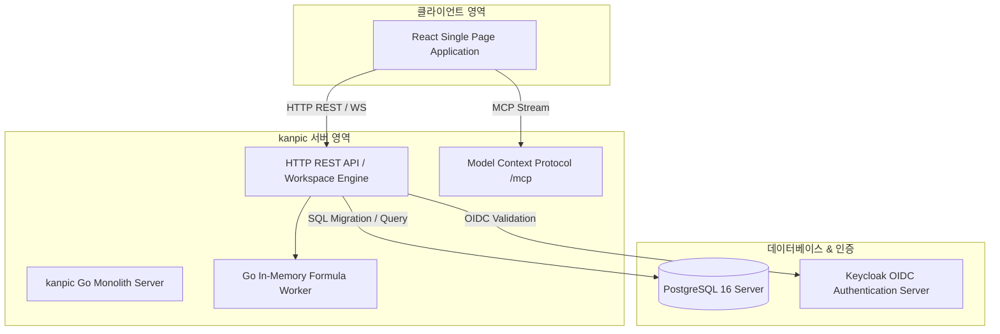
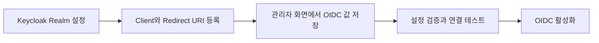

# kanpic 관리자 가이드 (System Administrator Manual)

- **제품명**: kanpic 데이터 협업 플랫폼  
- **시스템 버전**: v0.18.0
- **문서 버전**: v1.0  
- **최종 수정일**: 2026년 8월 2일
- **문서 분류**: 시스템 관리자 및 DevOps 엔지니어용 통합 운영 매뉴얼 (System Administrator Manual)  

---

## 1. 개요 및 시스템 아키텍처

본 문서는 **kanpic 플랫폼**의 설치, 배포, 보안 설정, Keycloak OIDC 통합, 데이터베이스 마이그레이션 및 일상 운영 관리를 담당하는 시스템 관리자를 위한 기술 가이드입니다.



---

## 2. 배포 및 아키텍처 특성

kanpic은 인프라 복잡도를 극소화하고 폐쇄망 환경에서의 안정성을 극대화하기 위해 **Redis-Free 인메모리 단일 바이너리/컨테이너** 아키텍처를 채택하고 있습니다.

- **Embedded Assets**: React 프론트엔드 정적 파일(`web/dist`), CA 인증서, 타임존 데이터, DDL 마이그레이션 SQL 파일이 Go 바이너리 내부(`embed.FS`)에 집적되어 별도의 외부 파일 의존성이 없습니다.
- **Server-Authoritative Storage**: PostgreSQL 16을 유일한 영구 저장소로 활용하며, 모든 워크북 변경사항은 JSONB 형태의 델타 변경 이력으로 기록됩니다.

---

## 3. 관리자 콘솔 (`/admin`) 및 주요 관리 기능

관리자 계정으로 로그인 후 상단 프로필 메뉴의 **[관리자 콘솔]** 또는 `/admin` 경로로 이동하여 시스템 전반을 관리할 수 있습니다.

```
+-----------------------------------------------------------------------------------+
| [kanpic Admin] 대시보드 | 사용자 관리 | API키 관리 | 시스템 설정 | 마이그레이션 이력 |
+-----------------------------------------------------------------------------------+
| System Overview                                                                   |
| +---------------------+  +---------------------+  +---------------------+        |
| | 활성 워크북 수      |  | 등록 사용자 수      |  | DB 커넥션 상태      |        |
| | 128 개              |  | 45 명               |  | Active: 8 / Max: 50 |        |
| +---------------------+  +---------------------+  +---------------------+        |
|                                                                                   |
| 등록된 API 키 감사 목록                                                           |
| +-------------------------------------------------------------------------------+ |
| | Key ID      | 소유자      | 생성일      | 권한 스코프 | 상태   | 조치         | |
| | live_sk_8f  | admin       | 2026-07-01  | mcp.use     | 활성   | [폐기]       | |
| +-------------------------------------------------------------------------------+ |
+-----------------------------------------------------------------------------------+
```

### 3.1 관리자 개요와 워크북 거버넌스

`/admin`은 **개요** 화면으로 시작합니다. 사용자·부서·워크북·공유 규모를 카드로 보여 주고, 점검이 필요한 항목(링크가 있는 모든 사용자에게 공개, 조직 전체 공개, 소유자가 없거나 정지된 워크북, 대기 중인 액세스 요청)을 클릭하면 해당 목록으로 바로 이동합니다.

**워크북 거버넌스** 화면은 관리자가 소유하지 않은 워크북까지 포함해 전체 목록을 보여 줍니다.

| 필터 | 용도 |
| --- | --- |
| 전체 | 활성 워크북 전체 |
| 링크 공개 | `링크가 있는 모든 사용자` 범위로 열려 있는 워크북 |
| 조직 전체 | `조직 내 모든 사용자` 범위로 열려 있는 워크북 |
| 소유자 문제 | 소유자가 비어 있거나 정지된 계정인 워크북 |
| 잠든 워크북 | 1년 이상 손대지 않은 워크북 |
| 휴지통 | 삭제되어 복원 가능한 워크북 |

각 행에서 **공개 해제**(링크 액세스를 제한됨으로 되돌리기), **소유권** 이전, **휴지통** 이동, 휴지통 항목의 **복원**을 실행할 수 있습니다.

조직 차원의 상한은 시스템 설정으로 강제합니다.

- `sharing.max_link_access`: 허용할 최대 링크 액세스 범위(`restricted`, `organization`, `anyone`). 이 범위를 넘는 공유 요청은 REST·MCP 모두에서 거부됩니다.
- `sharing.default_link_access`: 새 워크북의 기본 링크 액세스.

### 3.2 사용자 및 역할 관리

`/admin` → **사용자 및 역할** 에서 계정 상태와 kanpic 역할을 관리합니다. 신원 자체는 OIDC 공급자(또는 bootstrap 로그인)가 소유하고, kanpic은 접근 통제에 필요한 상태만 보관합니다.

- **자동 등록**: 로그인한 사용자는 사용자 ID, 표시 이름, 이메일과 마지막 접속 시각으로 자동 등록됩니다. 아직 로그인하지 않은 사람은 **사용자 등록** 으로 미리 만들어 두고 역할·부서를 배정할 수 있습니다.
- **계정 정지**: 정지하면 즉시 모든 세션이 삭제되고 이후 모든 API·화면 요청이 `403 account_suspended`로 차단됩니다. 정지 해제하면 다시 로그인할 수 있습니다. 자기 자신은 정지할 수 없습니다.
- **kanpic 역할**: 사용자에게 역할을 부여하면 워크북 공유 창의 **역할** 대상으로 즉시 사용할 수 있습니다. OIDC 토큰의 역할과 kanpic 역할은 함께 평가되며 둘 중 하나만 일치해도 권한이 부여됩니다. 한 사용자는 최대 50개 역할을 가집니다.
- **관리자 지정**: 사용자 상세의 **관리자로 지정** 은 `kanpic-admin` 역할(또는 `auth.oidc.admin_roles`의 첫 역할)을 부여합니다. 이 역할을 가진 사용자는 콘솔과 모든 워크북에 접근할 수 있습니다. **관리자 해제** 로 회수하며, 자신의 관리자 역할은 잠금 방지를 위해 스스로 회수할 수 없습니다.
- **세션 종료**: **모든 세션 종료** 는 해당 사용자의 브라우저 세션을 모두 삭제합니다.
### 부서 관리자 위임

전역 관리자가 **부서 및 공유** 화면에서 부서마다 **부서 관리자** 를 지정할 수 있습니다.

부서 관리자는 **자기 부서와 그 아래 부서의 구성원 계정** 만 다룹니다. 부서가 나뉘어도 맡은 사람이 바뀌지 않도록 아래 부서까지 봅니다 — 팀이 둘로 갈라졌다고 관리자가 절반을 못 보게 되면 위임이 끊긴 것을 아무도 알아채지 못합니다.

| 열어 준 것 | 열지 않은 것 |
| --- | --- |
| 맡은 구성원 목록 보기 | 워크북 소유권 이전 |
| 계정 정지·해제, 메모 | 개요(조직 전체 숫자) |
| kanpic 역할 부여·회수 | 워크북 거버넌스 |
| 모든 세션 종료 | 설정·로그·API 키·AI 정책·메일 |
| | 사용자 등록·일괄 등록 |

- **소유권 이전을 열지 않은 이유**: 자료를 옮기는 일이기 때문입니다. 잘못 옮기면 조용히 사고가 나고, 되돌리려면 누가 무엇을 가졌는지 다시 맞춰야 합니다.
- **개요를 열지 않은 이유**: 조직 전체 규모가 새어 나갑니다. 부서 관리자는 자기 부서만 알면 됩니다. 사용자 목록도 **맡은 구성원만** 보입니다.
- **자기 자신은 다룰 수 없습니다.** 스스로 정지를 풀거나 역할을 얹을 수 있으면 위임이 아니라 승격입니다.
- **부서 관리자는 전역 관리자만 지정합니다.** 부서 관리자가 스스로를 늘릴 수 있으면 위임이 아니라 승격입니다.
- 사용자 등록과 일괄 등록은 전역 관리자만 합니다. 새로 만든 사용자는 아직 어느 부서에도 없어, 만든 사람이 곧바로 볼 수 없기 때문입니다.

- **일괄 등록**: **일괄 등록…** 에서 CSV를 붙여 넣거나 파일을 고르면 팀 하나를 한 번에 들일 수 있습니다.
  - **머리글 줄이 있어야 합니다.** `user_id`(필수) · `display_name` · `email` · `note` 를 읽고, `사용자 ID` · `이름` · `이메일` · `메모` 로 적어도 됩니다. 자리로 읽으면 열 차례가 다른 파일을 말없이 엉뚱하게 읽어, 이름 칸에 이메일이 들어간 사용자가 스무 명 생깁니다.
  - **먼저 미리 보여 줍니다.** 새로 만들 사람, 이미 있어 정보만 갱신될 사람, 건너뛸 줄을 줄마다 알려 줍니다. 사람을 여럿 만드는 일은 되돌리기 번거롭습니다.
  - **같은 파일 안에 같은 아이디가 두 번** 나오면 뒤엣것으로 덮어쓰지 않고 몇 번째 줄과 겹치는지 짚어 줍니다. 어느 줄이 맞는지는 사람이 정해야 합니다.
  - 한 줄이 잘못돼도 나머지를 버리지 않고, 무엇이 들어갔고 무엇이 안 들어갔는지 줄마다 돌려줍니다.
  - 역할과 부서는 등록한 뒤 사용자별로 지정합니다.
- **잠든 계정 찾기**: 사용자 목록의 **잠든 계정만(90일)** 을 켜면 90일 넘게 들어오지 않은 계정만 보입니다. **한 번도 들어온 적 없는 계정도 잠든 것으로 셉니다** — 미리 등록해 두고 아무도 쓰지 않은 계정이 그대로 남는 일이 흔합니다. 개요 화면에도 수가 나옵니다.
- **가진 워크북 인수인계**: 사용자를 고르고 **가진 워크북 인수인계…** 를 누르면 그 사람이 소유한 워크북을 **모두** 보여 주고 한 번에 새 소유자에게 넘깁니다. 퇴사자가 마흔 개를 가지고 있어도 한 번입니다.
  - 목록은 **자르지 않습니다.** 200개까지만 보여 주면 201번째 워크북은 넘겨지지 않은 채 남고 아무도 그것을 모릅니다.
  - **휴지통에 있는 것은 넘기지 않고 몇 개인지 셉니다.** 되살린 뒤에 다시 넘기세요. 조용히 빼면 "다 넘겼다" 는 말과 남아 있는 워크북이 어긋납니다.
  - 넘긴 것과 **넘기지 못한 것을 하나하나** 보여 줍니다. 절반만 넘어갔는데 "다 됐습니다" 라고 하면 남은 절반은 정지된 계정에 묶인 채 잊힙니다.
  - **정지된 사람에게는 넘기지 않습니다.** 받은 사람도 손댈 수 없으므로 옮긴 것이 아니라 옮긴 척한 것이 됩니다.
  - **이전 소유자를 편집자로 남기기** 를 켜면 인수인계 기간에 이전 담당자가 계속 볼 수 있습니다. 정지 전에 미리 넘길 때 씁니다.
  - 워크북을 **하나씩** 넘기는 것은 워크북 거버넌스 화면에 그대로 있습니다. 기기 분실이나 권한 변경 직후에 사용합니다.
- **목록 정보**: 역할, 소속 부서, 소유 워크북 수, 마지막 접속 시각을 한눈에 확인하고 사용자·이메일·역할·부서로 검색합니다.

REST 계약은 `GET/POST /api/v1/admin/users`, `GET/PATCH /api/v1/admin/users/{userId}`, `POST /api/v1/admin/users/{userId}/roles`, `DELETE /api/v1/admin/users/{userId}/roles/{role}`, `DELETE /api/v1/admin/users/{userId}/sessions`이며 모두 관리자 세션 또는 `admin.*` scope를 요구합니다.

> API 키는 소유자 계정을 따릅니다. 소유자가 정지되면 그 키로 보낸 요청도 함께 차단됩니다.

### 3.3 부서 계층 및 워크북 공유 통제

`/admin` → **부서 및 공유** 에서 조직의 부서 계층을 관리합니다. 부서는 워크북 공유의 기본 단위이므로 관리자만 변경할 수 있습니다.

- **부서 생성**: 이름과 상위 부서를 지정합니다. 같은 상위 부서 아래에서는 이름이 중복될 수 없고 최대 8단계까지 중첩됩니다.
- **구성원 배치**: 사용자 ID 또는 이메일을 쉼표나 공백으로 구분해 한 번에 최대 200명까지 추가합니다. 대소문자는 구분하지 않습니다.
- **상위 부서 변경**: 자신의 하위 부서를 상위로 지정하는 순환 구조는 거부됩니다.
- **부서 삭제**: 하위 부서가 없어야 하며, 삭제 시 그 부서로 부여된 모든 워크북 공유가 함께 제거됩니다.

상위 부서에 공유하면 하위 부서 구성원까지 권한을 상속합니다. 예를 들어 `경영지원본부`에 편집자 권한을 주면 `재무팀`, `인사팀` 구성원 모두가 편집자가 됩니다.

권한 판정은 소유자 → 관리자 → 개인 공유 → 부서 공유 → 역할 공유 → 링크 액세스를 모두 계산해 **가장 높은 권한**을 적용합니다. 관리자 역할(`auth.oidc.admin_roles`)을 가진 사용자는 감사와 복구를 위해 모든 워크북에 소유자 권한으로 접근하며, 이때 공유 창에는 `관리자 권한으로 접근 중입니다`로 표시됩니다.

REST `GET /api/v1/departments`와 MCP `spreadsheet.department.list`는 모든 로그인 사용자가 사용할 수 있고(공유 대상 선택에 필요), 생성·수정·삭제·구성원 변경은 `admin.*` scope 또는 관리자 세션만 허용합니다.

### 3.4 개인 API 키 통제 및 회전 (Key Rotation)
- `/admin` 콘솔에서 발급된 모든 Personal API Key 목록을 조회하고, 보안 위협 발생 시 즉시 **[폐기(Revoke)]** 또는 **[회전(Rotate)]**을 집행할 수 있습니다.

---

## 4. OIDC / Keycloak 연동 설정

kanpic은 기업용 SSO 구축을 위해 Keycloak과의 OIDC PKCE 인증을 지원합니다.



### 4.1 관리자 화면 설정 명세

| 설정 키 | 기본값 | 설명 |
| :--- | :--- | :--- |
| `auth.oidc.enabled` | `false` | 검증과 연결 시험을 마친 뒤 SSO 로그인 활성화 |
| `auth.oidc.issuer_url` | 빈 값 | Keycloak Realm Issuer URL |
| `auth.oidc.client_id` | `kanpic` | OIDC Client ID |
| `auth.oidc.client_secret` | 빈 값 | Public Client는 비우고 Confidential Client만 입력하는 비밀 설정 |
| `auth.oidc.scopes` | `openid, profile, email` | 요청할 OIDC scope 목록 |
| `auth.oidc.admin_roles` | `kanpic-admin` | 관리자 권한으로 인정할 Keycloak role 목록 |
| `auth.oidc.ca_pem` | 빈 값 | 폐쇄망 사설 CA 인증서 PEM 비밀 설정 |
| `server.public_url` | 빈 값 | 리버스 프록시 외부 주소. 비우면 요청 Host 사용 |

각 저장·수정·삭제는 설정 스냅샷 revision을 생성합니다. **전체 검증**으로 필수값과 타입을 확인한 뒤 **연결 테스트**로 Issuer discovery와 PostgreSQL 상태를 시험합니다. 문제가 생기면 설정 버전 목록에서 이전 revision을 복원할 수 있습니다. 서버 시작에 필요한 환경 변수는 `POSTGRES_DSN` 하나이며, bootstrap 로그인 보호가 필요할 때만 `BOOTSTRAP_ADMIN_ID`와 `BOOTSTRAP_ADMIN_PASSWORD`를 함께 추가합니다.

---

## 5. 사내 AI Gateway 설정과 안전 정책

관리자 콘솔의 **사내 AI Gateway 간편 연결** 카드에서 OpenAI 호환 `/v1` Gateway를 설정합니다. 설정값은 환경 변수가 아니라 PostgreSQL의 관리 설정으로 저장되며, 다른 설정과 동일하게 변경 revision, 검증, 연결 테스트와 이전 버전 복원을 지원합니다.

| 설정 키 | 기본값 | 설명 |
| :--- | :--- | :--- |
| `ai.enabled` | `false` | 검증과 연결 테스트가 끝난 뒤 Workbook Agent 활성화 |
| `ai.gateway_url` | 빈 값 | 사내 vLLM 또는 OpenAI 호환 Gateway URL |
| `ai.model` | `kanpic-default` | 요청에 사용할 배포 모델 이름 |
| `ai.api_key` | 빈 값 | Gateway Bearer API Key 비밀 설정 |
| `ai.ca_pem` | 빈 값 | 폐쇄망 사설 CA 인증서 PEM 비밀 설정 |
| `ai.timeout_seconds` | `30` | Gateway 호출 1회당 제한 시간 |
| `ai.max_input_cells` | `200` | 한 계획에 전달할 선택 범위 최대 셀 수 |
| `ai.max_changes` | `100` | 한 계획에서 허용할 최대 변경 셀 수 |
| `ai.max_output_tokens` | `0` | 응답 최대 토큰. `0`이면 모델의 컨텍스트 길이에서 자동 계산 |
| `ai.history_retention_days` | `0` | AI 호출 이력 보존 기간(일). `0`이면 계속 보관 |

응답 길이는 기본적으로 서버가 정합니다. `GET /v1/models` 응답의 `max_model_len`(vLLM) 또는 `context_length`를 읽어 컨텍스트 길이를 파악하고, 프롬프트 추정 토큰과 여유분을 뺀 값을 그 요청의 `max_tokens`로 사용합니다. 값은 10분간 캐시하며, 컨텍스트 길이를 제공하지 않는 Gateway에서는 첫 호출이 8K 컨텍스트 안에 들도록 입력 크기를 반영한 보수적 상한을 쓰고 응답이 실제로 잘리면 상한을 키웁니다. `ai.max_output_tokens`를 지정하면 작은 값도 포함해 그 상한이 항상 우선합니다. `ai.model`에 적은 이름이 목록에 없고 모델이 하나뿐이면 그 모델을 사용합니다.

## 알림 메일 (SMTP)

콘솔의 **알림 메일** 화면에서 사내 SMTP를 연결하고 이벤트 알림 발송을 관리합니다. 사내 릴레이를 쓰는 경우 **SMTP 서버 주소만 넣으면 됩니다.** 사용자 이름을 비워 두면 인증 없이 발송하고, 포트는 25가 기본이며 465를 입력하면 별도 설정 없이 TLS로 접속합니다.

| 키 | 기본값 | 설명 |
| --- | --- | --- |
| `mail.enabled` | `false` | 알림 메일 발송 사용 |
| `mail.smtp_host` | 빈 값 | 사내 SMTP 서버 주소 |
| `mail.smtp_port` | `25` | 사내 릴레이 25, STARTTLS 587, TLS 465 |
| `mail.security` | `auto` | `auto`는 서버가 STARTTLS를 광고할 때만 사용. `none`, `starttls`, `tls` 지정 가능 |
| `mail.username` | 빈 값 | 비우면 인증 없이 발송. 값이 있으면 PLAIN·LOGIN·CRAM-MD5 중 서버가 지원하는 방식 사용 |
| `mail.password` | 빈 값 | SMTP 비밀번호(비밀 설정) |
| `mail.from_address` | 빈 값 | 보내는 주소. 비우면 `kanpic@SMTP호스트` |
| `mail.from_name` | `kanpic` | 보내는 사람 이름 |
| `mail.base_url` | 빈 값 | 메일 본문 링크에 쓰는 kanpic 주소 |
| `mail.skip_tls_verify` | `false` | 사설 인증서 SMTP의 인증서 검증 생략 |
| `mail.timeout_seconds` | `10` | SMTP 연결 제한 시간 |
| `mail.notify_share` | `true` | 워크북 공유 알림 |
| `mail.notify_comment` | `true` | 댓글·답글 알림 |
| `mail.notify_mention` | `true` | 멘션 알림 |
| `mail.notify_access_request` | `true` | 액세스 요청과 처리 결과 알림 |

**연결 확인** 은 릴레이에 접속해 인사(EHLO)까지만 하고 메일을 보내지 않습니다. **테스트 메일 보내기** 는 지정한 주소로 실제 메일을 한 통 보냅니다. 두 기능 모두 결과를 화면에 그대로 보여 주므로 방화벽이나 인증 문제를 바로 확인할 수 있습니다.

발송되는 이벤트는 다음과 같습니다.

- **워크북 공유**: 사용자 대상으로 공유하면 그 사람에게. 부서·역할 공유는 대상이 확정되지 않아 발송하지 않습니다.
- **댓글과 답글**: 워크북 소유자, 사용자 공유 대상, 같은 스레드 참여자에게. 작성자 본인은 제외합니다.
- **멘션**: `@사용자`로 언급된 사람에게. 멘션 대상은 스레드 알림을 중복으로 받지 않습니다.
- **액세스 요청**: 소유자와 공유 대상에게. 승인·거절 결과는 요청자에게.

메일은 요청 처리와 분리된 백그라운드에서 보내므로 SMTP가 느려도 화면이 기다리지 않습니다. 실패하면 2초 뒤 한 번 더 시도하고, 모든 시도는 **발송 이력** 표에 시각·이벤트·수신자·상태·오류와 함께 남습니다. 수신자 주소는 사용자 디렉터리의 이메일에서 찾으며, 이메일이 없는 계정은 조용히 건너뜁니다.

```http
GET  /api/v1/admin/mail/deliveries?status=sent|failed|queued&limit=100
POST /api/v1/admin/mail:test   {"recipient":"admin@corp.example"}
```

---

## 방문자 추적 (Analytics)

콘솔의 **방문자 추적** 화면에서 웹사이트 방문자 데이터를 수집하는 자바스크립트를 넣습니다. 제공자를 고르고 식별자만 입력하면 삽입할 코드와 그 코드가 필요로 하는 콘텐츠 보안 정책(CSP)이 함께 만들어지므로, 정책을 따로 손볼 필요가 없습니다.

| 키 | 기본값 | 설명 |
| --- | --- | --- |
| `analytics.enabled` | `false` | 추적 코드 삽입 사용 |
| `analytics.provider` | `none` | `none`, `ga4`, `gtm`, `matomo`, `custom` |
| `analytics.measurement_id` | 빈 값 | GA4 측정 ID(`G-`) 또는 GTM 컨테이너 ID(`GTM-`) |
| `analytics.matomo_url` | 빈 값 | 자체 호스팅 Matomo 주소 |
| `analytics.matomo_site_id` | 빈 값 | Matomo 사이트 ID |
| `analytics.custom_snippet` | 빈 값 | 직접 입력하는 `<script>` 코드. 최대 8KB |
| `analytics.allowed_hosts` | 빈 값 | 코드에서 찾지 못한 도메인을 직접 추가. 쉼표로 구분 |
| `analytics.include_admin` | `false` | 관리자·개인 설정 화면에도 삽입 |
| `analytics.placement` | `head` | `head` 또는 `body` 끝에 삽입 |

- **Google Analytics 4**와 **Google Tag Manager**는 ID만 넣으면 로더와 초기화 코드를 만들고 `googletagmanager.com`·`google-analytics.com`을 정책에 함께 허용합니다.
- **Matomo**는 서버 주소에서 원본(origin)을 뽑아 스크립트·수집 요청·이미지 전송을 허용하므로 폐쇄망 자체 호스팅에 그대로 쓸 수 있습니다.
- **직접 입력**은 사내 분석 도구의 태그를 그대로 붙여 넣는 방식입니다. **붙여 넣은 코드에 적힌 주소는 자동으로 허용됩니다.** 스크립트를 내려받는 주소, 수집 엔드포인트, 픽셀 주소를 코드에서 찾아 정책에 넣으므로 대부분 추가 설정이 필요 없습니다. 화면의 미리보기 아래에 찾아낸 도메인이 표시됩니다.
- 주소를 코드 안에서 조립하는 도구라면 찾아낼 수 없습니다. 이때는 아래 **차단된 요청** 목록에서 한 번에 허용하거나 **추가 허용 도메인**에 직접 적습니다.
- 화면 아래 **미리보기**는 실제로 삽입될 코드를 그대로 보여 주고, **설정 확인**은 빠진 값이 있으면 어떤 키가 문제인지 알려 줍니다.

### 보안 정책과의 관계

kanpic은 `script-src 'self'` 기반의 엄격한 CSP를 보내며 `unsafe-inline`을 쓰지 않습니다. 추적 코드는 **요청마다 새로 만드는 nonce**를 붙여 삽입하고 같은 nonce를 응답 헤더의 `script-src`에 넣기 때문에, 정책을 느슨하게 만들지 않고도 인라인 코드가 실행됩니다. 페이지 응답은 `Cache-Control: no-store`이므로 nonce가 재사용되지 않습니다.

- 붙여 넣은 코드에 이미 `nonce` 속성이 있으면 건드리지 않고, 없는 `<script>` 태그에만 nonce를 붙입니다.
- 관리자 콘솔(`/admin`)과 개인 설정(`/preferences`)은 기본적으로 추적하지 않습니다. 콘솔 이용까지 집계하려면 **관리자 화면 포함**을 켭니다.
- `analytics.enabled`가 꺼져 있으면 코드도, 추가 허용 도메인도 응답에 나타나지 않습니다. 제공자 설정은 그대로 남아 있으므로 스위치만으로 껐다 켤 수 있습니다.

### 차단된 요청 확인과 허용

추적이 켜져 있는 동안에는 정책에 `report-uri`가 함께 나가므로, 브라우저가 무엇을 막았는지 서버로 알려 줍니다. 콘솔의 **차단된 요청** 카드에서 막힌 주소·지시문·횟수·마지막 시각을 확인하고 **이 도메인 허용**을 누르면 `analytics.allowed_hosts`에 추가되어 스크립트·수집 요청·이미지 전송이 함께 열립니다.

- 브라우저 콘솔에 `violates the following Content Security Policy directive` 오류가 보이는데 수집이 되지 않는다면 여기부터 확인하십시오.
- 보고는 인증 없이 받는 경로(`POST /api/v1/analytics/csp-report`)로 들어오고, 서버는 **메모리에 최근 100개 출처만** 같은 주소끼리 묶어 보관합니다. 데이터베이스에 남기지 않으므로 재시작하면 비워지고, 인스턴스가 여러 대면 각자 자기 것만 보여 줍니다.
- 이미 허용된 주소는 **허용됨**으로 표시됩니다. **기록 비우기** 로 목록을 지운 뒤 페이지를 다시 열어 보면 남은 문제만 다시 나타납니다.
- 확장 프로그램이나 `data:` 같이 허용할 수 없는 항목은 기록하지 않습니다.

```http
GET    /api/v1/admin/analytics/violations
DELETE /api/v1/admin/analytics/violations
POST   /api/v1/admin/analytics/violations:allow   {"origin":"https://collector.corp.example"}
```
- 설정 변경은 저장 즉시 적용되며, 이미 열려 있는 화면은 새로 고침한 뒤부터 반영됩니다.

수집 도구가 브라우저 밖으로 데이터를 보내는 만큼, 개인정보 처리방침과 사내 규정에 맞는 도구인지 확인한 뒤 사용하십시오. 폐쇄망에서는 Matomo 자체 호스팅이나 사내 수집기를 **직접 입력**으로 연결하는 방식을 권장합니다.

---

### AI 호출 이력

콘솔의 **AI 호출 이력** 화면은 조직 전체의 AI 요청을 한 곳에서 보여 줍니다. 사용자, 워크북, 작업 유형, 상태, 기간, 요청 문장으로 걸러 보고 행을 누르면 요청·요약·설명·변경 셀·이벤트 타임라인을 확인합니다. Workbook Agent의 대화, Run, Plan Step, Tool Call, ChangeSet과 검증 결과는 별도 PostgreSQL 감사 테이블에도 연결되어 사용자 요청부터 실제 도구 실행과 Undo까지 추적할 수 있습니다. 상단 카드에는 전체 요청 수, 적용·실패 건수, 입력과 응답 토큰 합계가 표시되고 아래에는 현재 필터 기준 사용량 상위 사용자가 나옵니다.

- **CSV 내보내기**는 화면에 적용된 필터를 그대로 사용합니다. 감사 자료로 그대로 제출할 수 있도록 시각·사용자·워크북·유형·범위·상태·모델·요청·변경 셀·토큰 열을 포함합니다.
- **보존 기간(일)** 을 지정하면 서버가 매시간 그보다 오래된 **완료·실패** 이력을 삭제합니다. 승인 대기 중인 요청은 삭제하지 않습니다. `0`이면 계속 보관합니다.
- **지정 시점 이전 삭제**로 특정 날짜 이전 이력을 즉시 정리할 수 있습니다. 삭제 건수는 `audit_logs`에 `ai.history.purge`로 남습니다.

```http
GET    /api/v1/admin/ai/actions?status=&mode=&actor=&q=&since=&until=&limit=&offset=&format=csv
GET    /api/v1/admin/ai/actions/{actionId}
DELETE /api/v1/admin/ai/actions?before=YYYY-MM-DD
```

세 경로 모두 관리자만 호출할 수 있습니다. 목록은 워크북 제목과 계획 이벤트에 기록된 토큰 사용량을 함께 반환합니다.

한 계획은 잘리거나 유효하지 않은 계획 응답을 최대 3회까지 교정하고, 일시 오류·컨텍스트 재조정·호환 옵션 전환을 별도 예산으로 처리하되 전체 Gateway 호출은 최대 5회로 제한합니다. 전체 계획 단계에는 115초 상한이 있고 선택적인 `/models` 조회는 최대 5초만 사용하므로 API 응답 제한 시간보다 오래 백그라운드 호출을 이어가지 않습니다. 429와 5xx 응답, 연결 실패는 `Retry-After`를 최대 5초 범위에서 반영해 재시도합니다. JSON 문법 오류, Markdown·추론 태그가 섞인 응답, 필수 필드 누락과 안전 검증 실패에는 제한된 교정 사유를 모델에 다시 전달합니다. 파서는 vLLM의 `reasoning_content`·`reasoning`, 여는 태그 없이 끝나는 `</think>`, 문자열·객체 envelope와 OpenAI 네이티브 `tool_calls`/`function_call`을 정규화하며, 여러 완성 계획이나 여러 도구 인자 객체가 섞인 모호한 응답은 실행하지 않습니다. HTTP 400/422가 출력까지 합친 컨텍스트 초과이면 응답 상한을 줄이고 JSON 모드와 이전 교정 사유를 유지합니다. 입력 프롬프트 자체가 모델 한도를 넘으면 반복 호출하지 않고 범위 축소나 새 대화를 안내하며, 실제 `response_format` 비호환일 때만 해당 옵션을 빼고 한 번 더 시도합니다. `ai.timeout_seconds`는 115초 전체 상한 안에서 각 호출에 따로 적용됩니다. 재시도한 모든 호출의 입력·응답 토큰 합계와 시도 횟수는 `ai_action_events` 페이로드에 남고 사용자 화면에도 표시됩니다.

**전체 검증**은 URL·모델·타입·제한값과 CA PEM을 검사하고, **연결 테스트**는 Gateway의 `GET /v1/models`를 호출합니다. API Key와 CA 원문은 비밀 설정으로 저장되며 조회 응답에 다시 노출되지 않습니다. 완전 폐쇄망에서는 `ai.gateway_url`을 사내 vLLM 또는 사내 LLM Gateway 주소로 지정하면 외부 인터넷 연결 없이 동작합니다.

서버는 셀 내용을 신뢰할 수 없는 데이터로 취급하고 사용자가 선택한 범위의 비어 있지 않은 셀만 Gateway에 전달합니다. 수식 생성·오류 수정 응답은 `=`로 시작하는 수식만, 데이터 정제 응답은 JSON 스칼라 값 또는 명시적 셀 비우기만 허용합니다. 범위 요약·수식 설명·이상치 탐지는 항상 읽기 전용이며, 발견 항목은 선택 범위의 서버 셀 스냅샷과 결합해 표시합니다. 선택 범위 밖 변경·발견 항목, 중복 좌표, 객체·배열·null 값과 최대 변경 수 초과는 서버가 거부합니다. 실제 쓰기는 사용자가 미리보기를 승인한 뒤에만 실행되며 계획 당시 워크북 버전과 각 셀의 이전 값을 다시 확인합니다. 모든 계획·승인·Undo는 멱등 키, revision, 모델명, 도구명과 결과를 `ai_actions`, `ai_action_events`, `audit_logs`에 보존합니다.

---

## 6. Model Context Protocol (MCP) 서버 연동

kanpic은 AI 에이전트 및 LLM이 스프레드시트 데이터를 안전하게 제어할 수 있도록 `/mcp` HTTP JSON-RPC 2.0 표준 엔드포인트를 제공합니다.

### 6.1 MCP 스코프 및 인증
- MCP 요청은 HTTP Header `Authorization: Bearer <API_KEY>`를 통과해야 합니다.
- 해당 API 키는 `mcp.use` 스코프 권한을 보유해야 `/mcp` 엔드포인트를 호출할 수 있습니다.
- `spreadsheet.presentation.*` MCP 도구는 REST와 **같은** 워크북 권한 검사를 지납니다. 도구 인자 `sheet_id`·`workbook_id`·`presentation_id`가 각각 같은 리소스 해석표를 타므로 에이전트 경로가 공유 규칙을 우회하지 않습니다. API 키 scope는 `presentation.read`(미리보기·조회)와 `presentation.write`(만들기·다시 만들기)입니다. PPTX 내려받기는 MCP에 노출하지 않습니다.
- 프레젠테이션 만들기는 원본 워크북의 **읽기** 권한으로 판정합니다. 덱을 내려받는 것도 마찬가지입니다 — 덱은 프레젠테이션 서비스의 공용 계정 아래 만들어지므로, kanpic이 `presentations` 테이블에 기록해 둔 워크북을 기준으로 권한을 따집니다. kanpic이 만들지 않은 덱은 어떤 사용자에게도 내려주지 않습니다.
- 인쇄 문서는 `/print-frame` 에서 받은 빈 페이지 안에 만들어지며, 그 응답만 **자기 정책** 을 가집니다: `default-src 'none'; style-src 'unsafe-inline'; img-src data:; font-src data:`. 앱 본체의 정책은 그대로 인라인 스타일을 막습니다. 인쇄 문서에서는 스크립트도 바깥으로 나가는 연결도 허용되지 않으므로, 할 수 있는 일은 종이에 그리는 것뿐입니다.
- `presentation.*` 설정은 관리자만 볼 수 있고 `presentation.api_key`는 저장 시 암호화됩니다. 브라우저에는 전달되지 않으며, 프레젠테이션 서비스 호출은 전부 kanpic 서버에서 나갑니다. 서비스 계정에는 `presentations:read`와 `presentations:write`만 주는 것을 권장합니다.
- 조건부 서식 조회·평가는 `format.read`, 생성·변경·삭제는 `format.write`를 추가로 검사합니다. 같은 기능은 REST와 `spreadsheet.conditional_format.*` MCP 도구에서 동일한 저장소와 revision 계약을 사용합니다.
- 공개 AI 설정 조회는 `spreadsheet.ai.config.get`, 계획·조회·승인·Undo는 `spreadsheet.ai.action.plan|list|get|approve|undo`로 제공합니다. 모든 호출에 `ai.use`가 필요하고 계획은 `range.read`, 수식 생성·오류 수정 승인은 `formula.write`, 데이터 정제 승인과 Undo는 `range.write`를 추가로 검사합니다. 설명·요약·이상치 탐지는 승인할 수 없습니다. Workbook Agent 계획은 만드는 물건의 scope 를 함께 검사합니다 — 차트는 `chart.write`, 조건부 서식은 `format.write`, 피벗은 `pivot.write`, 입력 규칙·필터 보기·정렬은 `range.write` 입니다. REST·MCP 로 직접 만들 때와 같은 scope 이므로, 에이전트를 통해 권한을 넘는 길은 없습니다.
- 워크북 자동화는 `spreadsheet.automation.list|get|create|update|delete|test|run|webhook.invoke|run.list|run.undo`로 제공합니다. 정의 조회·검증·이력에는 `automation.read`, 생성·수정·삭제에는 `automation.write`, 실행·Undo에는 `automation.run`, 웹훅 전달에는 `automation.webhook.invoke`가 필요합니다. 검증은 `range.read`, 값 설정·지우기와 Undo는 `range.write`, 수식 실행은 `formula.write`를 추가 검사합니다. 웹훅 MCP 호출도 개인 API 키 인증이 필수입니다.

### 6.2 워크북 자동화 실행 정책

관리자 콘솔의 **워크북 자동화 실행 정책** 카드는 자동화 전체 활성화와 실행 한도를 관리합니다. 설정은 다른 관리자 설정처럼 PostgreSQL에 저장되고 CRUD, revision 이력, 이전 버전 복원, 전체 검증과 실제 저장소 연결 테스트를 지원합니다.

| 설정 키 | 기본값 | 유효 범위 | 설명 |
| :--- | ---: | ---: | :--- |
| `automation.enabled` | `false` | boolean | 실제 수동·셀 변경·예약 자동화 실행 허용. 정의 CRUD와 쓰기 없는 검증은 계속 가능. 꺼져 있으면 워크북의 자동화 패널이 그 사실과 이유를 표시 |
| `automation.max_cells_per_run` | `1000` | 1~10,000 | 한 실행이 변경할 수 있는 최대 셀 수 |
| `automation.max_runs_per_hour` | `100` | 1~10,000 | 워크북 하나에서 최근 1시간 동안 시작할 수 있는 실행 수 |
| `automation.scheduler_poll_seconds` | `15` | 5~300 | PostgreSQL에서 실행 예정 자동화를 확인하는 주기(초) |

**정책 검증**은 값 유형과 범위를 검사합니다. **저장소 준비 상태 테스트**는 자동화가 활성화된 경우 PostgreSQL의 예약 및 웹훅 감사 컬럼을 실제로 조회해 최신 마이그레이션까지 적용됐는지 확인합니다. 운영 활성화 전에는 낮은 한도로 수동 실행과 Undo를 확인한 다음 셀 변경·일정·웹훅 트리거를 켜는 것을 권장합니다. 확인 주기는 서버 재시작 없이 다음 스케줄러 tick부터 반영됩니다.

자동화 정의는 이름별 유일성과 revision 기반 낙관적 잠금을 사용하며 삭제는 soft delete로 처리됩니다. 실행은 기준 워크북 버전, 작업 정의, 변경 전 셀 스냅샷, 예약 기준 시각, 실제 셀 작업 및 Undo 작업 ID를 `automation_runs`에 보존합니다. 수동 실행은 검증 응답의 자동화 revision과 워크북 `base_version`을 모두 제출해야 하며 둘 중 하나라도 바뀌면 409로 중단됩니다. 수동·웹훅 재시도는 사용자·자동화·멱등 키로, 셀 변경 재전송은 원본 `operation_id`로, 예약 실행은 자동화와 `scheduled_for` 조합으로 중복 제거합니다. 중복 실행 결과는 협업 이벤트를 다시 발행하지 않습니다. 웹훅 payload 원문은 보존하지 않고 API 키 UUID, SHA-256과 byte 수만 저장합니다. 다중 인스턴스의 시간당 실행 한도 판정과 실행 행 생성은 워크북 단위 PostgreSQL advisory lock 안에서 처리되고, 같은 예약을 조회해도 서버 권위 셀 작업과 유일 제약으로 한 번만 반영됩니다. 셀 적용 뒤 실행 상태 기록이 일시 실패한 예약은 `running` 상태와 due 시각을 유지해 같은 실행 ID로 복구하며, 실행 성공 알림과 다음 시각 갱신 실패를 분리합니다. 실행은 정확한 기준 버전 및 셀 스냅샷이 일치할 때만 적용되고, 성공·변경 없음·실패·Undo는 구조화 로그와 감사 로그에서 추적할 수 있습니다. 실행 행을 만들기 전에 거절된 셀 변경 트리거도 `failed` 실행과 사유를 남기므로 사용자 화면의 실행 이력에서 확인할 수 있으며, 시간당 한도 초과처럼 매 편집마다 반복되는 거절은 자동화별로 시간당 한 행으로 합칩니다.

업그레이드 시 `024_automation_rate_admission.sql`이 자동 적용되어 실제로 접수된 실행과 실행 제한으로 거부된 예약 이력을 구분합니다. 기존 실행 이력은 접수된 실행으로 유지됩니다. 자체 REST/MCP 클라이언트가 수동 실행을 호출한다면 `:test` 응답의 `automation_revision`과 `base_version`을 각각 `expected_revision`, `expected_base_version`으로 보내도록 함께 업그레이드해야 합니다.

---

## 7. DB 마이그레이션 & 백업 복구 (Backup & Disaster Recovery)

### 7.1 자동 DDL 마이그레이션 (`migrations/`)
kanpic 서버 기동 시 `migrations/` 내의 DDL SQL 파일(`001_initial.sql` ~ `033_presentations.sql`)을 자동 순차 실행하여 스키마를 최신 상태로 유지합니다. `015_automations.sql`은 자동화 정의·revision·soft delete를 저장하는 `automations`와 실행 스냅샷·상태·작업·Undo·멱등 정보를 저장하는 `automation_runs`를 추가합니다. `016_scheduled_automations.sql`은 다음 실행 시각, 예약 기준 시각, `skipped` 상태, due 조회 인덱스와 예약 중복 방지 유일 인덱스를 추가합니다. `017_webhook_automations.sql`은 웹훅 trigger 상태, 호출 API 키 참조, payload digest·크기와 키별 조회 인덱스를 추가하며, `024_automation_rate_admission.sql`은 실행 제한에 실제로 접수된 이력만 포함하도록 구분 컬럼과 조회 인덱스를 추가합니다. `031_conditional_rank.sql`은 조건부 서식 규칙 종류에 상위·하위 N개(`rank`)를, `032_conditional_icon_set.sql`은 아이콘 집합(`icon_set`)과 그 종류·순서 뒤집기 컬럼을 더하고, `033_presentations.sql`은 워크북에서 만든 프레젠테이션의 출처(원본 범위와 그때의 워크북 버전)를 저장하는 `presentations`를 추가합니다.

### 7.2 백업 및 복구 명령어 (pg_dump)

```bash
# PostgreSQL 백업 수행 (폐쇄망 환경)
docker exec -t kanpic-postgres pg_dump -U kanpic_user -d kanpic_db -F c -b -v -f /backups/kanpic_dump_$(date +%Y%m%d).bak

# 복구 수행
docker exec -i kanpic-postgres pg_restore -U kanpic_user -d kanpic_db -v /backups/kanpic_dump_20260731.bak
```

---

## 7.3 서버 로그 내보내기 (감사 대응)

`/admin` → **서버 로그** 에서 레벨·검색어와 함께 **기간** 으로 거를 수 있습니다. 시작·끝 날짜만 적으면 그 날이 통째로 들어갑니다 — 끝 날짜의 기록이 빠지면 아무도 알아채지 못하기 때문입니다.

**CSV 내보내기** 는 화면에 건 조건 **그대로** 내려받습니다. 화면과 내보내기가 같은 물음을 쓰므로, 감사에 넘긴 파일과 화면에서 본 것이 어긋나지 않습니다.

- 화면은 최근 200건까지 보여 주지만 **내보내기는 개수를 자르지 않습니다.** 감사에 넘길 파일이 조용히 잘려 있으면 없느니만 못합니다 — 받은 사람은 그것이 전부라고 믿습니다.
- 한 줄씩 흘려 보내므로 기록이 많아도 서버 메모리를 채우지 않습니다.
- 파일 앞에 BOM을 붙입니다. 받은 사람이 엑셀로 여는 것이 보통이고, BOM이 없으면 한글이 깨집니다.
- 끝이 시작보다 앞이면 **거절합니다.** 그대로 두면 늘 빈 파일이 나오고, 사람은 기록이 없다고 믿습니다.
- 열은 `logged_at`(UTC, RFC3339) · `level` · `message` · `trace_id` · `attributes`(JSON)입니다.

```bash
curl -H "X-Kanpic-Actor: admin" \
  "https://kanpic.example/api/v1/admin/logs.csv?from=2026-01-01&to=2026-01-31&level=ERROR" \
  -o kanpic-logs-1월.csv
```

## 8. 보안 및 컴플라이언스 (Security Checklists)

> [!IMPORTANT]
> **운영 서버 보안 체크리스트**  
> 1. 기본 관리자 계정의 초기 비밀번호 변경 필수  
> 2. 관리자 설정의 OIDC Client Secret은 화면에 재노출하지 말고 설정 변경·복원 권한을 관리자에게만 부여
> 3. PostgreSQL TLS 1.3 통신 적용 및 8080 포트 리버스 프록시(Nginx/HAProxy) SSL 오프로딩 적용
