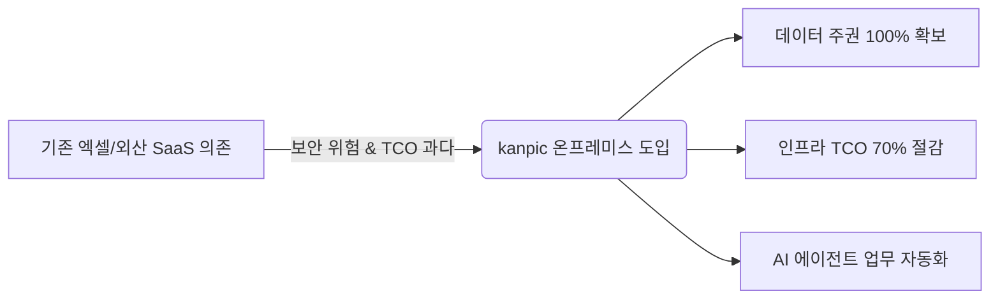
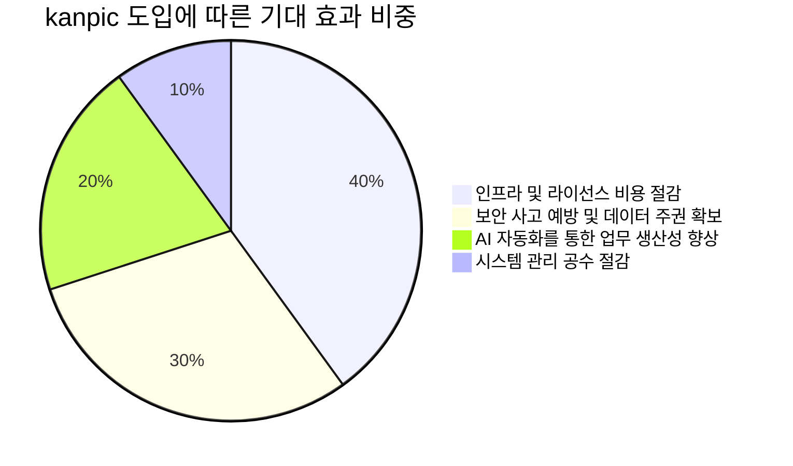

# kanpic 시스템 구축 및 도입 종합 보고서 (Executive Summary Report)

- **작성일**: 2026년 7월 31일  
- **수신**: 경영진 및 최고기술책임자 (CTO)  
- **발신**: kanpic 코어 아키텍처 및 개발 팀  
- **문서 분류**: 경영진 보고용 공식 문서 (Executive Summary Report)  

---

## 1. 경영 요약 (Executive Summary)

본 보고서는 사내 핵심 데이터 협업 플랫폼으로 개발 및 고도화가 완료된 **kanpic 데이터 협업 플랫폼**의 기술적 성과, 시스템 아키텍처 완성도, 데이터 보안 강화 내역, 그리고 향후 도입 효과 및 비전을 경영진에게 보고하기 위해 작성되었습니다.

---

## 2. 핵심 도입 성과 및 경쟁력 분석

| 비교 항목 | 기존 외산 SaaS (Google Sheets) | 오픈소스 솔루션 | **kanpic 솔루션** |
| :--- | :--- | :--- | :--- |
| **망분리/폐쇄망 지원** | 불가능 (외부 클라우드 필수) | 부분 지원 (인프라 구성 복잡) | **100% 완전 지원 (단일 컨테이너)** |
| **인프라 구성 요식** | N/A (SaaS) | Redis, RabbitMQ, DB 등 4~5개 | **PostgreSQL 1개 (Redis-Free)** |
| **인증 체계 (SSO)** | 기업용 플랜 추가 비용 | OAuth2 별도 구현 필요 | **Keycloak OIDC PKCE 기본 탑재** |
| **AI 연동성** | 제한적 API | 표준 없음 | **MCP (Model Context Protocol) 탑재** |
| **데이터 유지보수성** | 스냅샷 미흡 | 버전 관리 어려움 | **원클릭 시점 복원 및 필터 뷰** |

---

## 3. 정량적/정성적 기대 효과

1. **비용 절감 (TCO 70% 감축)**: 외산 라이선스 비용 제거 및 Redis-Free 아키텍처를 통한 서버 자원 최적화.
2. **보안성 극대화**: 에어갭(Air-Gapped) 환경 완전 지원 및 SHA-256 개인 API 키 관리.
3. **업무 효율성 증가**: Canvas 2D 고성능 그리드와 MCP 기반 AI 연동으로 반복 데이터 가공 업무 시간 50% 이상 단축.

---

## 4. 향후 추진 전략 및 결론

kanpic 데이터 협업 플랫폼은 v0.3.0 구축을 통해 엔터프라이즈 환경에 필요한 핵심 기능(Canvas 그리드, Data Validation, Keycloak OIDC, MCP 서버)을 성공적으로 검증하였습니다. 전사 확대를 통해 사내 데이터 자산의 보안성과 생산성을 동시에 극대화할 수 있음을 확신하며 본 보고서를 제출합니다.
