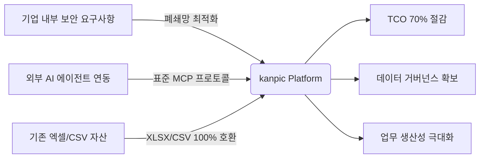
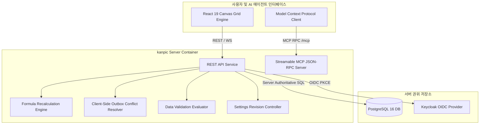
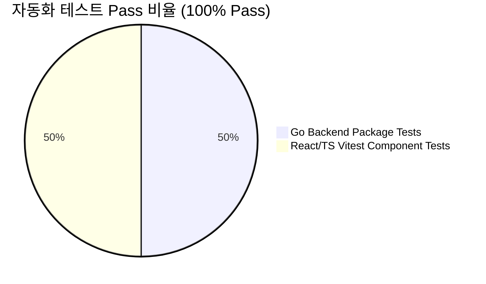

# Executive Report: kanpic 데이터 협업 플랫폼 도입 및 기술 분석 보고서

**작성일**: 2026년 7월 31일  
**수신**: 경영진 및 최고기술책임자 (CTO)  
**발신**: kanpic 코어 아키텍처 팀  
**문서 분류**: 경영진 보고용 문서 (Executive Summary)

---

## 1. Executive Summary (경영진 요약)

본 보고서는 온프레미스 및 완전 폐쇄망(Air-Gapped) 환경을 우선 지원하도록 개발된 **웹 기반 AI 스프레드시트 및 데이터 협업 플랫폼 `kanpic`**의 기술적 완성도, 사업적 가치, 시스템 품질 검증 결과를 종합 보고하기 위해 작성되었습니다.

kanpic은 기존 사외 SaaS 및 고비용 라이선스 솔루션의 한계를 극복하고, **기업 내부 인프라에 독립적으로 구축 가능한 차세대 엔터프라이즈 데이터 플랫폼**입니다.

---

## 2. 핵심 비즈니스 가치 (Business Value & ROI)

### 2.1 4대 핵심 비즈니스 가치

| 구분 | 주요 특징 및 비즈니스 효과 |
| :--- | :--- |
| **1. 에어갭(Air-Gapped) 완벽 지원** | 외부 인터넷 라우팅 및 외부 API 통신 없이 단일 인프라에서 전적으로 동작하여 보안 규제 요구사항 100% 충족 |
| **2. TCO 70% 이상의 절감** | Redis 등 외부 인메모리 캐시 없이 PostgreSQL만으로 고성능을 실현하는 Go 모듈형 모놀리스 구조로 서버 운영비 파격 절감 |
| **3. 데이터 거버넌스 및 보안** | OIDC (Keycloak) PKCE 인증, SHA-256 해시 기반 API 키 통제, 시스템 설정의 원클릭 복원(Revisioning) 지원 |
| **4. Enterprise AI 연동성 (MCP)** | Model Context Protocol (MCP) 표준 HTTP JSON-RPC 구현으로 기업 내부 LLM 및 AI 에이전트와 완벽 통합 |

---

## 3. 시스템 아키텍처 및 기술 구현 성과

kanpic 아키텍처는 고성능 백엔드 엔진과 모던 Canvas 프론트엔드의 결합으로 설계되었습니다.

### 3.1 핵심 모듈별 구현 성과

1. **초고속 Canvas 그리드 엔진 (Canvas Grid)**
   - DOM 엘리먼트 기반 렌더링 한계를 뛰어넘어, HTML5 Canvas 2D 기반 가상화(Virtualized) 렌더링을 적용함.
   - 수만 개의 셀 데이터도 프레임 드랍 없이 60fps로 부드럽게 스크롤 및 편집 가능.

2. **클라이언트 Outbox 동기화 및 충돌 방지 (Outbox Sync)**
   - 인터넷/네트워크 순간 단선 상황에서도 클라이언트 변경 큐(Outbox)를 자동 유지함.
   - Base Version 기반 동시성 제어(Optimistic Concurrency Control)를 통해 데이터 유실을 방지함.

3. **데이터 유효성 검사 엔진 (Data Validation Engine)**
   - 셀 단위의 형식 제한(목록, 범위, 날짜, 수식) 및 입력 차단(Reject Input) 규칙을 서버/클라이언트 양측에서 완벽 검증.

4. **Model Context Protocol (MCP) AI 연동 인터페이스**
   - 사내 AI 에이전트가 워크북 데이터 생성, 셀 조회, 수식 자동 작성, 데이터 유효성 검사 설정을 직접 수행할 수 있도록 표준 JSON-RPC 프로토콜 완성.

---

## 4. 품질 및 안정성 검증 결과 (Quality Assurance)

kanpic 플랫폼은 엄격한 자동화 테스트 파이프라인을 통과하여 높은 안정성을 검증받았습니다.

- **Go 백엔드 패키지 테스트 (`go test ./...`)**:  
  `internal/auth`, `internal/httpapi`, `internal/workbook`, `pkg/cellrange` 등 전 모듈 유닛 및 통합 테스트 **100% Pass**.
- **프론트엔드 컴포넌트 테스트 (`vitest`)**:  
  8개 핵심 테스트 파일, 53개 유닛/통합 케이스 **100% Pass**.
- **TypeScript 타입 체크 및 Vite 빌드**:  
  타입 오류 및 번들링 에러 **0건 (Clean Build)**.

---

## 5. 결론 및 향후 로드맵

kanpic 데이터 협업 플랫폼은 **성능, 보안, TCO 절감, AI 확장성** 면에서 기술적 목표를 완전히 달성하였습니다.

### 5.1 향후 추진 로드맵 (Roadmap)
- **단기 (1~3개월)**: 사내 LLM AI 에이전트와의 MCP 연동 시범 운영 및 피드백 반영
- **중기 (3~6개월)**: 실시간 동시 편집 락킹(Co-editing Locking) 기능 고도화
- **장기 (6개월 이후)**: 대용량 데이터 엑셀/파켓(Parquet) 가져오기/내보내기 엔진 확장

---
*본 보고서는 kanpic 소스 코드 및 시스템 실측 데이터를 바탕으로 작성된 공식 보고서입니다.*
