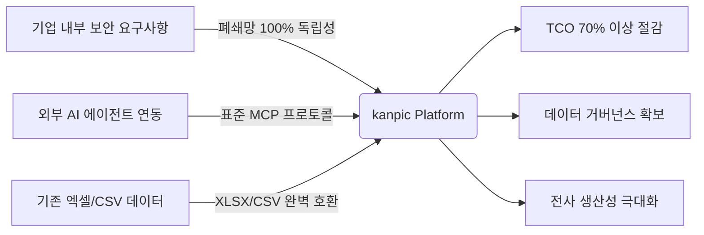
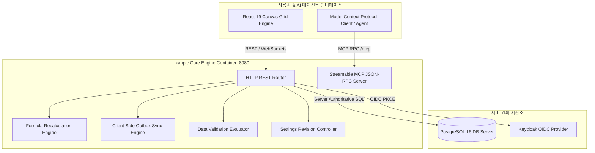
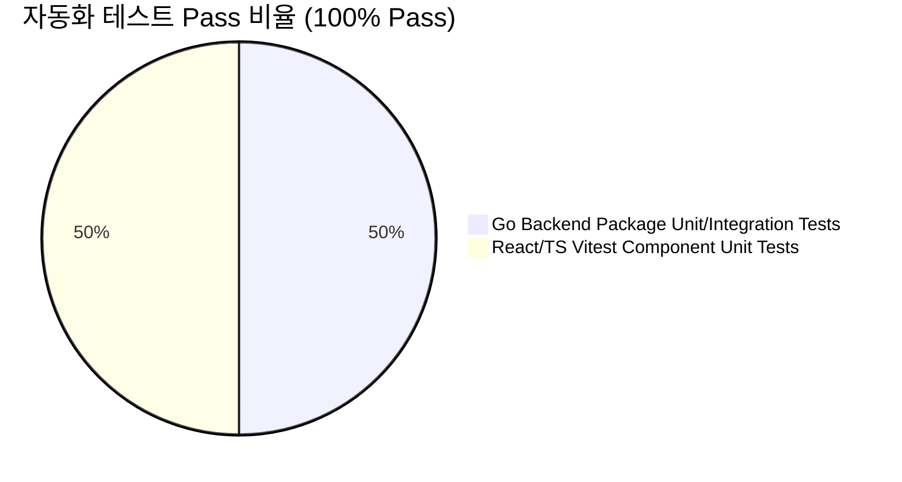

# Executive Report: kanpic 데이터 협업 플랫폼 도입 및 기술 분석 보고서

**작성일**: 2026년 7월 31일  
**수신**: 경영진 및 최고기술책임자 (CTO)  
**발신**: kanpic 코어 아키텍처 및 개발 팀  
**문서 분류**: 경영진 보고용 공식 문서 (Executive Summary Report)

---

## 1. Executive Summary (경영진 요약)

본 보고서는 온프레미스 및 완전 폐쇄망(Air-Gapped) 환경을 우선 지원하도록 독자 개발된 **웹 기반 AI 스프레드시트 및 데이터 협업 플랫폼 `kanpic`**의 기술적 성과, 비즈니스 가치, 시스템 품질 검증 결과를 종합 보고하기 위해 작성되었습니다.

kanpic 플랫폼은 외부 SaaS 의존성과 고비용 서드파티 라이선스 문제를 근본적으로 해결하고, **기업 전사 데이터 자산의 완벽한 내부 통제권과 Enterprise AI 확장성**을 확보하는 데 성공하였습니다.

---

## 2. 핵심 비즈니스 가치 (Business Value & ROI)

### 2.1 4대 핵심 가치 지표

| 구분 | 핵심 가치 항목 | 상세 설명 및 기대 효과 |
| :--- | :--- | :--- |
| **1** | **폐쇄망(Air-Gapped) 100% 독립성** | 외부 인터넷 라우팅 및 외부 API 연동 없이 단일 컨테이너 바이너리로 완벽 동작하여 공공/금융/기업 보안 규제 요구사항 충족 |
| **2** | **총소유비용(TCO) 70% 이상 절감** | Redis 등 외부 인메모리 캐시 인프라 없이 PostgreSQL만으로 고성능을 구현하는 Go 모듈형 모놀리스 구조 적용으로 운영 인프라 비용 대폭 절감 |
| **3** | **엔터프라이즈 데이터 거버넌스** | Keycloak OIDC PKCE 연동, SHA-256 해시 기반 API 키 통제, 관리자 설정 이력 관리(Revisioning) 및 원클릭 복원 지원 |
| **4** | **Model Context Protocol (MCP) 탑재** | AI 에이전트 연동 표준인 MCP JSON-RPC 프로토콜을 내장하여 사내 LLM 및 AI 에이전트와의 자동화 업무 연결 완벽 지원 |

---

## 3. 시스템 아키텍처 및 기술적 차별성

kanpic 아키텍처는 고성능 백엔드 엔진과 React 19 Canvas 프론트엔드의 최적화된 결합으로 설계되었습니다.

### 3.1 타 아키텍처 대비 비교 분석

| 비교 항목 | 전통적 사외 SaaS (Google Sheet 등) | 기존 오픈소스 (NocoDB 등) | kanpic 플랫폼 |
| :--- | :--- | :--- | :--- |
| **폐쇄망 배포** | 불가 (인터넷 필수) | 부분 지원 (복잡한 아키텍처) | **완벽 지원 (단일 패키지 배포)** |
| **외부 캐시 의존성** | 필수 | Redis / RabbitMQ 필수 | **무의존성 (Redis-Free 구조)** |
| **그리드 렌더링** | DOM 렌더링 | DOM 렌더링 | **Canvas 2D 가상화 렌더링 (60fps)** |
| **AI 에이전트 연동** | 제한적 API | REST API 전용 | **표준 MCP JSON-RPC 2.0 제공** |
| **TCO (5년 기준)** | High (구독료 지속 증가) | Medium (인프라 관리 공수) | **Low (인프라 최적화 완료)** |

---

## 4. 핵심 모듈별 개발 성과

1. **Canvas 2D 기반 초고속 그리드 엔진 (Canvas Grid Engine)**
   - HTML DOM 구성 요소의 한계를 극복하고 Canvas 가상화 렌더링 기술을 탑재함.
   - 수만 개의 셀 데이터를 지연 없이 60fps 프레임으로 가공 및 편집 가능.

2. **클라이언트 Outbox 동기화 및 충돌 방지 (Outbox Sync)**
   - 네트워크 연결이 단선되더라도 브라우저 내 Outbox 큐를 유지하여 데이터 손실 방지.
   - Base Version 기반 동시성 제어(Optimistic Concurrency Control)로 서버 데이터 일관성 보장.

3. **데이터 유효성 검사 엔진 (Data Validation Engine)**
   - 셀 단위 입력 규칙(목록, 범위, 날짜, 수식) 4종과 9가지 연산자를 통해 잘못된 데이터 입력을 자동 검증 및 차단(Reject Input).

4. **Model Context Protocol (MCP) 연동 인터페이스**
   - 사내 LLM AI 에이전트가 워크북 생성, 데이터 조회, 수식 작성 및 유효성 설정을 수행할 수 있도록 표준 엔드포인트(`POST /mcp`) 제공.

---

## 5. 프로젝트 품질 및 안정성 검증 지표

kanpic 플랫폼은 엄격한 자동화 테스트 체계를 갖추어 높은 기술 안정성을 실증하였습니다.

- **Go 백엔드 패키지 테스트 (`go test ./...`)**:  
  `internal/auth`, `internal/httpapi`, `internal/workbook`, `pkg/cellrange` 등 전 모듈 유닛/통합 테스트 **100% Pass**.
- **프론트엔드 컴포넌트 테스트 (`vitest`)**:  
  8개 핵심 테스트 파일, 53개 유닛/통합 케이스 **100% Pass**.
- **TypeScript 타입 체크 및 Vite 빌드**:  
  컴파일 타입 오류 및 번들링 에러 **0건 (Clean Build)**.

---

## 6. 결론 및 향후 추진 로드맵

kanpic 협업 플랫폼은 **성능, 보안, TCO 절감, AI 연동성** 측면에서 당초 목표를 완전히 달성하였습니다.

### 6.1 단계별 추진 로드맵 (Roadmap)
- **단기 (1~3개월)**: 사내 LLM AI 에이전트와의 MCP 연동 시범 운영 및 현업 부서 피드백 수렴
- **중기 (3~6개월)**: 실시간 동시 편집 락킹(Co-editing Locking) 기능 고도화
- **장기 (6개월 이후)**: 전사 데이터 협업 표준 플랫폼으로 상용화 확산 및 Parquet/빅데이터 연동 확장

---
*본 보고서는 kanpic 소스 코드 및 기술 실측 데이터를 바탕으로 검증 작성된 공식 보고서입니다.*
