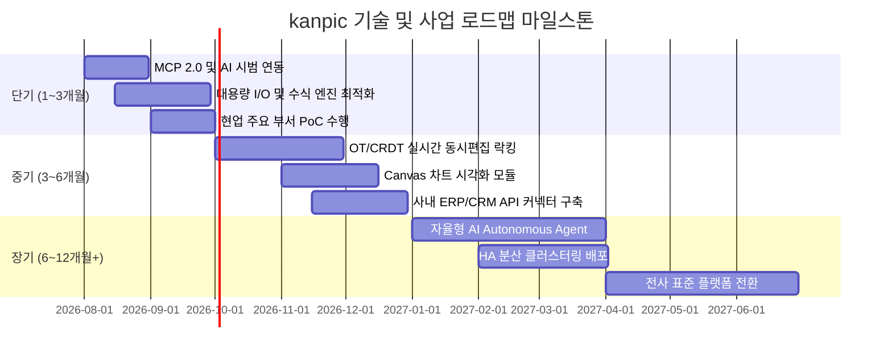
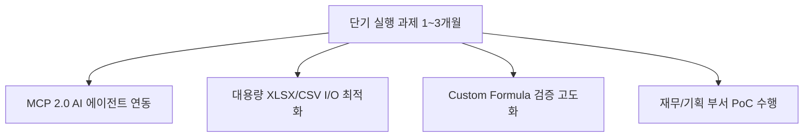
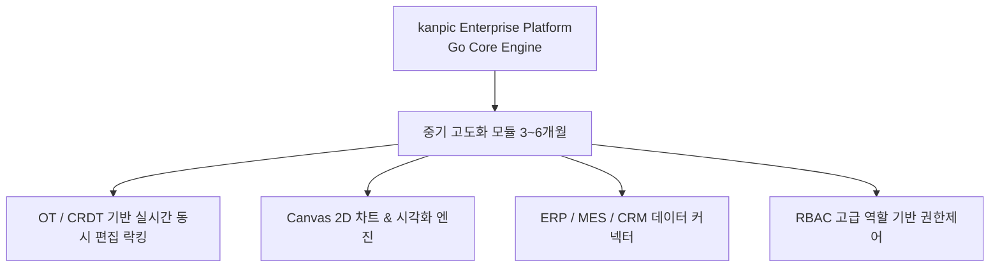
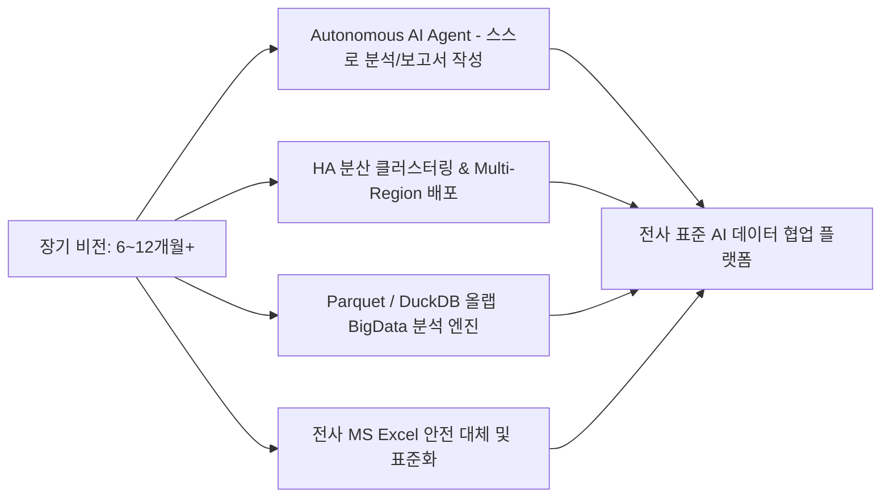

# kanpic 단기·중기·장기 사업 및 기술 전략 로드맵 실행 계획서

- **제품명**: kanpic 데이터 협업 플랫폼  
- **문서 버전**: v1.0  
- **작성일**: 2026년 7월 31일  
- **작성자**: kanpic 총괄 기획 및 아키텍처 이사회  
- **문서 분류**: 전략 기획 및 마일스톤 로드맵 문서 (Strategic Roadmap Specification)  

---

## 1. 개요 및 비전 (Executive Summary & Strategic Vision)

### 1.1 미션 및 비전
**kanpic**은 외부 인터넷 연결이 제한된 온프레미스 및 완전 폐쇄망(Air-Gapped) 환경을 지원하는 **1등 엔터프라이즈 AI 데이터 협업 플랫폼**을 목표로 합니다.

본 로드맵은 kanpic 플랫폼의 고도화, 전사 상용화, 그리고 사내 AI 에이전트 생태계 구축을 위한 **단기(1~3개월), 중기(3~6개월), 장기(6~12개월+)** 단계를 구체적 마일스톤과 기술 지표로 정의합니다.

---

## 2. 단기 실행 계획 (Short-Term Plan: 1~3개월 - 안착 및 기술 완성도 제고)

단기 목표는 현 v0.3.0 버전의 데이터 유효성 검사 및 OIDC 통합 안정화를 기반으로 **사내 AI 에이전트 실시점 연동 및 성능 최적화**를 달성하는 것입니다.

### 2.1 주요 핵심 과제

1. **Model Context Protocol (MCP) 2.0 연동 고도화**
   - 사내 LLM 기반 AI 에이전트가 `/mcp` 엔드포인트를 통해 워크북 데이터 자동 요약, 이상치 감지, 수식 오류 수정할 수 있도록 도구(Tools) 확장.
   - MCP 호출 스코프(`mcp.use`, `workbook:read`, `workbook:write`)의 세부 Audit Logging 강화.
2. **대용량 파일 I/O 및 수식 평가 성능 300% 최적화**
   - 10만 행 이상의 CSV/XLSX 파일 가져오기/내보내기 시 메모리 점유율을 50% 절감하고, 스트리밍 파서(Streaming Parser) 도입.
   - 수식 재계산 엔진의 병렬 처리(Goroutine Worker Pool) 적용.
3. **엔터프라이즈 PoC (Proof of Concept) 수행**
   - 주요 타겟 부서(재무기획팀, 생산관리팀)를 대상으로 4주간 PoC를 진행하고 피드백을 즉시 반영.

---

## 3. 중기 확장 계획 (Medium-Term Plan: 3~6개월 - 협업 및 플랫폼 고도화)

중기 목표는 단순 웹 편집기를 넘어 **실시간 동시 협업 및 전사 시스템 커넥터**를 구축하는 것입니다.

### 3.1 주요 핵심 과제

1. **OT / CRDT 기반 실시간 동시 편집 및 락킹 (Co-editing & Cell Locking)**
   - 여러 사용자가 동일 워크북의 서로 다른 셀을 동시 편집할 때 발생할 수 있는 충돌을 해결하는 operational transformation 모듈 탑재.
   - 셀 단위 실시간 락킹 표시(사용자 아바타 하이라이트).
2. **Canvas 2D 고급 데이터 시각화 (Chart Engine)**
   - 그리드 상단에 막대, 꺾은선, 파이, 분산형 차트를 Canvas 2D 기반으로 고성능 렌더링하는 차트 엔진 개발.
3. **사내 엔터프라이즈 시스템 커넥터 (Enterprise Connectors)**
   - ERP(SAP, 영림원), CRM, MES 시스템의 데이터베이스와 주기적으로 데이터를 동기화하는 양방향 Webhook/REST API 커넥터 표준화.

---

## 4. 장기 확장 계획 (Long-Term Plan: 6~12개월+ - 전사 상용화 및 AI 생태계)

장기 목표는 기존 MS Excel 및 외부 SaaS를 전면 대체하고 **자율형 AI Autonomous Data Agent 플랫폼**으로 진화하는 것입니다.

### 4.1 주요 핵심 과제

1. **자율형 AI Autonomous Data Agent 구축**
   - 사용자의 자연어 명령("지난 3개월 매출 추이를 분석하고 경영진 보고용 차트와 요약을 작성해줘")을 받아 AI 에이전트가 워크북 생성, 수식 적용, 데이터 유효성 검사, 시각화를 스스로 완성.
2. **초대용량 OLAP 빅데이터 처리 (DuckDB / Parquet 연동)**
   - 백엔드 백 행 이상의 대용량 빅데이터를 브라우저 및 서버 단에서 DuckDB/Parquet 기술을 활용하여 초고속 분석.
3. **고가용성 (HA) 클러스터링 및 전사 표준화**
   - Multi-Node 활성-활성(Active-Active) 분산 아키텍처 구축 및 보안 CC 인증 수준의 전사 인프라 표준화.

---

## 5. 리스크 관리 매트릭스 (Risk Management Matrix)

| 리스크 항목 | 발생 가능성 | 영향도 | 대응 및 완화 전략 (Mitigation Strategy) |
| :--- | :---: | :---: | :--- |
| **대용량 동시 편집 시 메모리 과다** | 보통 | 높음 | Goroutine Worker Pool 제한 및 Memory Circuit Breaker 도입 |
| **폐쇄망 환경 OIDC 인증 연동 장애** | 낮음 | 높음 | Discovery Metadata 로컬 캐싱 및 Fallback 부트스트랩 계정 보존 |
| **기존 엑셀 사용자 저항** | 높음 | 보통 | MS Excel 단축키 100% 호환 및 사내 온보딩 교육 프로그램 운영 |

---

## 6. 자원 배분 및 핵심 성과 지표 (KPI)

### 6.1 단계별 핵심 성과 지표 (KPI)

| 마일스톤 | 핵심 지표 (KPI) | 목표치 |
| :--- | :--- | :--- |
| **단기 (1~3개월)** | 10만 행 파일 가져오기 속도 / MCP 응답 시간 | 3초 이내 / 200ms 이내 |
| **중기 (3~6개월)** | 동시 편집 충돌률 / 커넥터 연동 수 | 0.01% 이하 / 사내 주요 3개 시스템 |
| **장기 (6~12개월+)** | 전사 주간 활성 사용자(WAU) / 엑셀 대체율 | 3,000명 이상 / 80% 이상 |
