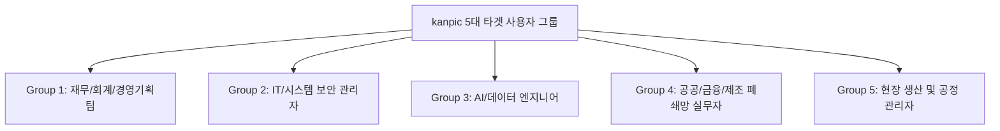
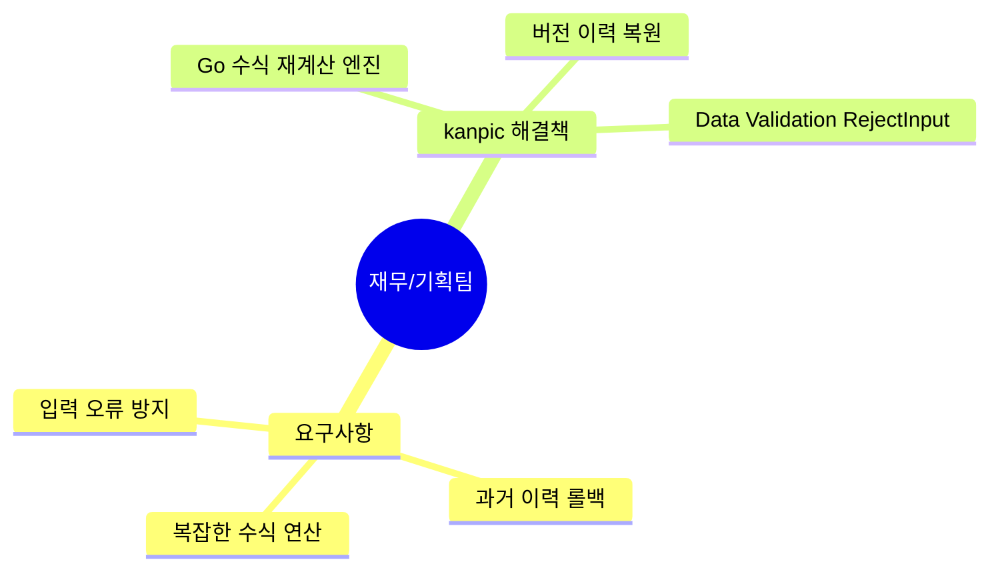

# kanpic 타겟 사용자 그룹 분석 및 유즈케이스 명세서

**제품명**: kanpic 데이터 협업 플랫폼  
**문서 버전**: v1.0  
**작성일**: 2026년 7월 31일  
**작성자**: kanpic 사용자 경험(UX) 및 도메인 분석 팀  
**문서 분류**: 타겟 유저 분석 및 페르소나 명세서 (User Group Analysis Specification)

---

## 1. 개요 및 분석 프레임워크

본 문서 분석은 **kanpic 플랫폼의 주요 사용자 그룹(Target User Groups)**을 세분화하고, 각 타겟 그룹의 직무적 특성, 기존 업무 방식에서의 통증점(Pain Points), kanpic 도입 시의 해결책 및 세부 유즈케이스(Use Cases)를 정의하기 위해 작성되었습니다.

---

## 2. 5대 핵심 사용자 그룹 및 페르소나 분석

### 2.1 Group 1: 재무 / 회계 / 경영기획팀 (Financial & Business Planning)

#### 타겟 특성
- 복잡한 수식 연산, 다중 시트 재무제표 집계, 대용량 실적 데이터 다루기.
- 데이터 정확성(Accuracy) 및 과거 시점 복구(Audit Trail)가 최고 우선순위.

#### 타겟 페르소나 (Persona 1)
- **이름**: 김민수 팀장 (42세, 경영기획실)
- **Pain Point**: 기존 엑셀 공유 시 누군가 잘못된 수치를 입력하거나 수식을 깨뜨리면 원인을 찾기 어렵고 이전 파일 백업본을 찾아 헤맸음.
- **kanpic 해결책**:
  - **데이터 유효성 검사 (Data Validation)**: `reject_input = true`로 설정하여 부서원들의 승인되지 않은 금액 입력 방지.
  - **버전 이력 (Version History)**: 실수로 수식이 지워져도 원클릭으로 어제 시점 스냅샷 복원.

---

### 2.2 Group 2: IT / 시스템 운영 및 보안 관리자 (IT & Security Admins)

#### 타겟 특성
- 인프라 복잡도 최소화, 외부 인터넷 라우팅 차단, 사내 SSO 연동, 보안 감사 대응.

#### 타겟 페르소나 (Persona 2)
- **이름**: 박진우 수석 (38세, IT 보안운영팀)
- **Pain Point**: 사외 SaaS(Google Sheets)는 보안 규정상 사용 불가하고, 오픈소스 도구는 Redis, RabbitMQ 등 인프라가 너무 복잡하여 관리 공수가 과다함.
- **kanpic 해결책**:
  - **Redis-Free 인메모리 아키텍처**: PostgreSQL 하나로 통합 동작하여 인프라 TCO 대폭 절감.
  - **Keycloak OIDC PKCE SSO**: 사내 Keycloak 계정과 연동하여 2FA 및 중앙집중식 권한 통제.
  - **API 키 감사 & Revisioning**: `/admin` 콘솔에서 전체 API 키 회전/폐기 및 설정 이력 복원.

---

### 2.3 Group 3: AI / Data Science / 엔지니어링 팀 (AI & Data Engineers)

#### 타겟 특성
- Python/Bash 스크립트를 통한 데이터 자동화, LLM AI 에이전트 연동, MCP 표준 활용.

#### 타겟 페르소나 (Persona 3)
- **이름**: 이수진 연구원 (31세, AI 혁신랩)
- **Pain Point**: 웹 스프레드시트와 사내 LLM AI 모델을 연결하려면 API가 비표준이거나 제한적이어서 커스텀 개발 비용이 큼.
- **kanpic 해결책**:
  - **Model Context Protocol (MCP) 표준 탑재**: `/mcp` HTTP JSON-RPC 엔드포인트를 통해 AI 에이전트가 데이터 읽기/쓰기, 수식 생성, 데이터 유효성 검사 설정을 자동 실행.
  - **개인 API 키 (`/preferences`)**: 파이썬 `requests` 스크립트로 자동화 파이프라인 구축.

---

### 2.4 Group 4: 공공 / 금융 / 제조 폐쇄망 실무자 (Closed-Network Enterprise Staff)

#### 타겟 특성
- 완전 폐쇄망(Air-Gapped) 환경 거주, 엑셀 파일 내보내기/가져오기 빈번.

#### 타겟 페르소나 (Persona 4)
- **이름**: 최현우 차장 (45세, 국방/공공 사업부)
- **Pain Point**: 망분리 환경이라 외부 구글 드라이브나 노션을 사용할 수 없어 엑셀 파일을 이메일로 수십 개씩 주고받아 정합성이 엉킴.
- **kanpic 해결책**:
  - **폐쇄망 단일 이미지 배포**: 외부 인터넷 통신 없이 단일 컨테이너로 완전 작동.
  - **비파괴 필터 뷰 (Filter Views)**: 팀원들이 동일한 워크북을 보면서 각자 자신만의 필터 조건으로 업무 수행.

---

### 2.5 Group 5: 현장 생산 & 공정 관리자 (Operations & Manufacturing Admins)

#### 타겟 특성
- 현장 입출고/생산량 단순 입력, 드롭다운 선택 필수, 오입력 방지.

#### 타겟 페르소나 (Persona 5)
- **이름**: 정성호 반장 (50세, 스마트 팩토리 공정팀)
- **Pain Point**: 현장 작업자들이 품목명이나 공정 상태를 오타로 입력하여 재고 데이터 연동에 오류 발생.
- **kanpic 해결책**:
  - **셀 내 드롭다운 칩 (Chip Style Validation)**: `승인`, `대기`, `불량`, `재작업` 버튼 칩을 드롭다운으로 제공하여 클릭 한 번으로 오타 없이 입력 완료.

---

## 3. 사용자 그룹별 기능 호환성 매트릭스 (Feature Matrix)

| 기능 요소 | 재무/기획팀 | IT 보안관리자 | AI/데이터팀 | 폐쇄망 실무자 | 현장 공정관리자 |
| :--- | :---: | :---: | :---: | :---: | :---: |
| **Canvas 2D 초고속 그리드** | ★★★ | ★★☆ | ★★☆ | ★★★ | ★★★ |
| **Data Validation (유효성 검사)** | ★★★ | ★☆☆ | ★★☆ | ★★☆ | ★★★ |
| **비파괴 필터 뷰 (Filter Views)** | ★★★ | ★☆☆ | ★★☆ | ★★★ | ★★☆ |
| **버전 이력 & 원클릭 복원** | ★★★ | ★★☆ | ★☆☆ | ★★★ | ★☆☆ |
| **Keycloak OIDC PKCE SSO** | ★☆☆ | ★★★ | ★★☆ | ★★★ | ★☆☆ |
| **MCP (Model Context Protocol)** | ★☆☆ | ★★☆ | ★★★ | ★☆☆ | ★☆☆ |
| **개인 API 키 & Python 연동** | ★☆☆ | ★★☆ | ★★★ | ★★☆ | ★☆☆ |
| **XLSX / CSV 내보내기/가져오기** | ★★★ | ★☆☆ | ★★☆ | ★★★ | ★★☆ |

---

## 4. 사용자 수용성 극대화 방안 (User Adoption Strategy)

1. **단축키 및 UX 익숙함 유지**: MS Excel 단축키(`Ctrl+C/V`, `Shift+방향키`, `Enter/Tab`)와 100% 동일하게 동작하도록 설계하여 기존 사용자의 학습 곡선(Learning Curve)을 최소화.
2. **시각적 드롭다운 칩(Chip) 적용**: 복잡한 입력 대신 시각적 칩 클릭으로 빠른 업무 처리 지원.
3. **부서별 체인지 매니지먼트 (Change Management)**: 사용자/관리자 가이드북 배포 및 숏폼 VOD 가이드 제공.
