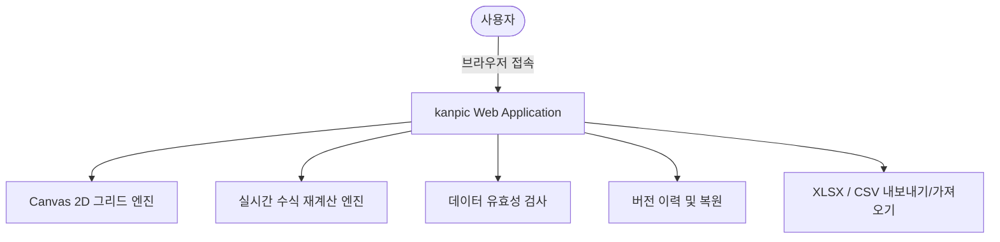
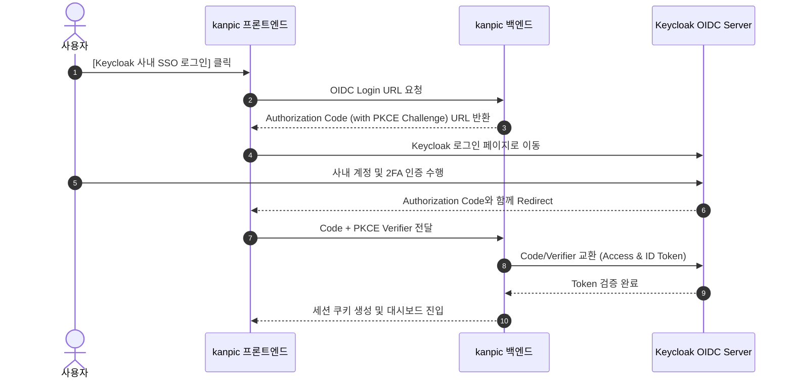
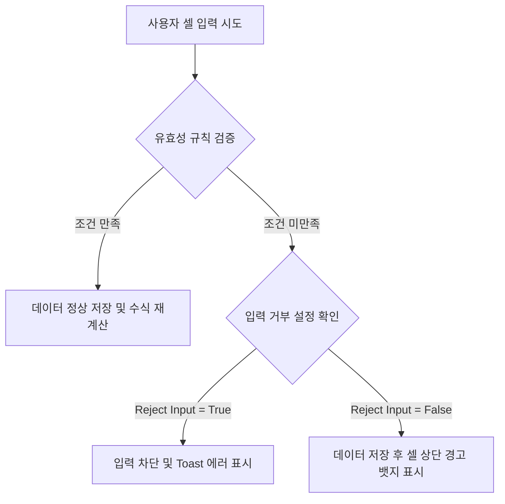

# kanpic 사용자 가이드 (Enterprise User Manual)

- **제품명**: kanpic 데이터 협업 플랫폼  
- **시스템 버전**: v0.9.0
- **문서 버전**: v1.0  
- **최종 수정일**: 2026년 8월 1일
- **문서 분류**: 엔드유저용 최종 사용 설명서 (End-User Manual)  

---

## 1. 문서 개요 및 시스템 소개

### 1.1 kanpic 플랫폼 개요
**kanpic**은 외부 인터넷 연결이 제한된 온프레미스 및 완전 폐쇄망(Air-Gapped) 환경을 우선 지원하도록 설계된 **웹 기반 AI 스프레드시트 및 데이터 협업 플랫폼**입니다. 

기존의 단순 웹 표 편집기를 넘어, 대용량 셀 데이터를 지연 없이 가공하는 **Canvas 렌더링 엔진**, 실시간 수식 평가 시스템, 셀 수준의 **데이터 유효성 검사 (Data Validation)**, 개인별 **비파괴 필터 뷰 (Filter Views)**, 그리고 **Model Context Protocol (MCP)** 기반의 AI 연동 기능을 통합 제공합니다.



### 1.2 핵심 사용자 이점
- **초고속 응답성**: HTML DOM의 성능 한계를 극복한 Canvas 그리드 기술로 수만 개의 셀 데이터도 60fps로 부드럽게 편집합니다.
- **데이터 보안 및 안전성**: 클라이언트 변경사항을 Outbox 큐에 보관하여 네트워크 순간 단선 시에도 데이터 유실을 완벽 방지합니다.
- **협업 충돌 방지**: 내 작업이 타 사용자에게 영향을 주지 않는 필터 뷰와 언제든 과거로 돌아갈 수 있는 버저닝을 지원합니다.

---

## 2. 계정 접속 및 인증 (Authentication)

### 2.1 일반 계정 로그인
관리자가 사전에 발급한 계정(ID)과 비밀번호(Password)를 입력하여 접속합니다.

1. 웹 브라우저에서 `http://<kanpic-서버-주소>:8080`으로 이동합니다.
2. 로그인 화면에서 사용자 ID와 비밀번호를 입력 후 **[로그인]** 버튼을 클릭합니다.

### 2.2 Keycloak OIDC SSO (Single Sign-On) 로그인
사내 SSO 인증 체계(Keycloak)와 연동된 경우 원클릭 인증으로 접속할 수 있습니다.



---

## 3. 메인 대시보드 (`/`) 및 워크북 관리

로그인 성공 시 가장 먼저 나타나는 **홈 대시보드**의 세부 기능 안내입니다.

```
+-----------------------------------------------------------------------------------+
| [kanpic 로고]   [검색어 입력...            ]                [⭐] [알림] [프로필 v] |
+-----------------------------------------------------------------------------------+
|  +-------------------+  +-------------------+  +-------------------+              |
|  | + 빈 워크북 생성  |  | 📁 CSV/XLSX 업로드|  | 📊 예산 템플릿    | (템플릿 영역)|
|  +-------------------+  +-------------------+  +-------------------+              |
|                                                                                   |
|  최근 워크북 목록                                                                 |
|  +-----------------------------------------------------------------------------+  |
|  | ⭐  2026_3분기_재무보고서   | 수정: 10분 전  | 소유자: 나     | [편집] [...]  |  |
|  |     전사_인력_현황_DB     | 수정: 어제     | 소유자: 홍길동 | [편집] [...]  |  |
|  +-----------------------------------------------------------------------------+  |
+-----------------------------------------------------------------------------------+
```

### 3.1 워크북 생성 및 파일 가져오기 (Import)
- **빈 워크북 생성**: `+ 빈 워크북 생성` 카드를 클릭하여 즉시 새 스프레드시트를 만듭니다.
- **파일 가져오기 (Import)**:
  - 지원 포맷: `CSV`, `TSV`, `XLSX` (Excel)
  - `📁 파일 업로드` 버튼을 클릭하거나 파일을 카드 위로 드래그 앤 드롭합니다.
  - 미리보기 대화상자에서 인코딩(UTF-8, EUC-KR 등) 및 첫 행 헤더 여부를 확인하고 **[원자적 가져오기]**를 실행합니다.

### 3.2 워크북 즐겨찾기 및 이력 관리
- **즐겨찾기(⭐)**: 워크북 카드 좌측의 별 아이콘을 클릭하여 대시보드 최상단에 고정합니다.
- **복사 및 삭제**: 워크북 우측의 `...` 메뉴를 클릭하여 워크북을 복제하거나 삭제할 수 있습니다.

---

## 4. Canvas 편집기 (Grid Editor) 상세 가이드

### 4.1 화면 구조 및 단축키 안내

```
+-----------------------------------------------------------------------------------+
| [<] 2026_3분기_재무보고서 (저장됨)                    [공유] [유효성검사] [내보내기]|
+-----------------------------------------------------------------------------------+
| [폰트 v] [11v] [B] [I] [U] | [좌] [중] [우] | [배경색] [글자색] | [필터] [버전이력]  |
+-----------------------------------------------------------------------------------+
| fx | =SUM(B2:B10)                                                                 |
+----+----+-------------------+-------------------+---------------------------------+
|    | A  |         B         |         C         |                D                |
+----+----+-------------------+-------------------+---------------------------------+
| 1  |    | 매출액            | 영업이익          | 당기순이익                      |
| 2  | Q1 | 1,200,000         | 340,000           | 290,000                         |
| 3  | Q2 | 1,450,000         | 410,000           | 360,000                         |
+----+----+-------------------+-------------------+---------------------------------+
```

#### 필수 단축키 (Shortcuts)
- `Enter`: 현재 셀 입력 완료 후 아래쪽 셀로 이동
- `Shift + Enter`: 위쪽 셀로 이동
- `Tab`: 오른쪽 셀로 이동
- `Shift + Tab`: 왼쪽 셀로 이동
- `Esc`: 셀 편집 취소 및 이전 값 복원
- `Ctrl + C` / `Ctrl + V`: 셀 범위 복사 및 붙여넣기
- `Ctrl + Z` / `Ctrl + Y`: 실행 취소 (Undo) / 다시 실행 (Redo)
- `Ctrl/⌘ + F` 또는 `Ctrl/⌘ + K`: 현재 워크북의 모든 시트에서 값과 수식 검색
- `Shift + 방향키`: 연속된 셀 범위 선택

#### 워크북 통합 검색

도구 모음의 검색 버튼이나 위 단축키로 검색 창을 엽니다. 검색은 브라우저에 보이는 셀만이 아니라 PostgreSQL에 저장된 워크북 전체 셀 블록을 대상으로 하며 대소문자를 구분하지 않습니다. 결과에는 시트 이름, A1 주소, 일치한 값 또는 수식이 표시됩니다. 결과를 선택하면 해당 시트로 전환하고 원거리 셀도 화면 안으로 자동 스크롤합니다.

에이전트는 `workbook.read` scope의 MCP 도구 `spreadsheet.workbook.search`를 사용합니다. REST 클라이언트는 `GET /api/v1/workbooks/{workbookId}/search?q=검색어&limit=50&offset=0`을 호출할 수 있습니다. 한 페이지는 최대 200건이며 응답의 `next_offset`이 있을 때 다음 페이지를 조회합니다.

---

### 4.2 수식(Formula) 엔진 및 함수 레퍼런스

kanpic은 문맥 인식 수식 파서를 통해 셀 참조와 계산을 실시간으로 수행합니다. 모든 수식은 `=` 기호로 시작합니다.

#### 1. 수학 및 통계 함수
- `=SUM(범위)`: 지정한 범위 내 모든 수치의 합계를 구합니다. (예: `=SUM(B2:B10)`)
- `=AVERAGE(범위)`: 지정한 범위의 평균값을 계산합니다. (예: `=AVERAGE(C2:C50)`)
- `=MIN(범위)` / `=MAX(범위)`: 최솟값 및 최댓값을 추출합니다.
- `=COUNT(범위)`: 수치가 포함된 셀의 개수를 셉니다.
- `=ROUND(수치, 자릿수)`: 반올림을 수행합니다. (예: `=ROUND(A1, 2)`)
- `=ABS(수치)`: 절대값을 반환합니다.

#### 2. 텍스트 조작 함수
- `=CONCAT(텍스트1, 텍스트2, ...)`: 여러 텍스트를 하나로 결합합니다. (예: `=CONCAT(A1, " ", B1)`)
- `=UPPER(텍스트)` / `=LOWER(텍스트)`: 대문자 / 소문자로 변환합니다.
- `=LEN(텍스트)`: 문자열의 길이를 반환합니다.
- `=TRIM(텍스트)`: 불필요한 공백을 제거합니다.

#### 3. 논리 함수
- `=IF(조건식, 참일때값, 거짓일때값)`: 조건을 평가하여 지정된 값을 반환합니다. (예: `=IF(B2>=1000, "달성", "미달")`)
- `=AND(조건1, 조건2, ...)` / `=OR(조건1, 조건2, ...)`: 다중 논리 연산을 수행합니다.

#### 수식 오류 코드 안내
- `#VALUE!`: 잘못된 인자 유형이 수식에 전달됨
- `#REF!`: 참조 대상 셀이 유효하지 않거나 삭제됨
- `#DIV/0!`: 0으로 나누기 연산이 시도됨
- `#NAME?`: 인식할 수 없는 함수 이름이 입력됨

---

## 5. 데이터 유효성 검사 (Data Validation)

데이터 유효성 검사는 잘못된 데이터 입력을 셀 수준에서 방지하여 전체 스프레드시트의 데이터 품질을 보장합니다.



### 5.1 규칙 유형 (Rule Types) 및 연산자 (Operators)

| 규칙 유형 (Rule Type) | 사용 가능 연산자 (Operators) | 설명 및 사용 예시 |
| :--- | :--- | :--- |
| **목록 (List)** | `in_list` | 지정한 옵션 항목 중 선택 (예: `승인, 대기, 거절`) |
| **숫자 (Number)** | `between`, `not_between`, `equal`, `not_equal`, `greater_than`, `greater_or_equal`, `less_than`, `less_or_equal` | 숫자 범위 및 대소 비교 (예: `greater_or_equal 0`) |
| **날짜 (Date)** | `equal`, `before`, `after` | 유효한 YYYY-MM-DD 날짜 검증 |
| **사용자 수식 (Custom Formula)** | `custom` | 수식 조건 만족 여부 검증 (예: `=A1<B1`) |

### 5.2 유효성 검사 설정 가이드
1. 검증을 적용할 셀 영역을 마우스로 드래그합니다.
2. 상단 툴바의 **[데이터 유효성 검사]** 아이콘을 클릭합니다.
3. 규칙 유형, 연산자, 조건값 및 드롭다운 표시 스타일(`chip`, `arrow`, `plain`)을 지정합니다.
4. **[잘못된 입력 거부 (Reject Input)]** 체크 박스를 설정하여 엄격한 차단 여부를 결정한 뒤 저장합니다.

---

## 6. 필터 뷰 (Filter Views) & 버전 복원 (Version History)

### 6.1 비파괴 필터 뷰 (Filter Views)
kanpic의 필터 뷰는 원본 데이터를 수정하지 않고 나만의 시각으로 데이터를 탐색하는 기능입니다.

- **독립성**: 내가 필터를 적용하더라도 동일 워크북을 보고 있는 타 사용자의 화면 행 순서에는 전혀 영향을 주지 않습니다.
- **조건 설정**: 특정 열의 텍스트 포함, 특정 숫자 범위, 셀 배경 색상별 필터링을 지원합니다.
- **저장 및 공유**: 자주 사용하는 필터 조건을 이름으로 저장하고 팀원들과 공유할 수 있습니다.

### 6.2 버전 이력 및 원클릭 복원
- 우측 사이드바의 **[버전 이력]** 탭을 클릭합니다.
- 변경된 시점별 타임스탬프와 작업자 라벨이 표시됩니다.
- 원하는 과거 버전을 선택하여 변경 내역을 미리 확인한 후 **[이 버전으로 복원]** 버튼을 눌러 안전하게 과거 상태로 롤백할 수 있습니다.

---

## 7. 셀·범위 댓글과 멘션 알림

1. 댓글을 연결할 셀 또는 범위를 선택합니다.
2. 편집기 도구 모음의 **댓글** 버튼을 눌러 오른쪽 댓글 패널을 엽니다.
3. 새 댓글을 입력하고 **등록**을 누릅니다. `@사용자ID` 또는 `@이메일` 형식으로 담당자를 멘션할 수 있습니다.
4. 스레드에서 답글을 작성하거나 자신의 메시지를 수정·삭제할 수 있습니다. 작업이 끝나면 **해결**을 누르고, 다시 논의해야 하면 **재열기**를 누릅니다.
5. 상단 종 모양 **알림** 버튼에는 읽지 않은 멘션 수가 표시됩니다. 알림을 선택하면 읽음 처리한 뒤 해당 워크북·시트·범위와 댓글 스레드로 이동합니다.

댓글 위치는 행·열 삽입 및 삭제를 따라 자동 이동합니다. 연결된 범위가 완전히 삭제되면 위치가 `#REF!`로 표시되지만 대화 내용은 보존됩니다. 동시에 수정된 메시지나 스레드는 revision 충돌로 거부되며, 최신 댓글을 다시 불러온 후 재시도해야 합니다. 댓글 본문은 일반 텍스트로만 표시되어 HTML이나 스크립트가 실행되지 않습니다.

에이전트는 `comment.read`/`comment.write` scope로 `spreadsheet.comment.list`, `spreadsheet.comment.get`, `spreadsheet.comment.create`, `spreadsheet.comment.reply`, `spreadsheet.comment.resolve`, `spreadsheet.comment.delete`, `spreadsheet.comment.message.update`, `spreadsheet.comment.message.delete`, `spreadsheet.notification.list`, `spreadsheet.notification.mark_read` MCP 도구를 사용할 수 있습니다.

---

## 8. 개인화 설정 및 개인 API 키 (`/preferences`)

### 8.1 테마 및 개인화
- `/preferences` 페이지에서 화면 테마(Light/Dark/System)를 설정할 수 있습니다.

### 8.2 개인 API 키 (Personal API Keys) 발급
파이썬 스크립트나 커스텀 애플리케이션에서 kanpic 데이터에 프로그램 방식으로 접근할 수 있습니다.

```python
import requests

# 개인 API 키 설정
API_KEY = "kanpic_live_sk_8f9a2b3c4d5e6f7a8b9c0d1e2f"
HEADERS = {"Authorization": f"Bearer {API_KEY}"}

# 워크북 목록 조회
response = requests.get("http://localhost:8080/api/v1/workbooks", headers=HEADERS)
print(response.json())
```

> [!CAUTION]
> **API 키 보안 유의사항**  
> API 키 원문은 생성 시 단 한 번만 화면에 표시되며, 데이터베이스에는 SHA-256 해시로 저장되므로 분실 시 키를 회전(Rotate)하여 새로 발급받아야 합니다.

---

## 9. 자주 묻는 질문 및 문제 해결 (FAQ)

> [!NOTE]
> **Q1. 네트워크가 갑자기 연결 끊기면 작성 중이던 내용이 날아가나요?**  
> A. 아닙니다. kanpic은 브라우저 내 Outbox 동기화 큐를 탑재하여 오프라인 상태에서도 입력을 안전하게 보관하며, 네트워크 재연결 시 서버로 자동 전송합니다.

> [!TIP]
> **Q2. 셀에 빨간 삼각형 경고 뱃지가 떠 있습니다. 무슨 의미인가요?**  
> A. 데이터 유효성 검사 규칙에 위배된 데이터가 입력되어 있음을 의미합니다. 셀에 마우스를 올리면 상세 오류 원인이 툴팁으로 표시됩니다.
