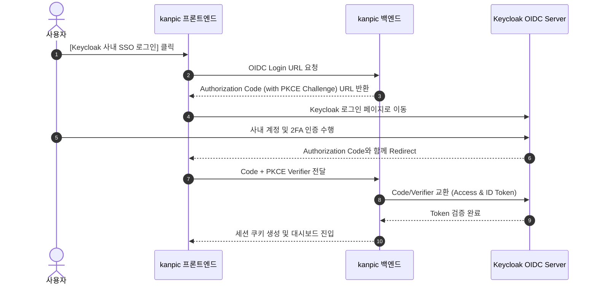
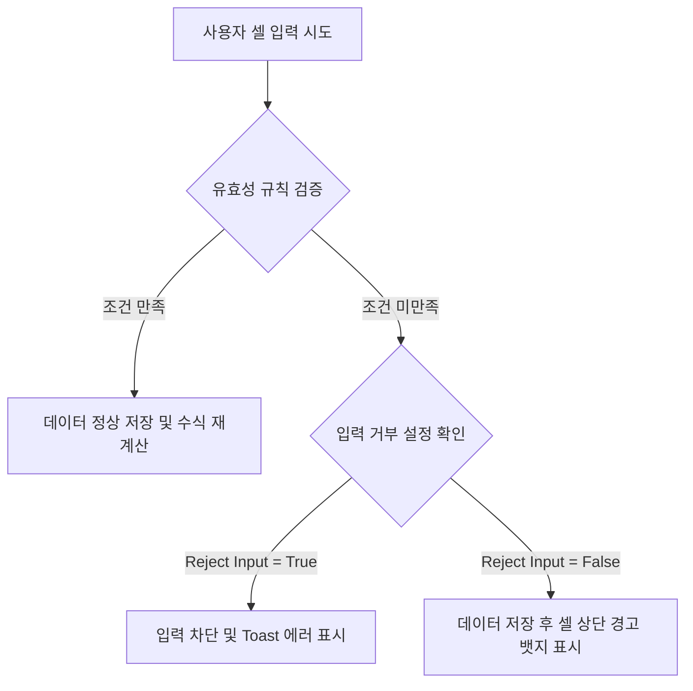

# kanpic 사용자 가이드 (Enterprise User Manual)

- **제품명**: kanpic 데이터 협업 플랫폼  
- **시스템 버전**: v0.18.0
- **문서 버전**: v1.0  
- **최종 수정일**: 2026년 8월 2일
- **문서 분류**: 엔드유저용 최종 사용 설명서 (End-User Manual)  

---

## 1. 문서 개요 및 시스템 소개

### 1.1 kanpic 플랫폼 개요
**kanpic**은 외부 인터넷 연결이 제한된 온프레미스 및 완전 폐쇄망(Air-Gapped) 환경을 우선 지원하도록 설계된 **웹 기반 AI 스프레드시트 및 데이터 협업 플랫폼**입니다. 

기존의 단순 웹 표 편집기를 넘어, 대용량 셀 데이터를 지연 없이 가공하는 **Canvas 렌더링 엔진**, 실시간 수식 평가 시스템, 셀 수준의 **데이터 유효성 검사 (Data Validation)**, 개인별 **비파괴 필터 뷰 (Filter Views)**, 그리고 **Model Context Protocol (MCP)** 기반의 AI 연동 기능을 통합 제공합니다.


### 1.2 핵심 사용자 이점
- **초고속 응답성**: HTML DOM의 성능 한계를 극복한 Canvas 그리드 기술로 수만 개의 셀 데이터도 60fps로 부드럽게 편집합니다.
- **데이터 보안 및 안전성**: 클라이언트 변경사항을 Outbox 큐에 보관하여 네트워크 순간 단선 시에도 데이터 유실을 완벽 방지합니다.
- **협업 충돌 방지**: 내 작업이 타 사용자에게 영향을 주지 않는 필터 뷰와 언제든 과거로 돌아갈 수 있는 버저닝을 지원합니다.

---

## 2. 계정 접속 및 인증 (Authentication)

### 2.1 일반 계정 로그인
관리자가 사전에 발급한 계정(ID)과 비밀번호(Password)를 입력하여 접속합니다.

1. 웹 브라우저에서 `http://<kanpic-서버-주소>:8080`으로 이동합니다.
2. 로그인 화면에서 사용자 ID와 비밀번호를 입력 후 **[로그인]** 버튼을 클릭합니다.

### 2.2 Keycloak OIDC SSO (Single Sign-On) 로그인
사내 SSO 인증 체계(Keycloak)와 연동된 경우 원클릭 인증으로 접속할 수 있습니다.



---

## 3. 메인 대시보드 (`/`) 및 워크북 관리

로그인 성공 시 가장 먼저 나타나는 **홈 대시보드**의 세부 기능 안내입니다.

```
+-----------------------------------------------------------------------------------+
| [kanpic 로고]   [검색어 입력...            ]                [⭐] [알림] [프로필 v] |
+-----------------------------------------------------------------------------------+
|  +-------------------+  +-------------------+  +-------------------+              |
|  | + 빈 워크북 생성  |  | 📁 CSV/XLSX 업로드|  | 📊 예산 템플릿    | (템플릿 영역)|
|  +-------------------+  +-------------------+  +-------------------+              |
|                                                                                   |
|  최근 워크북 목록                                                                 |
|  +-----------------------------------------------------------------------------+  |
|  | ⭐  2026_3분기_재무보고서   | 수정: 10분 전  | 소유자: 나     | [편집] [...]  |  |
|  |     전사_인력_현황_DB     | 수정: 어제     | 소유자: 홍길동 | [편집] [...]  |  |
|  +-----------------------------------------------------------------------------+  |
+-----------------------------------------------------------------------------------+
```

### 3.1 워크북 생성 및 파일 가져오기 (Import)
- **빈 워크북 생성**: `+ 빈 워크북 생성` 카드를 클릭하여 즉시 새 스프레드시트를 만듭니다.
- **파일 가져오기 (Import)**:
  - 지원 포맷: `CSV`, `TSV`, `XLSX` (Excel)
  - `📁 파일 업로드` 버튼을 클릭하거나 파일을 카드 위로 드래그 앤 드롭합니다.
  - 미리보기 대화상자에서 인코딩(UTF-8, EUC-KR 등) 및 첫 행 헤더 여부를 확인하고 **[원자적 가져오기]**를 실행합니다.

### 3.2 워크북 즐겨찾기 및 이력 관리
- **즐겨찾기(⭐)**: 워크북 카드 좌측의 별 아이콘을 클릭하여 대시보드 최상단에 고정합니다.
- **복사 및 삭제**: 워크북 우측의 `...` 메뉴를 클릭하여 워크북을 복제하거나 삭제할 수 있습니다.

---

## 4. Canvas 편집기 (Grid Editor) 상세 가이드

### 4.1 화면 구조 및 단축키 안내

```
+-----------------------------------------------------------------------------------+
| [<] 2026_3분기_재무보고서 (저장됨)                    [공유] [유효성검사] [내보내기]|
+-----------------------------------------------------------------------------------+
| [폰트 v] [11v] [B] [I] [U] | [좌] [중] [우] | [배경색] [글자색] | [필터] [버전이력]  |
+-----------------------------------------------------------------------------------+
| fx | =SUM(B2:B10)                                                                 |
+----+----+-------------------+-------------------+---------------------------------+
|    | A  |         B         |         C         |                D                |
+----+----+-------------------+-------------------+---------------------------------+
| 1  |    | 매출액            | 영업이익          | 당기순이익                      |
| 2  | Q1 | 1,200,000         | 340,000           | 290,000                         |
| 3  | Q2 | 1,450,000         | 410,000           | 360,000                         |
+----+----+-------------------+-------------------+---------------------------------+
```

#### 필수 단축키 (Shortcuts)
- `Enter`: 현재 셀 입력 완료 후 아래쪽 셀로 이동
- `Shift + Enter`: 위쪽 셀로 이동
- `Tab`: 오른쪽 셀로 이동
- `Shift + Tab`: 왼쪽 셀로 이동
- `Esc`: 셀 편집 취소 및 이전 값 복원
- `Ctrl + C` / `Ctrl + V`: 셀 범위 복사 및 붙여넣기
- `Ctrl + Z` / `Ctrl + Y`: 실행 취소 (Undo) / 다시 실행 (Redo)
- `Ctrl/⌘ + F` 또는 `Ctrl/⌘ + K`: 현재 워크북의 모든 시트에서 값과 수식 검색
- `Shift + 방향키`: 연속된 셀 범위 선택

#### 워크북 통합 검색

도구 모음의 검색 버튼이나 위 단축키로 검색 창을 엽니다. 검색은 브라우저에 보이는 셀만이 아니라 PostgreSQL에 저장된 워크북 전체 셀 블록을 대상으로 하며 대소문자를 구분하지 않습니다. 결과에는 시트 이름, A1 주소, 일치한 값 또는 수식이 표시됩니다. 결과를 선택하면 해당 시트로 전환하고 원거리 셀도 화면 안으로 자동 스크롤합니다.

에이전트는 `workbook.read` scope의 MCP 도구 `spreadsheet.workbook.search`를 사용합니다. REST 클라이언트는 `GET /api/v1/workbooks/{workbookId}/search?q=검색어&limit=50&offset=0`을 호출할 수 있습니다. 한 페이지는 최대 200건이며 응답의 `next_offset`이 있을 때 다음 페이지를 조회합니다.

---

### 4.2 수식(Formula) 엔진 및 함수 레퍼런스

kanpic은 문맥 인식 수식 파서를 통해 셀 참조와 계산을 실시간으로 수행합니다. 모든 수식은 `=` 기호로 시작합니다.

#### 1. 수학 및 통계 함수
- `=SUM(범위)`: 지정한 범위 내 모든 수치의 합계를 구합니다. (예: `=SUM(B2:B10)`)
- `=AVERAGE(범위)`: 지정한 범위의 평균값을 계산합니다. (예: `=AVERAGE(C2:C50)`)
- `=MIN(범위)` / `=MAX(범위)`: 최솟값 및 최댓값을 추출합니다.
- `=COUNT(범위)`: 수치가 포함된 셀의 개수를 셉니다.
- `=ROUND(수치, 자릿수)`: 반올림을 수행합니다. (예: `=ROUND(A1, 2)`)
- `=ABS(수치)`: 절대값을 반환합니다.

#### 2. 텍스트 조작 함수
- `=CONCAT(텍스트1, 텍스트2, ...)`: 여러 텍스트를 하나로 결합합니다. (예: `=CONCAT(A1, " ", B1)`)
- `=UPPER(텍스트)` / `=LOWER(텍스트)`: 대문자 / 소문자로 변환합니다.
- `=LEN(텍스트)`: 문자열의 길이를 반환합니다.
- `=TRIM(텍스트)`: 불필요한 공백을 제거합니다.

#### 3. 논리 함수
- `=IF(조건식, 참일때값, 거짓일때값)`: 조건을 평가하여 지정된 값을 반환합니다. (예: `=IF(B2>=1000, "달성", "미달")`)
- `=AND(조건1, 조건2, ...)` / `=OR(조건1, 조건2, ...)`: 다중 논리 연산을 수행합니다.

#### 수식 오류 코드 안내
- `#VALUE!`: 잘못된 인자 유형이 수식에 전달됨
- `#REF!`: 참조 대상 셀이 유효하지 않거나 삭제됨
- `#DIV/0!`: 0으로 나누기 연산이 시도됨
- `#NAME?`: 인식할 수 없는 함수 이름이 입력됨

---

## 5. 데이터 유효성 검사 (Data Validation)

데이터 유효성 검사는 잘못된 데이터 입력을 셀 수준에서 방지하여 전체 스프레드시트의 데이터 품질을 보장합니다.



### 5.1 규칙 유형 (Rule Types) 및 연산자 (Operators)

| 규칙 유형 (Rule Type) | 사용 가능 연산자 (Operators) | 설명 및 사용 예시 |
| :--- | :--- | :--- |
| **목록 (List)** | `in_list` | 지정한 옵션 항목 중 선택 (예: `승인, 대기, 거절`) |
| **숫자 (Number)** | `between`, `not_between`, `equal`, `not_equal`, `greater_than`, `greater_or_equal`, `less_than`, `less_or_equal` | 숫자 범위 및 대소 비교 (예: `greater_or_equal 0`) |
| **날짜 (Date)** | `equal`, `before`, `after` | 유효한 YYYY-MM-DD 날짜 검증 |
| **사용자 수식 (Custom Formula)** | `custom` | 수식 조건 만족 여부 검증 (예: `=A1<B1`) |

### 5.2 유효성 검사 설정 가이드
1. 검증을 적용할 셀 영역을 마우스로 드래그합니다.
2. 상단 툴바의 **[데이터 유효성 검사]** 아이콘을 클릭합니다.
3. 규칙 유형, 연산자, 조건값 및 드롭다운 표시 스타일(`chip`, `arrow`, `plain`)을 지정합니다.
4. **[잘못된 입력 거부 (Reject Input)]** 체크 박스를 설정하여 엄격한 차단 여부를 결정한 뒤 저장합니다.

---

## 6. 필터 뷰 (Filter Views) & 버전 복원 (Version History)

### 6.1 비파괴 필터 뷰 (Filter Views)
kanpic의 필터 뷰는 원본 데이터를 수정하지 않고 나만의 시각으로 데이터를 탐색하는 기능입니다.

- **독립성**: 내가 필터를 적용하더라도 동일 워크북을 보고 있는 타 사용자의 화면 행 순서에는 전혀 영향을 주지 않습니다.
- **조건 설정**: 특정 열의 텍스트 포함, 특정 숫자 범위, 셀 배경 색상별 필터링을 지원합니다.
- **저장 및 공유**: 자주 사용하는 필터 조건을 이름으로 저장하고 팀원들과 공유할 수 있습니다.

### 6.2 버전 이력 및 원클릭 복원
- 우측 사이드바의 **[버전 이력]** 탭을 클릭합니다.
- 변경된 시점별 타임스탬프와 작업자 라벨이 표시됩니다.
- 원하는 과거 버전을 선택하여 변경 내역을 미리 확인한 후 **[이 버전으로 복원]** 버튼을 눌러 안전하게 과거 상태로 롤백할 수 있습니다.

---

## 7. 셀·범위 댓글과 멘션 알림

1. 댓글을 연결할 셀 또는 범위를 선택합니다.
2. 편집기 도구 모음의 **댓글** 버튼을 눌러 오른쪽 댓글 패널을 엽니다.
3. 새 댓글을 입력하고 **등록**을 누릅니다. `@사용자ID` 또는 `@이메일` 형식으로 담당자를 멘션할 수 있습니다.
4. 스레드에서 답글을 작성하거나 자신의 메시지를 수정·삭제할 수 있습니다. 작업이 끝나면 **해결**을 누르고, 다시 논의해야 하면 **재열기**를 누릅니다.
5. 상단 종 모양 **알림** 버튼에는 읽지 않은 멘션 수가 표시됩니다. 알림을 선택하면 읽음 처리한 뒤 해당 워크북·시트·범위와 댓글 스레드로 이동합니다.

댓글 위치는 행·열 삽입 및 삭제를 따라 자동 이동합니다. 연결된 범위가 완전히 삭제되면 위치가 `#REF!`로 표시되지만 대화 내용은 보존됩니다. 동시에 수정된 메시지나 스레드는 revision 충돌로 거부되며, 최신 댓글을 다시 불러온 후 재시도해야 합니다. 댓글 본문은 일반 텍스트로만 표시되어 HTML이나 스크립트가 실행되지 않습니다.

에이전트는 `comment.read`/`comment.write` scope로 `spreadsheet.comment.list`, `spreadsheet.comment.get`, `spreadsheet.comment.create`, `spreadsheet.comment.reply`, `spreadsheet.comment.resolve`, `spreadsheet.comment.delete`, `spreadsheet.comment.message.update`, `spreadsheet.comment.message.delete`, `spreadsheet.notification.list`, `spreadsheet.notification.mark_read` MCP 도구를 사용할 수 있습니다.

---

## 8. 네이티브 차트

1. 표의 머리글과 항목 이름을 포함한 범위를 선택합니다.
2. 편집기 오른쪽 아래 **차트** 버튼을 눌러 차트 패널을 열고 **새 차트**를 선택합니다.
3. 막대, 선, 영역, 원형, 분산, 히스토그램 중 유형을 선택하고 원본 시트·범위, 제목, 범례와 축 제목을 설정합니다.
4. 생성된 차트의 머리글을 드래그해 위치를 옮기고 오른쪽 아래 핸들로 크기를 조절합니다. 내보내기 버튼으로 SVG 또는 PNG 파일을 저장할 수 있습니다.

차트는 화면 캡처가 아니라 PostgreSQL에 저장되는 버전 관리 엔터티입니다. 원본 셀이나 수식 결과가 바뀌면 최신 워크북 버전의 데이터로 다시 그려지며, 워크북 복제·버전 복원과 행·열 삽입/삭제도 원본 범위에 반영됩니다. 원본 시트 또는 전체 원본 범위가 삭제되면 차트는 삭제되지 않고 `#REF!` 상태로 보존됩니다.

분산형 차트는 첫 번째 열을 X값으로, 이후 열을 각각 Y계열로 사용합니다. 한 차트의 원본은 최대 10,000셀이고 워크북당 최대 100개까지 만들 수 있습니다.

에이전트는 `chart.read`/`chart.write` scope로 `spreadsheet.chart.list`, `spreadsheet.chart.get`, `spreadsheet.chart.data`, `spreadsheet.chart.create`, `spreadsheet.chart.update`, `spreadsheet.chart.delete`를 사용할 수 있습니다. REST 클라이언트는 `/api/v1/workbooks/{workbookId}/charts`와 `/api/v1/charts/{chartId}`를 사용합니다.

---

## 9. 관리형 피벗 테이블

1. 머리글을 포함한 원본 데이터 범위를 선택합니다.
2. 편집기 오른쪽 아래 **피벗** 버튼을 눌러 패널을 열고 **새 피벗**을 선택합니다.
3. 행·열 그룹 필드를 고르고, 필요하면 날짜를 연도·분기·월·일로 묶거나 숫자 구간과 사용자 그룹을 설정합니다.
4. 값 필드마다 합계·평균·개수·최소·최대 집계를 선택하고 필터를 추가합니다. 계산 필드는 `=V1/V2`처럼 앞서 정의한 값 집계를 참조합니다.
5. 자동 갱신 또는 수동 갱신을 선택해 저장한 뒤 패널의 **결과 열기**를 누릅니다. 결과 셀을 선택하면 해당 집계에 포함된 원본 행을 페이지 단위로 확인할 수 있습니다.

피벗은 원본 셀을 변경하지 않는 독립 엔터티이며 정의, revision, 워크북 버전과 감사 작업자를 PostgreSQL에 저장합니다. 자동 모드는 조회할 때 최신 원본을 계산하고 수동 모드는 명시적으로 **지금 갱신**할 때 결과 캐시를 교체합니다. 행·열 삽입 또는 삭제 시 원본 범위가 이동하며, 원본 전체나 원본 시트가 삭제되면 정의를 `#REF!` 상태로 보존합니다. 워크북·시트 복제와 버전 스냅샷·복원에도 피벗 정의가 포함됩니다.

원본 범위는 최대 100,000셀, 결과는 최대 20,000셀, 워크북당 피벗은 최대 50개입니다. 행·열 차원은 합계 6개, 값 10개, 필터 10개, 계산 필드 5개까지 설정할 수 있습니다.

에이전트는 `pivot.read`/`pivot.write` scope로 `spreadsheet.pivot.list`, `spreadsheet.pivot.get`, `spreadsheet.pivot.data`, `spreadsheet.pivot.drilldown`, `spreadsheet.pivot.create`, `spreadsheet.pivot.update`, `spreadsheet.pivot.refresh`, `spreadsheet.pivot.delete`를 사용할 수 있습니다. REST 클라이언트는 `/api/v1/workbooks/{workbookId}/pivots`, `/api/v1/pivots/{pivotId}`, `/data`, `/refresh`, `/drilldown` 경로를 사용합니다.

---

## 10. 조건부 서식

1. 값을 시각적으로 구분할 범위를 선택하고 툴바의 **조건부 서식** 버튼을 누릅니다.
2. **값 조건**에서는 숫자·텍스트 비교, 포함 여부와 빈 값을 선택하고 배경색·글자색·굵게·기울임을 지정합니다.
3. **중복·고유 값**은 규칙 전체 범위의 값을 비교해 반복 값이나 한 번만 나타나는 값을 강조합니다.
4. **색상 범위**는 숫자의 최솟값과 최댓값 사이를 2색 또는 중간 색상을 포함한 3색으로 보간합니다.
5. **데이터 막대**는 같은 범위의 최솟값과 최댓값을 기준으로 셀 안에 비율 막대를 표시합니다.

규칙의 숫자가 작을수록 먼저 평가됩니다. 값 조건과 중복 규칙에서 **조건이 참이면 낮은 우선순위 규칙 중지**를 선택하면 같은 셀에 뒤따르는 규칙은 적용되지 않습니다. 여러 규칙의 서식 속성은 우선순위 순서로 합성되며 데이터 막대는 셀 값 위의 반투명 배경으로 표시됩니다.

조건부 서식은 원본 셀 값·수식·기본 서식을 바꾸지 않는 서버 권위 엔터티입니다. 정의에는 revision과 작업자, 워크북 버전이 기록되며 행·열 삽입·삭제 시 범위가 이동합니다. 시트·워크북 복제와 버전 스냅샷·복원에도 규칙이 포함됩니다. 시트당 최대 100개, 규칙 원본 범위는 최대 100,000셀, 화면 평가 요청은 최대 10,000셀입니다.

에이전트는 `format.read`/`format.write` scope로 `spreadsheet.conditional_format.list`, `spreadsheet.conditional_format.get`, `spreadsheet.conditional_format.evaluate`, `spreadsheet.conditional_format.create`, `spreadsheet.conditional_format.update`, `spreadsheet.conditional_format.delete`를 사용할 수 있습니다. REST 클라이언트는 `/api/v1/sheets/{sheetId}/conditional-formats`, `/api/v1/sheets/{sheetId}/conditional-formats:evaluate`, `/api/v1/conditional-formats/{conditionalFormatId}`를 사용합니다.

---

## 11. 동일 셀 편집 충돌 비교 및 해소

두 사용자가 같은 워크북 버전을 기준으로 동일 셀을 수정하면 kanpic은 마지막 입력을 임시 적용하면서 충돌 기록을 별도로 보존합니다. 단순한 마지막 저장 우선 방식처럼 이전 변경을 조용히 없애지 않습니다.

1. 상단 저장 상태의 주황색 **충돌 N건** 배지 또는 툴바의 **편집 충돌** 경고 아이콘을 선택합니다.
2. 오른쪽 패널에서 시트·셀 주소와 충돌 버전을 확인합니다.
3. **충돌 전 기준**, **먼저 반영된 값**, **현재 서버 값**을 비교합니다. 값뿐 아니라 수식과 굵게·기울임·색상 같은 서식 차이도 함께 표시됩니다.
4. 마지막 입력을 채택하려면 **현재 값 유지**, 먼저 반영된 상대 사용자 값을 되살리려면 **먼저 반영된 값 복원**을 선택합니다.
5. **해소된 충돌 이력 포함**을 켜면 결정, 처리자와 처리 버전을 다시 확인할 수 있습니다.

복원은 충돌 이후 해당 셀이 다시 변경되지 않았을 때만 실행됩니다. 값이 다시 바뀐 경우 복원 버튼이 비활성화되고 서버도 낙관적 버전 검증으로 덮어쓰기를 거부합니다. 모든 결정은 독립된 작업 ID와 최신 워크북 버전으로 남으므로 실행 취소 및 감사 이력과 연결할 수 있습니다.

에이전트는 `range.read` scope의 `spreadsheet.conflict.list`, `spreadsheet.conflict.get`으로 비교 정보를 조회하고, `range.write` scope의 `spreadsheet.conflict.resolve`로 `keep_current` 또는 `restore_previous`를 실행할 수 있습니다. REST 클라이언트는 `GET /api/v1/workbooks/{workbookId}/conflicts`, `GET /api/v1/conflicts/{conflictId}`, `POST /api/v1/conflicts/{conflictId}:resolve`를 사용합니다.

---

## 12. 안전한 AI 도우미

편집기 오른쪽 아래 **AI** 버튼으로 수식 생성, 수식 설명, 수식 오류 수정, 선택 범위 요약, 이상치 탐지와 데이터 정제를 요청할 수 있습니다. AI가 비활성화되어 있으면 관리자에게 사내 LLM Gateway 설정과 활성화를 요청합니다.

1. AI가 참고하고 변경할 셀 범위를 먼저 선택합니다. 패널 상단에서 모델에 전달될 A1 범위와 최대 셀 수를 확인합니다.
2. 여섯 작업 유형 중 하나를 고르고 자연어 요청을 입력합니다. **범위 요약**, **수식 설명**, **이상치 탐지**는 읽기 전용이며 **수식 생성**, **수식 오류 수정**, **데이터 정제**는 승인 가능한 변경 계획입니다.
3. **분석 및 계획 미리보기**를 누릅니다. 이 단계에서는 워크북이 변경되지 않습니다.
4. 요약·설명·발견 항목 또는 각 셀의 현재 값·수식과 제안 값·수식을 비교합니다. 이상치 발견에는 심각도, 셀 주소와 현재 서버 값이 함께 표시됩니다.
5. 변경 계획이 정확할 때만 **검토한 계획 승인**을 누릅니다. 읽기 전용 작업에는 승인 버튼이 없습니다.
6. 적용 직후 **Undo**를 누르면 AI가 변경한 작업 전체를 새 서버 버전으로 되돌릴 수 있습니다.

AI는 선택한 범위의 데이터만 사내 Gateway에 전달하며 셀에 적힌 문장을 명령으로 신뢰하지 않습니다. 수식 작업은 수식만, 데이터 정제는 문자열·숫자·불리언 같은 값 또는 명시적 셀 비우기만 허용합니다. 선택 범위 밖 변경이나 발견 항목, 객체·배열 값과 읽기 전용 작업의 변경 제안은 서버가 거부합니다. 계획 후 다른 사용자가 워크북을 수정하면 오래된 계획의 승인은 충돌로 중단되므로 새 계획을 만들어야 합니다. 최근 AI 작업 목록에서는 분석 완료·승인 대기·적용·취소·실패 상태와 사용 모델을 다시 확인할 수 있습니다.

에이전트는 `mcp.use`와 `ai.use`를 기본으로 사용합니다. 계획에는 `range.read`, 수식 생성·오류 수정 승인에는 `formula.write`, 데이터 정제 승인과 Undo에는 `range.write` scope가 추가로 필요합니다. MCP 도구는 `spreadsheet.ai.config.get`, `spreadsheet.ai.action.plan`, `list`, `get`, `approve`, `undo`입니다.

---

## 13. 워크북 자동화

편집기 오른쪽 아래 **자동화** 버튼에서 반복되는 셀 작업을 워크북 단위 규칙으로 관리합니다. 관리자가 자동화 실행을 활성화하기 전에도 정의와 쓰기 없는 미리보기는 만들 수 있지만 실제 실행은 차단됩니다.

1. 자동화 패널에서 **새 자동화**를 누르고 이름과 사용 여부를 지정합니다.
2. **수동 실행**, **셀 변경 시**, **일정(Cron)** 또는 **인바운드 웹훅**을 선택합니다. 셀 변경 트리거는 감시할 시트와 A1 범위를 함께 지정합니다. 일정은 프리셋을 고르거나 `분 시 일 월 요일` 형식의 5필드 Cron과 `Asia/Seoul` 같은 IANA 시간대를 입력합니다. 웹훅은 저장 뒤 카드에 전용 호출 경로가 표시됩니다.
3. 작업 시트와 대상 범위를 정한 뒤 **값 설정**, **수식 설정**, **내용 지우기** 중 하나를 선택합니다. 값은 문자열·숫자·불리언만 허용되며 수식은 `=`로 시작해야 합니다.
4. **저장 후 검증**을 누르면 현재 서버 셀과 실행 후 값을 비교하는 미리보기가 표시됩니다. 이 단계에서는 셀이 변경되지 않습니다.
5. 변경 범위와 기준 워크북 버전을 확인한 후 **검토한 자동화 실행**을 눌러 한 번의 원자적 작업으로 적용합니다.
6. 실행 이력에서 성공·변경 없음·실패·Undo 상태를 확인합니다. 성공한 실행은 후속 셀 변경과 충돌하지 않을 때 **Undo**할 수 있습니다. 일정 자동화 카드에는 서버가 계산한 다음 실행 시각이 표시됩니다.

수식을 여러 셀에 적용하면 대상 범위의 왼쪽 위 셀을 기준으로 상대 참조가 이동합니다. 실행 직전에 자동화 revision과 최신 워크북 버전 및 대상 셀 스냅샷을 확인하므로, 검증 이후 다른 사용자가 값을 바꾼 경우 실행을 중단하고 다시 검증해야 합니다. 같은 멱등 키나 같은 셀 변경 작업이 재전송되어도 실행은 한 번만 생성됩니다. 자동화 결과는 일반 셀 작업과 마찬가지로 저장·수식 재계산·WebSocket 협업 전파·버전 이력에 반영됩니다.

현재 지원하는 트리거는 수동 실행, 셀 변경, Cron 일정과 인증된 인바운드 웹훅이며 작업은 값 설정, 수식 설정, 내용 지우기입니다. Cron은 `*`, 목록, 범위, step, 영문 월·요일 이름과 `@hourly`, `@daily`, `@weekly`, `@monthly`, `@yearly` 별칭을 지원합니다. 예약 시각은 PostgreSQL에 저장되므로 서버 재시작 후에도 이어지며, 같은 예약 시각은 여러 서버 인스턴스가 확인해도 한 번만 반영됩니다. 대상 셀이 이미 원하는 상태라면 워크북 버전을 만들지 않고 **변경 없음**으로 기록합니다. 장시간 중단 뒤에는 과거 실행을 모두 몰아서 적용하지 않고 재개 시점에 한 번 처리한 후 다음 미래 시각으로 진행합니다. 아웃바운드 웹훅 호출, 알림, AI와 MCP 연쇄 실행은 이후 단계에서 추가됩니다. 자동화가 자신의 트리거 범위를 다시 변경하더라도 연쇄 자동화를 자동으로 발생시키지 않습니다.

### 13.1 인바운드 웹훅 호출

1. `/preferences`의 **개인 API 키**에서 `automation.webhook.invoke` scope를 가진 전용 키를 만듭니다. 원문 키는 생성 직후 한 번만 표시되므로 호출 시스템의 Secret Manager에 저장합니다.
2. 웹훅 자동화 카드에 표시되는 `POST /api/v1/automations/{automationId}:webhook` 경로를 호출합니다.
3. `Authorization: Bearer <API_KEY>`, 재전송 전체에서 같은 `Idempotency-Key`, `Content-Type: application/json`을 보냅니다.
4. 키를 회전하면 기존 키는 즉시 폐기되므로 외부 호출 시스템의 secret도 함께 교체합니다. 더 이상 사용하지 않으면 키를 폐기합니다.

```bash
curl -X POST 'https://kanpic.internal/api/v1/automations/AUTOMATION_ID:webhook' \
  -H 'Authorization: Bearer kp_live_...' \
  -H 'Idempotency-Key: source-event-20260802-001' \
  -H 'Content-Type: application/json' \
  --data '{"event":"approved","request_id":"REQ-001"}'
```

payload는 비어 있거나 최대 1MiB의 유효한 JSON이어야 합니다. kanpic은 payload 내용을 셀 작업·실행 이력·감사 로그에 저장하지 않으며 원본 바이트의 SHA-256, byte 수와 API 키 ID만 기록합니다. 같은 사용자·자동화·`Idempotency-Key` 조합을 다시 보내면 다른 payload여도 첫 실행 결과를 반환하므로, 원본 시스템의 이벤트 ID를 안정적인 멱등 키로 사용하십시오. 대상이 이미 원하는 상태면 새 워크북 버전 없이 **변경 없음** 실행으로 기록합니다.

에이전트는 `mcp.use`와 기능별 scope를 함께 사용합니다. 정의 조회·검증·실행 이력에는 `automation.read`, 생성·수정·삭제에는 `automation.write`, 실행·Undo에는 `automation.run`, 웹훅 호출에는 `automation.webhook.invoke`가 필요합니다. 검증에는 `range.read`, 값 설정·지우기 실행 및 Undo에는 `range.write`, 수식 실행에는 `formula.write`가 추가로 필요합니다. MCP 도구는 `spreadsheet.automation.list`, `get`, `create`, `update`, `delete`, `test`, `run`, `webhook.invoke`, `run.list`, `run.undo`입니다.

---

## 14. 개인화 설정 및 개인 API 키 (`/preferences`)

### 14.1 테마 및 개인화
- `/preferences` 페이지에서 화면 테마(Light/Dark/System)를 설정할 수 있습니다.

### 14.2 개인 API 키 (Personal API Keys) 발급
파이썬 스크립트나 커스텀 애플리케이션에서 kanpic 데이터에 프로그램 방식으로 접근할 수 있습니다.

```python
import requests

# 개인 API 키 설정
API_KEY = "kanpic_live_sk_8f9a2b3c4d5e6f7a8b9c0d1e2f"
HEADERS = {"Authorization": f"Bearer {API_KEY}"}

# 워크북 목록 조회
response = requests.get("http://localhost:8080/api/v1/workbooks", headers=HEADERS)
print(response.json())
```

> [!CAUTION]
> **API 키 보안 유의사항**  
> API 키 원문은 생성 시 단 한 번만 화면에 표시되며, 데이터베이스에는 SHA-256 해시로 저장되므로 분실 시 키를 회전(Rotate)하여 새로 발급받아야 합니다.

키 카드의 **수정**에서 이름, 만료 시점과 scope를 변경하거나 만료를 해제할 수 있습니다. `mcp.use`와 사용할 기능의 최소 scope를 함께 선택합니다. 조건부 서식 에이전트에는 `format.read` 또는 `format.write`, 차트 에이전트에는 `chart.read` 또는 `chart.write`, 피벗 에이전트에는 `pivot.read` 또는 `pivot.write`가 필요합니다. AI 에이전트에는 `ai.use`와 작업에 맞는 `range.read`, `formula.write`, `range.write`가 필요합니다. 자동화 에이전트에는 `automation.read`, `automation.write`, `automation.run`과 실제 셀 작업에 필요한 `range.read`, `range.write` 또는 `formula.write`를 조합합니다. **회전**하면 기존 키는 즉시 폐기되고 같은 이름·scope·만료 정책을 가진 새 키가 한 번만 표시됩니다. 더 이상 사용하지 않는 키는 **폐기**합니다.

---

## 15. 자주 묻는 질문 및 문제 해결 (FAQ)

> [!NOTE]
> **Q1. 네트워크가 갑자기 연결 끊기면 작성 중이던 내용이 날아가나요?**  
> A. 아닙니다. kanpic은 브라우저 내 Outbox 동기화 큐를 탑재하여 오프라인 상태에서도 입력을 안전하게 보관하며, 네트워크 재연결 시 서버로 자동 전송합니다.

> [!TIP]
> **Q2. 셀에 빨간 삼각형 경고 뱃지가 떠 있습니다. 무슨 의미인가요?**  
> A. 데이터 유효성 검사 규칙에 위배된 데이터가 입력되어 있음을 의미합니다. 셀에 마우스를 올리면 상세 오류 원인이 툴팁으로 표시됩니다.
