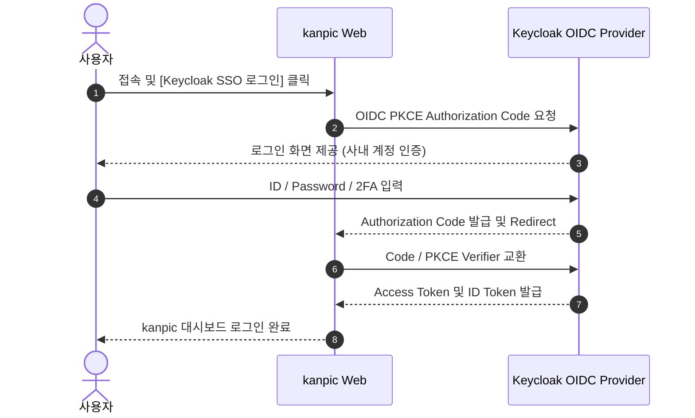
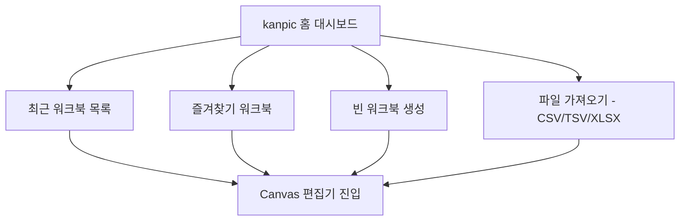
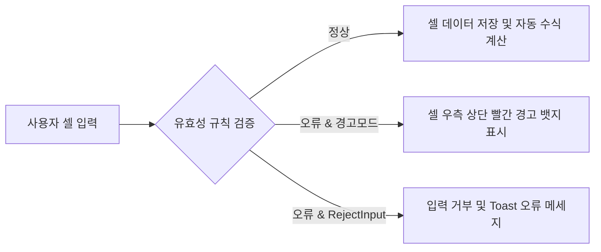

# kanpic 사용자 가이드 (User Guide)

**시스템 버전**: v0.3.0  
**최종 수정일**: 2026년 7월 31일  
**문서 분류**: 일반 사용자용 가이드 (End-User Documentation)

---

## 1. 문서 개요 및 kanpic 소개

**kanpic**은 온프레미스 및 에어갭(Air-Gapped) 폐쇄망 환경을 우선 지원하도록 설계된 **웹 기반 AI 스프레드시트 및 데이터 협업 플랫폼**입니다.

### 1.1 핵심 특징
- **초고속 Canvas 그리드 엔진**: 대용량 웹 스프레드시트 셀 데이터를 지연 없이 부드럽게 렌더링하고 편집합니다.
- **실시간 자동 재계산 수식 엔진**: `SUM`, `AVERAGE`, `CONCAT` 등 다양한 함수와 셀 상호 참조를 실시간 처리합니다.
- **데이터 유효성 검사 (Data Validation)**: 잘못된 데이터 입력을 셀 수준에서 자동 검증하고 경고/입력 거부를 수행합니다.
- **비파괴 필터 뷰 (Filter Views)**: 타 사용자에게 영향을 주지 않고 나만의 데이터 필터링 조건으로 탐색합니다.
- **버전 이력 및 복원 (Version History)**: 주요 시점별 스냅샷 생성 및 원클릭 복원(Rollback)을 지원합니다.
- **강력한 데이터 호환성**: CSV, TSV, XLSX 파일 가져오기 및 내보내기를 완벽 지원합니다.

---

## 2. 시스템 접근 및 인증

### 2.1 로그인 및 SSO (Single Sign-On)
kanpic 시스템 접속 주소(`http://<서버주소>:8080`)로 이동하여 로그인합니다.



1. **기본 관리자/사용자 로그인**: 관리자가 지정한 계정 정보를 입력하여 로그인합니다.
2. **Keycloak OIDC 간편 로그인**: 사내 계정 통합 SSO 버튼을 클릭하여 Keycloak 인증을 거쳐 즉시 진입합니다.

---

## 3. 대시보드 및 워크북 관리

로그인 완료 후 첫 화면인 **홈 대시보드 (`/`)** 구조는 다음과 같습니다.



- **새 워크북 생성**: 상단 `+ 빈 워크북 생성` 버튼을 클릭하여 새로운 스프레드시트를 만듭니다.
- **파일 가져오기 (Import)**: CSV, TSV, XLSX 파일을 드래그 앤 드롭으로 업로드한 후 미리보기 확인 및 원자적 가져오기를 수행합니다.
- **즐겨찾기 지정**: 목록에서 별 아이콘(⭐)을 클릭하여 자주 사용하는 워크북을 상단에 고정합니다.

---

## 4. Canvas 편집기 (Editor) 사용법

### 4.1 셀 선택 및 수식 입력
- **셀 이동 및 입력**: 클릭 또는 방향키(`←`, `↑`, `→`, `↓`)로 선택 후 `Enter` 키 또는 직접 타이핑으로 셀 값을 입력합니다.
- **수식(Formula) 처리**: `=` 문자로 시작하여 수식을 작성합니다.
  - 수학 연산: `=A1 + B1 * 2`, `=SUM(A1:A100)`
  - 집계/통계: `=AVERAGE(C1:C50)`, `=COUNT(D1:D30)`
  - 문자열 조작: `=CONCAT(A1, " ", B1)`
  - 수식 입력 시 상호 참조 셀이 실시간 하이라이트되며 결과가 자동 반영됩니다.

### 4.2 셀 서식 및 스타일링
상단 툴바를 통해 셀의 다양한 서식을 적용할 수 있습니다.

| 서식 항목 | 사용 기능 및 설명 |
| :--- | :--- |
| **글꼴 (Font Family)** | Inter, Pretendard, Noto Sans KR, Arial 선택 |
| **글자 크기 (Font Size)** | 9pt ~ 24pt 크기 지정 |
| **강조 스타일** | **굵게 (Bold)**, *이탈릭 (Italic)*, <u>밑줄 (Underline)</u> |
| **정렬 방식** | 좌측 정렬, 중앙 정렬, 우측 정렬 |
| **색상 지정** | 텍스트 색상 및 셀 배경 fill 색상 팔레트 지정 |

---

## 5. 고급 기능: 데이터 유효성 검사 (Data Validation)

잘못된 데이터 입력을 자동 방지하고 데이터 품질을 유지하기 위한 기능입니다.



### 5.1 유효성 검사 설정 순서
1. 서식을 적용할 셀 또는 셀 범위를 드래그하여 선택합니다.
2. 툴바 상단의 **데이터 유효성 검사 (Data Validation)** 아이콘을 클릭합니다.
3. Dialog 창에서 다음과 같이 규칙을 설정합니다.

```
+-------------------------------------------------------------------+
|                     데이터 유효성 검사 설정                       |
+-------------------------------------------------------------------+
|  규칙 유형 (Rule Type) : [ 목록 (List)                    v ]   |
|  연산자 (Operator)     : [ 목록 포함 (in_list)            v ]   |
|  옵션 값 (Options)     : 승인, 대기, 거절                         |
|  표시 스타일 (Style)   : [ 드롭다운 칩 (Chip)              v ]   |
|  [X] 잘못된 입력 거부 (Reject Input)                             |
|  [X] 셀 내 드롭다운 표시 (Show Dropdown)                         |
+-------------------------------------------------------------------+
|                        [ 취소 ]   [ 규칙 저장 ]                   |
+-------------------------------------------------------------------+
```

### 5.2 지원 규칙 및 연산자

- **목록 (List)**: `in_list` (지정된 선택 항목 목록 제공)
- **숫자 (Number)**: `between`, `not_between`, `greater_than`, `less_than`, `equal`, `not_equal`
- **날짜 (Date)**: 유효한 Date 형식 검증
- **사용자 지정 수식 (Custom Formula)**: 특정 수식 조건(예: `=A1>10`) 만족 여부

---

## 6. 고급 기능: 필터 뷰 & 버전 이력

### 6.1 필터 뷰 (Filter Views)
- **독립적 필터링**: 내가 적용한 필터 조건이 다른 공동 작업자의 화면을 방해하지 않는 비파괴(Non-destructive) 필터 방식입니다.
- **조건 설정**: 특정 열의 텍스트 포함 여부, 숫자 조건, 특정 셀 색상 조건에 따라 조건부 행 숨김을 지원합니다.

### 6.2 버전 관리 및 복원 (Version History)
- 우측 **버전 패널**을 클릭하면 해당 워크북의 변경 이력이 라벨과 함께 저장됩니다.
- 과거 시점 클릭 시 이전 상태를 미리 확인하고 **[이 버전으로 복원]**을 눌러 원클릭 복구할 수 있습니다.

---

## 7. 개인화 설정 및 API 키 (`/preferences`)

1. **테마 변경**: 라이트 모드(Light), 다크 모드(Dark), 시스템 연동 선택.
2. **개인 API 키 발급**:
   - 외부 Python/Bash 스크립트나 커스텀 앱에서 kanpic REST API 호출 시 필요한 API Key를 발급할 수 있습니다.
   - **주의**: API 키는 생성 시 1회만 표시되며, 서버에는 SHA-256 해시로 안전하게 저장됩니다.

---

## 8. 자주 묻는 질문 (FAQ)

> [!TIP]
> **Q. 네트워크가 순간적으로 끊기면 데이터가 손실되나요?**  
> A. 아닙니다. kanpic은 클라이언트 Outbox 동기화 큐를 탑재하여 재연결 시 변경 사항이 순차적으로 자동 동기화됩니다.

> [!NOTE]
> **Q. 엑셀(XLSX) 파일로 내보낼 때 수식도 함께 보존되나요?**  
> A. 네, 표준 수식 및 셀 서식, 값 등이 XLSX 포맷 구조로 완벽히 다운로드됩니다.
