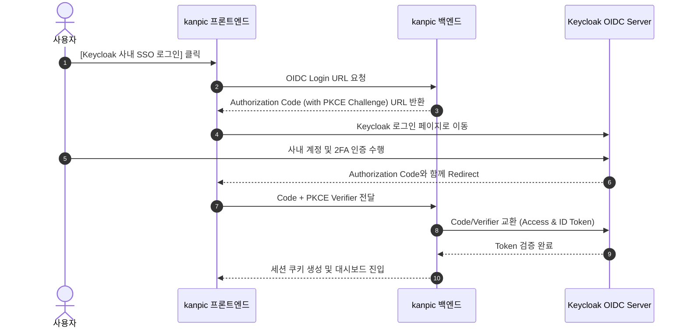
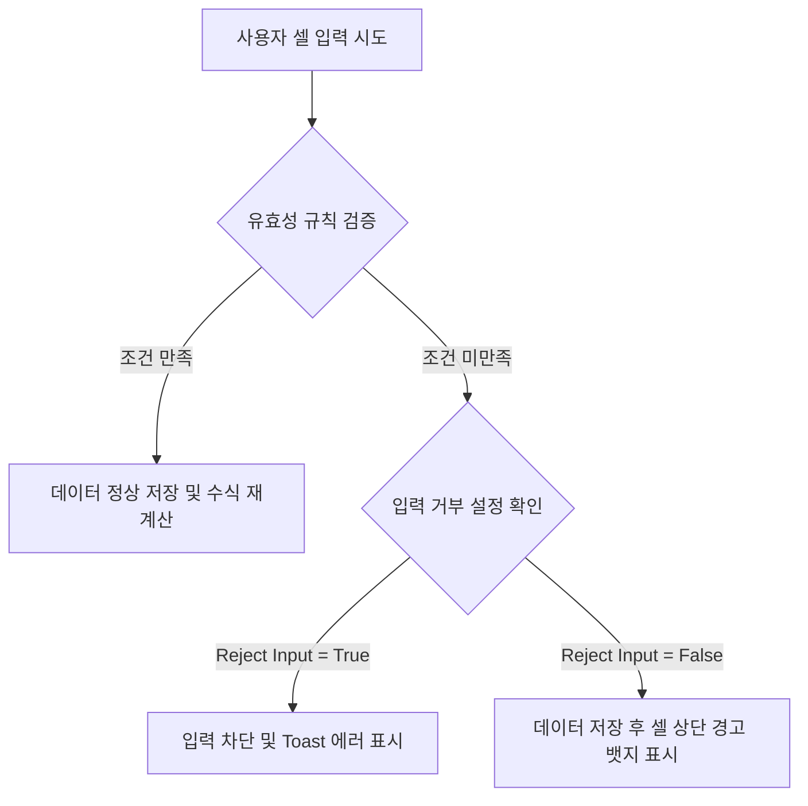

# kanpic 사용자 가이드 (Enterprise User Manual)

- **제품명**: kanpic 데이터 협업 플랫폼  
- **시스템 버전**: v0.18.0
- **문서 버전**: v1.0  
- **최종 수정일**: 2026년 8월 2일
- **문서 분류**: 엔드유저용 최종 사용 설명서 (End-User Manual)  

---

## 1. 문서 개요 및 시스템 소개

### 1.1 kanpic 플랫폼 개요
**kanpic**은 외부 인터넷 연결이 제한된 온프레미스 및 완전 폐쇄망(Air-Gapped) 환경을 우선 지원하도록 설계된 **웹 기반 AI 스프레드시트 및 데이터 협업 플랫폼**입니다. 

기존의 단순 웹 표 편집기를 넘어, 대용량 셀 데이터를 지연 없이 가공하는 **Canvas 렌더링 엔진**, 실시간 수식 평가 시스템, 셀 수준의 **데이터 유효성 검사 (Data Validation)**, 개인별 **비파괴 필터 뷰 (Filter Views)**, 그리고 **Model Context Protocol (MCP)** 기반의 AI 연동 기능을 통합 제공합니다.


### 1.2 핵심 사용자 이점
- **초고속 응답성**: HTML DOM의 성능 한계를 극복한 Canvas 그리드 기술로 수만 개의 셀 데이터도 60fps로 부드럽게 편집합니다.
- **데이터 보안 및 안전성**: 클라이언트 변경사항을 Outbox 큐에 보관하여 네트워크 순간 단선 시에도 데이터 유실을 완벽 방지합니다.
- **협업 충돌 방지**: 내 작업이 타 사용자에게 영향을 주지 않는 필터 뷰와 언제든 과거로 돌아갈 수 있는 버저닝을 지원합니다.

---

## 2. 계정 접속 및 인증 (Authentication)

### 2.1 일반 계정 로그인
관리자가 사전에 발급한 계정(ID)과 비밀번호(Password)를 입력하여 접속합니다.

1. 웹 브라우저에서 `http://<kanpic-서버-주소>:8080`으로 이동합니다.
2. 로그인 화면에서 사용자 ID와 비밀번호를 입력 후 **[로그인]** 버튼을 클릭합니다.

### 2.2 Keycloak OIDC SSO (Single Sign-On) 로그인
사내 SSO 인증 체계(Keycloak)와 연동된 경우 원클릭 인증으로 접속할 수 있습니다.



---

## 3. 메인 대시보드 (`/`) 및 워크북 관리

로그인 성공 시 가장 먼저 나타나는 **홈 대시보드**의 세부 기능 안내입니다.

```
+-----------------------------------------------------------------------------------+
| [kanpic 로고]   [검색어 입력...            ]                [⭐] [알림] [프로필 v] |
+-----------------------------------------------------------------------------------+
|  +-------------------+  +-------------------+  +-------------------+              |
|  | + 빈 워크북 생성  |  | 📁 CSV/XLSX 업로드|  | 📊 예산 템플릿    | (템플릿 영역)|
|  +-------------------+  +-------------------+  +-------------------+              |
|                                                                                   |
|  최근 워크북 목록                                                                 |
|  +-----------------------------------------------------------------------------+  |
|  | ⭐  2026_3분기_재무보고서   | 수정: 10분 전  | 소유자: 나     | [편집] [...]  |  |
|  |     전사_인력_현황_DB     | 수정: 어제     | 소유자: 홍길동 | [편집] [...]  |  |
|  +-----------------------------------------------------------------------------+  |
+-----------------------------------------------------------------------------------+
```

### 3.1 워크북 생성 및 파일 가져오기 (Import)
- **빈 워크북 생성**: `+ 빈 워크북 생성` 카드를 클릭하여 즉시 새 스프레드시트를 만듭니다.
- **템플릿으로 시작**: 빠른 시작 영역의 추천 템플릿을 누르거나 **템플릿 갤러리** 에서 62개 템플릿을 분류·검색해 고릅니다. 템플릿은 표 머리글, 예시 데이터, 계산되는 수식, 통화·백분율 서식, 열 너비, 머리글 고정까지 갖춘 상태로 열립니다.

#### 템플릿 갤러리

| 분류 | 템플릿 |
| --- | --- |
| 재무·회계 | 월간 손익계산서, 현금흐름 관리, 예산 대비 실적, 거래명세서, 견적서, 경비 정산서 |
| 영업·마케팅 | 영업 파이프라인, 고객 관리 대장, 마케팅 캠페인 성과, 월간 매출 분석, KPI 대시보드 |
| 프로젝트 | 프로젝트 현황, 프로젝트 일정표, 업무 요청 관리, 회의록, 리스크 관리 대장 |
| 인사 | 근태 관리, 급여 대장, 채용 진행 현황, 사원 명부, 교육 이수 관리 |
| 운영·재고 | 재고 관리, 발주 관리, 자산 대장, 거래처 관리 대장, 품질 점검 체크리스트 |
| 개인·기타 | 가계부, 주간 플래너, 학습 계획표, 행사 준비 체크리스트 |
| 부동산 | 임대 부동산 포트폴리오, 임대료 관리대장, 주택담보대출 상환 스케줄, 전세·월세 비교, 부동산 취득 비용 계산, 임대 수익률 분석, 아파트 매물 비교, 부동산 현금흐름 추정, 건물 관리비 정산, 임대차 만기 관리 |
| 주식·투자 | 주식 포트폴리오, 배당금 관리, 매매일지, 적립식 투자 계획, 기업가치 상대평가, DCF 기업가치 평가, 자산 배분 리밸런싱, 관심종목 모니터링, ETF 비교, 포트폴리오 위험 관리 |
| 신용평가 | 개인 신용평가 스코어카드, 기업 신용평가, 여신 심사표, 연체 채권 연령분석, 거래처 여신한도 관리, 재무비율 분석 |
| 금융 | 대출 상품 비교, 목표 저축 계획, 은퇴 자금 시뮬레이션, 12개월 자금수지 계획, 외화 자산·환위험 관리, 보험 가입 현황 |
| 수식·함수 | 조회 함수 모음, 조건부 집계 모음, 텍스트 정리 도구, 날짜 계산 도구, 재무 함수 계산기, 통계 분석 기초, 동적 배열 수식, 자동 확장 범위, QUERY 데이터 조회, 논리·오류 처리 |

**수식·함수** 분류는 함수를 배우면서 바로 복사해 쓰라고 만든 실습용 워크북입니다. 각 시트에는 예시 데이터가 들어 있어 열자마자 결과가 계산되어 있고, 옆 칸에 그 수식이 무엇을 하는지 한 줄로 적혀 있습니다. 재무 함수 계산기는 대출 원금·이율·기간만 바꾸면 회차별 원금과 이자가 다시 계산되고, 자동 확장 범위는 `A:A` 참조로 행을 계속 추가해도 집계가 따라오는 구성을, QUERY 데이터 조회는 주문 원본에서 지역별 매출을 한 줄로 뽑아내고 제품별 추세를 셀 안 미니 차트로 보여 줍니다.

부동산·주식·신용평가·금융 템플릿은 단순한 관리대장부터 계산이 필요한 모형까지 함께 제공합니다. 주택담보대출 상환 스케줄과 대출 상품 비교는 원리금 균등 상환식으로 월 상환액과 총이자를 계산하고, DCF 기업가치 평가는 연차별 할인계수와 잔존가치를, 적립식 투자·목표 저축·은퇴 자금은 복리를 적용합니다. 신용평가 템플릿은 가중 배점으로 점수와 등급을, 여신 심사표는 LTV·DTI·DSR을 규제 한도와 비교해 판정합니다.

각 템플릿에는 합계와 비율, 상태 판정 같은 계산이 이미 들어 있습니다. 예를 들어 재고 관리는 `기초+입고-출고`로 현재고를 구하고 재주문점 이하이면 상태에 **재주문** 을 표시하며, 거래명세서는 수량과 단가에서 공급가액·부가세·합계를 계산합니다. 사용하지 않는 예시 행은 지우고 쓰면 됩니다.

REST 클라이언트는 `GET /api/v1/templates`로 목록을 받고 `POST /api/v1/workbooks`에 `template_id`를 넣어 생성합니다. 에이전트는 `spreadsheet.template.list`와 `spreadsheet.workbook.create`의 `template_id` 인자를 사용합니다.
- **파일 가져오기 (Import)**:
  - 지원 포맷: `CSV`, `TSV`, `XLSX` (Excel)
  - `📁 파일 업로드` 버튼을 클릭하거나 파일을 카드 위로 드래그 앤 드롭합니다.
  - 미리보기 대화상자에서 인코딩(UTF-8, EUC-KR 등) 및 첫 행 헤더 여부를 확인하고 **[원자적 가져오기]**를 실행합니다.

### 3.2 워크북 즐겨찾기 및 이력 관리
- **즐겨찾기(⭐)**: 워크북 카드 좌측의 별 아이콘을 클릭하여 대시보드 최상단에 고정합니다.
- **복사 및 삭제**: 워크북 우측의 `...` 메뉴를 클릭하여 워크북을 복제하거나 삭제할 수 있습니다.

---

## 4. Canvas 편집기 (Grid Editor) 상세 가이드

### 4.1 화면 구조 및 단축키 안내

```
+-----------------------------------------------------------------------------------+
| [<] 2026_3분기_재무보고서 (저장됨)                    [공유] [유효성검사] [내보내기]|
+-----------------------------------------------------------------------------------+
| [폰트 v] [11v] [B] [I] [U] | [좌] [중] [우] | [배경색] [글자색] | [필터] [버전이력]  |
+-----------------------------------------------------------------------------------+
| fx | =SUM(B2:B10)                                                                 |
+----+----+-------------------+-------------------+---------------------------------+
|    | A  |         B         |         C         |                D                |
+----+----+-------------------+-------------------+---------------------------------+
| 1  |    | 매출액            | 영업이익          | 당기순이익                      |
| 2  | Q1 | 1,200,000         | 340,000           | 290,000                         |
| 3  | Q2 | 1,450,000         | 410,000           | 360,000                         |
+----+----+-------------------+-------------------+---------------------------------+
```

#### 필수 단축키 (Shortcuts)
- `Ctrl/⌘ + S`: 저장 대기 중인 변경을 서버에 즉시 반영합니다. 변경은 자동 저장도 됩니다.
- `Ctrl/⌘ + Z`, `Ctrl/⌘ + Y`, `Ctrl/⌘ + Shift + Z`: 실행 취소 / 다시 실행합니다.
- `Ctrl/⌘ + F`: 현재 워크북의 모든 시트에서 값과 수식을 검색합니다. `Ctrl/⌘ + K`는 시트·워크북·명령을 찾는 빠른 이동 창을 엽니다.
- `Ctrl/⌘ + /`: 편집기에서 지원하는 전체 단축키 목록을 엽니다.
- 편집기를 열고 `Tab`을 한 번 누르면 **시트로 건너뛰기** 링크가 나타납니다. `Enter`로 도구 모음을 지나 바로 시트에 들어갑니다. 마우스 없이 쓰는 경우 도구 모음의 단추를 마흔 번 넘게 지나칠 필요가 없습니다.
- 대화상자는 열리면 초점을 안에 붙들고, `Esc`로 닫으면 열었던 단추로 초점이 돌아옵니다.
- `Shift + F11`: 새 시트를 추가합니다. `Ctrl/⌘ + Alt + M`은 현재 선택 범위의 댓글 패널을 엽니다.
- `Enter`, `Shift + Enter`, `Tab`, `Shift + Tab`: 셀 입력을 완료하고 아래 / 위 / 오른쪽 / 왼쪽 셀로 이동합니다. `F2`는 셀 편집을 시작하고 `Esc`는 편집을 취소합니다.
- `Ctrl/⌘ + C`, `Ctrl/⌘ + X`, `Ctrl/⌘ + V`, `Ctrl/⌘ + Shift + V`: 복사 / 잘라내기 / 붙여넣기 / 값만 붙여넣기입니다.
- `F4`: 수식을 쓰는 중에 참조 고정을 바꿉니다. `A1` → `$A$1` → `A$1` → `$A1` → `A1` 순으로 돌아가며, 셀 안에서도 수식 입력줄에서도 같습니다. 캐럿이 놓인 참조 하나만 바뀌고, 범위를 골라 두면 그 안의 참조가 함께 바뀝니다. 방금 친 참조 뒤에 캐럿이 있으면 그 참조를 집습니다.
- `Ctrl/⌘ + Enter`, `Ctrl/⌘ + D`, `Ctrl/⌘ + R`: 입력값을 선택 범위에 채우거나 아래 / 오른쪽으로 채웁니다.
- `방향키`, `Shift + 방향키`, `Ctrl/⌘ + 방향키`, `Ctrl/⌘ + Shift + 방향키`: 셀 이동, 범위 확장, 데이터 영역 끝으로 이동 또는 확장합니다.
- `Ctrl + Space`, `Shift + Space`, `Ctrl/⌘ + A`, `Ctrl/⌘ + Home`, `Ctrl/⌘ + End`: 현재 열, 현재 행, 전체 시트, 시트 시작 또는 끝을 선택·이동합니다.
- `Ctrl/⌘ + B`, `Ctrl/⌘ + I`, `Ctrl/⌘ + U`, `Alt + Shift + 5`: 굵게 / 기울임 / 밑줄 / 취소선을 적용합니다.
- `Ctrl/⌘ + Shift + L`, `Ctrl/⌘ + Shift + E`, `Ctrl/⌘ + Shift + R`: 왼쪽 / 가운데 / 오른쪽 정렬을 적용합니다. `Ctrl/⌘ + Shift + 1`~`6`은 숫자·시간·날짜·통화·백분율·지수 표시 형식을 적용합니다.
- `Ctrl/⌘ + H`: 찾기 및 바꾸기를 엽니다. `Ctrl/⌘ + \`는 선택 범위의 서식만 지우고 값과 수식은 유지합니다.
- `Ctrl/⌘ + \``(백틱)`: 값 대신 저장된 수식을 그대로 표시하는 수식 보기를 켜고 끕니다.
- `Alt + =`: 활성 셀 위쪽 또는 왼쪽의 연속된 숫자를 합산하는 `=SUM()` 수식을 만들어 편집 상태로 제안합니다.
- `Ctrl/⌘ + ;`, `Ctrl/⌘ + Shift + ;`: 오늘 날짜와 현재 시간을 입력합니다.
- `Ctrl/⌘ + Alt + =`, `Ctrl/⌘ + Alt + -`: 선택한 행 또는 열을 삽입·삭제합니다. 행·열 전체 선택이 아니면 행과 열 관리 창을 엽니다.
- `Ctrl/⌘ + Alt + 9`, `Ctrl/⌘ + Alt + 0`: 선택 행 또는 열을 숨깁니다. `Ctrl/⌘ + Shift + 9`, `Ctrl/⌘ + Shift + 0`은 숨긴 행·열을 모두 표시합니다.
- `PageUp`, `PageDown`, `Alt + PageUp`, `Alt + PageDown`: 한 화면씩 위·아래 또는 좌·우로 이동합니다. `Shift`와 함께 누르면 범위를 확장합니다.
- `Ctrl/⌘ + PageUp`, `Ctrl/⌘ + PageDown`: 이전 / 다음 시트로 전환합니다.
- `Ctrl/⌘ + Shift + A`: 활성 셀을 포함한 연속 데이터 영역을 선택합니다. `Home`은 행의 첫 열, `End`는 데이터 끝으로 이동합니다.
- `Shift + F10` 또는 `컨텍스트 메뉴 키`: 활성 셀 위치에서 셀 컨텍스트 메뉴를 엽니다.

#### 빠른 이동 (Ctrl/⌘ + K)

`Ctrl/⌘ + K`는 빠른 이동 창을 엽니다. 한 곳에서 다음을 검색해 실행합니다.

워크북 목록 화면에서도 같은 단축키가 열립니다. 그곳에서는 워크북과 그 화면에서 할 수 있는 일(새 워크북, 파일 가져오기, 템플릿 갤러리, 목록 바꾸기)을 찾습니다. 시트와 셀 주소는 워크북을 연 뒤에야 뜻이 생기므로 편집기에서만 나옵니다.

- **시트**: 현재 워크북의 표시된 시트로 이동
- **이름 범위**: 저장된 이름 범위로 이동
- **셀 주소**: `C7`, `A1:D9`처럼 입력하면 현재 시트의 그 범위로 이동
- **워크북**: 접근 권한이 있는 다른 워크북 열기
- **명령**: 공유, 모든 시트 관리, 찾기 및 바꾸기, 수식 보기, 정렬·필터·검증·조건부 서식, 부분합과 부분합 제거, 슬라이서 추가, 데이터 연결, 열 통계, 시트·범위 보호, 편집 기록 표시, 내보내기, 단축키 목록 등

명령은 한글과 영문 검색어를 함께 들고 있어 `subtotal`로도 `소계`로도 찾힙니다. **편집 기록 표시** 는 지금 선택한 셀을 대상으로 열리므로, 팔레트를 열기 전에 보고 싶은 셀에 커서를 두세요.

방향키로 이동하고 `Enter`로 실행하며 `Esc`로 닫습니다. 검색은 이름의 일부만 입력해도 찾을 수 있도록 부분 일치와 초성 순서 매칭을 함께 사용합니다.

#### 대화상자 조작

모든 대화상자는 같은 규칙을 따릅니다.

- `Esc` 또는 배경 클릭으로 닫습니다.
- `Tab`과 `Shift + Tab` 포커스가 창 안에서만 순환합니다.
- 열리면 첫 입력 항목에 자동으로 포커스가 갑니다.
- 닫으면 대화상자를 연 버튼으로 포커스가 돌아가고, 열려 있는 동안 뒤쪽 화면은 스크롤되지 않습니다.

#### 사람 이름 표시

댓글, 멘션 알림, 편집 충돌, 버전 이력, 접속자 커서, 공유 목록은 계정 ID 대신 관리자 디렉터리에 등록된 표시 이름을 보여 줍니다. 표시 이름이 없으면 이메일의 앞부분처럼 읽기 쉬운 형태로 줄여서 표시하고, 정확한 계정은 항목에 마우스를 올리면 툴팁으로 확인할 수 있습니다.

#### 워크북 메뉴와 컨텍스트 메뉴

상단 메뉴 막대의 **파일·수정·보기·삽입·서식·데이터·도구·도움말**은 편집기의 모든 기능을 키보드와 마우스로 동일하게 제공합니다. 방향키로 메뉴 사이를 이동하고 `Enter`로 실행하며, 각 항목에는 대응하는 단축키가 함께 표시됩니다. 수식 보기처럼 켜고 끄는 항목은 현재 상태가 체크 표시로 나타납니다.

마우스 오른쪽 버튼을 사용하면 위치에 맞는 메뉴가 열립니다. 모든 컨텍스트 메뉴는 같은 부품을 사용하므로 방향키로 이동하고 `→`로 하위 메뉴를 열며 `Enter`로 실행하고 `Esc`로 닫습니다.

- **셀 영역**: 잘라내기·복사·붙여넣기·특수 붙여넣기(값만·서식만·행과 열 바꾸기), 행·열 삽입과 삭제, 행·열 이동, 내용 지우기, 서식 지우기, 셀 병합, 정렬·필터·데이터 검증·조건부 서식·이름 범위, 차트·피벗·댓글 만들기, 편집 기록 표시, 선택 범위 링크 복사를 제공합니다. **데이터** 하위 메뉴에는 정렬·검증·조건부 서식에 이어 **부분합…**, **중복 항목 삭제…**, **텍스트를 열로 분할…** 이 함께 있습니다. 세 가지 모두 지금 선택한 범위를 그대로 넘겨받습니다.
- **열 머리글**: 좌우 삽입, 삭제, 내용 지우기, 열 너비 자동 맞춤과 지정, 숨기기와 모두 표시, 해당 열까지 고정, 이 열 기준 오름차순·내림차순 정렬, 필터 보기와 조건부 서식을 제공합니다.
- **행 머리글**: 위아래 삽입, 삭제, 내용 지우기, 행 높이 자동 맞춤과 지정, 숨기기와 모두 표시, 해당 행까지 고정을 제공합니다.
- **왼쪽 위 모서리**: 전체 선택, 붙여넣기, 숨긴 행·열 모두 표시, 고정 해제, 시트 레이아웃을 제공합니다.
- **시트 탭**: 활성 탭이 아니어도 오른쪽 클릭으로 열립니다. 이름 변경, 복제, 다른 워크북으로 복사, 좌우 이동, 탭 색상, 숨기기, 삭제, 모든 시트 관리를 제공하며 메뉴를 열면 그 시트로 이동합니다.
- **시트 탭의 빈 영역**: 새 시트, 모든 시트 관리, 숨긴 시트 목록을 제공합니다. 숨긴 시트 이름을 선택하면 바로 다시 표시합니다.
- **차트**: 차트 설정, 원본 데이터 범위로 이동, SVG·PNG 내보내기, 차트 삭제를 제공합니다.
- **슬라이서**: 값 버튼을 눌러 필터를 켜고 끄며, 머리글을 끌어 옮기고 오른쪽 아래 핸들로 크기를 조절합니다.
- **홈 화면의 워크북 카드**: 열기, 새 탭에서 열기, 공유, 즐겨찾기, 이름 변경, 복제, 링크 복사, 휴지통으로 이동을 제공합니다. 목록의 빈 영역에서는 새 워크북, 파일 가져오기, 휴지통 보기를 제공합니다.
- **워크북 목록은 한 번에 60개씩** 불러옵니다. 목록 위의 검색 상자에 이름의 일부를 넣으면 첫 페이지에 없는 워크북도 찾을 수 있고, **더 보기** 로 다음 60개를 이어서 봅니다. 검색과 필터(내 소유·공유됨·즐겨찾기)는 서버에서 처리하므로 워크북이 수천 개여도 화면이 느려지지 않습니다.

여러 행이나 열을 선택한 상태에서 메뉴를 열면 삽입·삭제·숨기기·크기 조절이 선택한 개수만큼 한 번에 적용됩니다.

`>` 표시가 있는 항목은 하위 메뉴입니다. 마우스를 올리면 **오른쪽에 하위 메뉴가 펼쳐지고**, 화면 오른쪽 끝에 공간이 없으면 왼쪽으로 열립니다. 하위 메뉴는 부모 메뉴 안에서 스크롤되지 않으므로 항목을 찾아 스크롤할 필요가 없습니다. 키보드는 `→`로 하위 메뉴에 들어가고 `←`로 돌아오며, 메뉴 막대에서는 하위 메뉴가 닫힌 상태의 `←`·`→`로 옆 메뉴로 이동합니다.

#### 서식 복사

서식만 다른 셀로 옮길 때 씁니다. 원본 셀을 고르고 툴바의 **붓 아이콘** 을 누른 뒤, 서식을 입힐 셀이나 범위를 클릭하면 됩니다.

- 대상은 원본과 **똑같은 모양** 이 됩니다. 원본에 없는 서식(예: 대상에만 있던 기울임)은 지워지므로 결과가 섞이지 않습니다.
- **값과 수식은 건드리지 않습니다.** 병합 상태도 바뀌지 않습니다.
- 붓을 **두 번 클릭** 하면 계속 사용 상태가 되어 여러 곳에 연달아 입힐 수 있습니다. `Esc` 를 누르거나 붓을 다시 누르면 해제됩니다.

#### 테이블 서식과 테두리

도구 모음의 셀 병합 아이콘 오른쪽에 **테이블 서식** 과 **테두리** 아이콘이 있습니다. 서식 메뉴에서도 같은 기능을 제공합니다.

- **테이블 서식**: 청록·파랑·회색·주황·테두리만 다섯 가지 중에서 고르면 머리글 행, 줄무늬 행, 바깥쪽 굵은 테두리와 안쪽 연한 선이 한 번에 적용됩니다. 셀 하나만 선택하면 주변 데이터 블록 전체가 대상이며, 적용 범위는 메뉴 상단에 표시됩니다. **옵션** 하위 메뉴에서 머리글 행, 줄무늬 행, 테두리, 합계 행 강조를 켜고 끌 수 있고, **테이블 서식 지우기** 는 값과 표시 형식은 남기고 색과 테두리만 제거합니다.
- **테두리**: 모든 테두리, 바깥쪽, 안쪽, 위·아래·왼쪽·오른쪽, 안쪽 가로·세로를 한 번에 그립니다. **선 색** 하위 메뉴에서 색을 고르고, 세부 설정은 **테두리 설정…** 에서 선 종류까지 지정합니다.

#### 메뉴 막대에서 할 수 있는 일

| 메뉴 | 주요 항목 |
| --- | --- |
| 파일 | 저장, 새 워크북·새 시트, 사본 만들기, 워크북 이름 변경, 시트 복제와 다른 워크북으로 복사, XLSX·CSV 내보내기, 인쇄(`Ctrl/⌘ + P`), 페이지 설정, 공유 설정, 버전 이력, 휴지통으로 이동 |
| 수정 | 실행 취소·다시 실행, 잘라내기·복사·붙여넣기, 특수 붙여넣기(값만·서식만·행과 열 바꾸기), 내용·서식 지우기, 찾기와 바꾸기, 전체 선택, 데이터 영역 선택 |
| 보기 | 수식 표시, 눈금선 표시, 전체 화면(`F11`), 확대·축소, 활성 셀 앞까지 고정과 고정 해제, 숨긴 행·열 표시, 시트 숨기기, 시트 레이아웃, 단축키 목록 |
| 삽입 | 행·열 삽입, 행과 열 관리, 차트, 피벗 테이블, 댓글, 이름 범위, 이름 있는 수식, 변경 알림, 자동 합계, 함수(SUM·AVERAGE·COUNT·COUNTA·MAX·MIN·MEDIAN·PRODUCT와 전체 목록), 링크, 드롭다운, 오늘 날짜와 현재 시간 |
| 서식 | 굵게·기울임·밑줄·취소선, 숫자 표시 형식, 맞춤과 줄바꿈, 글꼴, 글꼴 크기, 텍스트 색, 채우기 색, 텍스트 회전, 셀 병합, 조건부 서식, 서식 세부 설정, 서식 지우기 |
| 데이터 | 선택 열 기준 A→Z·Z→A 정렬, 범위 정렬, 필터 보기, 슬라이서 추가, 데이터 연결, 데이터 검증, 피벗 테이블, 이름 범위, 데이터 정리(중복 항목 삭제·공백 제거·부분합 제거, 미리보기), 텍스트를 열로 분할(미리보기), 부분합, 행·열 숨기기, 워크북 검색 |
| 도구 | AI 도우미, 자동화, 프레젠테이션 목록, 차트·피벗 패널, 댓글, 편집 충돌, 개인 환경설정 |
| 도움말 | 함수 목록, 단축키 목록, 빌드 정보 |

#### 셀 입력과 수식 입력창

셀을 선택한 뒤 바로 입력하면 기존 값을 대체하고, `Enter`나 `F2`, 더블클릭으로 열면 기존 값을 이어서 고칩니다. 한글처럼 조합이 필요한 입력기는 첫 글자부터 그대로 조합되며, 조합 중에 누른 `Enter`는 조합을 끝내기만 하고 셀을 저장하지 않습니다.

`Enter`와 `Tab`은 입력을 저장하면서 곧바로 다음 셀로 이동하므로 저장이 끝나기를 기다리지 않고 계속 입력할 수 있습니다. 입력 중에 다른 셀을 클릭하거나 도구 모음을 사용해도 입력하던 값이 저장됩니다. 취소하려면 `Esc`를 누릅니다.

수식 입력창(`fx`)은 활성 셀을 직접 편집합니다. 클릭해서 수식을 고치고 `Enter`로 저장하면 아래 셀로 이동하며, `Esc`로 되돌립니다. 이름 상자나 빠른 이동으로 셀을 옮기면 키보드 초점이 그리드로 돌아오므로 이동 후 바로 입력할 수 있습니다.

#### XLSX 내보내기와 시트 배치

**파일 › XLSX로 내보내기** 는 값·수식·서식과 함께 **시트 배치**도 담습니다. 엑셀에서 열었을 때 kanpic에서 보던 모양과 같도록 하기 위해서입니다.

| kanpic | XLSX |
| :--- | :--- |
| 숨긴 행·열 | 숨김 상태 그대로 |
| 행 높이·열 너비 | 픽셀을 엑셀 단위(포인트·문자 폭)로 환산 |
| 고정 창 | 틀 고정 |
| 행·열 그룹 | 아웃라인 수준(접은 그룹은 숨김까지) |

숨긴 행은 인쇄와 달리 **파일에는 담기되 숨김으로 표시** 됩니다. 인쇄물은 지금 보고 있는 화면이지만, 파일은 데이터 원본이므로 숨겼다는 사실만 옮기고 내용은 남겨 두는 편이 맞습니다.

**데이터 검증 규칙도 함께 옮겨집니다.** 드롭다운 목록, 범위에서 가져오는 드롭다운, 숫자·날짜 조건, 맞춤 수식이 엑셀의 데이터 유효성 검사로 나가고, 반대로 엑셀 파일의 유효성 검사도 읽어 옵니다. 엑셀이 표현할 수 없는 규칙이나 kanpic에 대응이 없는 규칙은 **비슷한 것으로 바꾸지 않고 빼놓습니다.** 잘못된 값을 제안하는 드롭다운은 드롭다운이 없는 것보다 나쁩니다.

**차트도 파일에 담깁니다.** 막대·누적 막대·선·영역·누적 영역·원형·분산 차트가 엑셀 차트로 나가고, 혼합 차트는 막대와 선을 겹친 엑셀 차트가 됩니다. 차트는 원본 셀 범위를 가리키므로 엑셀에서 값을 고치면 차트도 따라 바뀝니다. 히스토그램은 kanpic이 구간을 직접 계산해 그리므로 대응하는 엑셀 차트가 없어 빠집니다. 차트 위치는 셀 기준으로 근사해 배치합니다(엑셀에는 픽셀 위치가 없습니다). 반대 방향(엑셀 차트 읽어 오기)은 아직 지원하지 않습니다.

**조건부 서식도 함께 옮겨집니다.** 값 조건(포함·빈 값 포함), 맞춤 수식, 중복·고유 값, 상위·하위 N개(그리고 백분율), 2색·3색 범위, 데이터 막대, 아이콘 집합이 엑셀의 조건부 서식으로 나가고 반대로도 읽어 옵니다. kanpic이 그리지 못하는 엑셀 아이콘 집합(깃발, 별 등)은 같은 개수의 아이콘으로 바꿔 읽으므로 세 단계·다섯 단계라는 뜻은 남습니다. 날짜 기간이나 평균 초과처럼 kanpic에 없는 규칙, 반대로 엑셀이 표현할 수 없는 규칙은 옮기지 않습니다.

**메모도 함께 옮겨집니다.** 셀에 단 메모는 엑셀의 셀 메모(주석)로 나가고, 엑셀 파일의 셀 메모는 kanpic 메모로 들어옵니다. 값이 없는 셀에 달린 메모도 그대로 옮겨집니다.

**이름 정의도 양방향으로 옮겨집니다.** kanpic에서 만든 이름 있는 범위는 엑셀의 이름 정의로 나가고, 엑셀 파일의 이름 정의도 읽어 옵니다. 한글 이름도 그대로 쓰이며, `=SUM(단가)` 같은 수식은 가져온 직후 첫 계산에서 바로 값을 냅니다. 시트 하나에만 적용되는 이름, 인쇄 영역(`_xlnm.Print_Area`), 상수나 수식을 가리키는 이름, 다른 파일을 가리키는 이름은 kanpic에 대응이 없어 가져오지 않습니다. 미리보기가 **무엇이 몇 개** 빠졌는지 이유별로 알려 주므로 — "시트 전용 1개, 인쇄 영역 1개, 값·수식을 가리키는 이름 1개" — 내 이름이 왜 빠졌는지 알 수 있습니다.

**가져오기가 무엇을 버리는지 미리 알려 줍니다.** 파일을 고르면 나오는 미리보기 대화상자에 차트, 피벗 테이블, 이미지, 외부 파일 연결, 매크로, 옮길 수 없는 이름 정의처럼 kanpic이 아직 읽지 못하는 것이 몇 개 들어 있는지 표시됩니다. 가져온 뒤에 무엇이 없어졌는지 찾아다니지 않아도 됩니다.

**가져오기도 같은 배치를 읽습니다.** XLSX를 올리면 숨긴 행·열, 행 높이·열 너비, 틀 고정, 아웃라인 그룹이 그대로 들어옵니다. kanpic에서 내보낸 파일을 다시 올리면 배치까지 원래대로 돌아오고, 엑셀에서 만든 파일도 그 배치를 유지한 채 열립니다. 파일이 말하는 배치도 요청과 똑같이 검사하므로, 범위를 벗어난 값은 무시됩니다. 값이 쓰인 마지막 행보다 아래에 병합이나 조건부 서식이 있어도 그 아래 행을 숨기지 않습니다.

#### 참조 고정 (F4)

`=단가*수량` 같은 수식을 아래로 채울 때 조회표는 제자리에 있어야 합니다. `$` 를 붙이면 그 자리가 고정되는데, 손으로 치는 대신 **F4** 를 누르면 됩니다.

수식을 쓰는 중에 참조에 캐럿을 두고 F4 를 누를 때마다 `A1` → `$A$1`(행·열 모두 고정) → `A$1`(행만) → `$A1`(열만) → `A1` 순으로 돌아갑니다. 셀 안에서 쓰든 수식 입력줄에서 쓰든 같습니다.

범위를 골라 두면 그 안의 참조가 함께 바뀝니다. `A1:B2` 를 통째로 골라 F4 를 누르면 양쪽 끝이 같이 고정되고, 고른 자리가 그대로 남아 다시 눌러 이어 돌릴 수 있습니다.

`'2분기'!C5` 처럼 시트 이름이 붙은 참조는 시트 이름을 건드리지 않고 셀 부분만 고정합니다. `LOG10(` 처럼 열 이름과 겹치는 함수 이름은 참조로 보지 않습니다.

#### 정렬 순서와 값 안의 숫자

글자를 정렬할 때 값 안의 숫자는 **하나의 수로** 셉니다. `1월, 2월, 3월, 10월, 12월` 순으로 늘어서고 `항목1, 항목2, 항목10` 순이 됩니다.

글자 그대로 견주면 `10월` 과 `12월` 이 `1월` 보다 앞에 옵니다. `0` 이 `월` 보다, `1` 이 `2` 보다 앞이기 때문인데 그렇게 정렬하고 싶은 경우는 거의 없습니다. **엑셀과 구글 시트는 글자 그대로 견주어 그 순서를 냅니다.** kanpic은 일부러 다르게 두었고, 그 순서가 필요하면 **범위 정렬** 대화상자의 **숫자를 글자로 취급** 을 켜면 됩니다.

아주 긴 숫자(계좌번호처럼 열다섯 자리를 넘는 값)도 정확히 정렬합니다. 앞자리를 0으로 맞춘 값(`007호`)은 같은 수인 `7호` 와 순서가 흔들리지 않도록 자릿수를 맞춘 쪽을 앞에 둡니다.

#### 채우기 손잡이로 이어 쓰기

선택 범위 오른쪽 아래 모서리의 작은 사각형을 끌면 값이 이어집니다. `1, 2` 를 끌면 3, 4가, 날짜를 끌면 하루씩, `항목 1` 을 끌면 `항목 2` 가 나옵니다.

**이름도 이어집니다.** `1월` → 2월, `월요일` → 화요일, `1분기` → 2분기, `Jan` → Feb, `Mon` → Tue. 짧은 형태(`월`, `Mon`)와 긴 형태(`월요일`, `Monday`) 모두 됩니다. 12월 다음은 13월이 아니라 **1월**이고, 일요일 다음은 월요일입니다.

씨앗을 두 개 이상 골라 끌면 그 간격을 지킵니다. `월`, `수` 를 함께 끌면 금, 일, 화 순으로 이어집니다. `1월`, `4월` 이면 7월, 10월입니다.

영문은 쓴 모양을 따라갑니다. `mon` 은 `tue`, `MON` 은 `TUE` 입니다.

숫자가 앞에 오는 이름(`3반`, `1차 검토`, `08호`)도 세어 나갑니다. 이쪽은 되돌아올 자리가 없으므로 계속 늘어나며, `08호` 처럼 자릿수를 맞춰 쓴 값은 자릿수를 지킵니다.

목록에 없는 값(`제품A`)이나 간격이 들쭉날쭉한 씨앗은 이어 쓰지 않고 그대로 복사합니다.

#### 입력한 값을 무엇으로 볼지

셀에 `1,234` 를 치면 글자가 아니라 **숫자 1234** 로 들어가고, 보이던 모습(`1,234`)은 표시 형식으로 남습니다. 화면은 친 그대로인데 합계에는 들어갑니다. `₩1,000`, `12.5%`, `(500)`(회계 표기의 음수), `98,000원` 도 같습니다. 백분율은 0.125처럼 비율로 저장되고 화면에는 `12.5%` 로 보입니다.

이미 표시 형식을 지정해 둔 칸에서는 그 형식을 그대로 둡니다. 값을 넣는 것은 서식을 바꾸겠다는 뜻이 아니기 때문입니다.

숫자로 볼 수 없는 것은 글자로 남깁니다. 쉼표가 세 자리씩 끊지 않는 `1,2`(소수점으로 쉼표를 쓰는 표기일 수 있습니다), 전화번호처럼 하이픈이 들어간 값, 날짜가 그렇습니다. 날짜는 `yyyy-mm-dd` 글자로 두고 날짜 계산에서 날짜로 다룹니다.

#### 다른 스프레드시트에서 붙여넣기

엑셀이나 구글 시트에서 범위를 복사하면 클립보드에는 평문과 HTML 표가 함께 올라갑니다. 평문에는 **보이던 글자**만 담기므로 통화 서식이 붙은 `₩1,234.50` 을 그대로 저장하면 숫자가 아니라 글자가 되어 합계가 0이 됩니다.

kanpic은 HTML 쪽을 함께 읽습니다.

- **셀이 실제로 담고 있던 값**을 씁니다. 엑셀은 `x:num`, 구글 시트는 `data-sheets-value` 로 그 값을 알려 줍니다. `12.5%` 는 0.125로, `₩1,234.50` 은 1234.5로 들어옵니다.
- **서식을 함께 가져옵니다.** 굵게, 기울임, 밑줄, 글자색, 배경색, 가로·세로 정렬, 줄바꿈, 글꼴 크기입니다.
- **여러 칸을 차지하는 셀** 뒤로 다음 셀이 밀리지 않도록 자리를 맞춥니다.

HTML이 없는 곳(메모장, 터미널)에서 붙여넣을 때도 보이던 글자를 숫자로 읽습니다. `1,234`, `98,000원`, `(1,234)` 는 숫자로 들어오고 보이던 모습은 표시 형식으로 남습니다. 쉼표가 세 자리씩 끊지 않는 `1,2` 처럼 자릿수 구분으로 볼 수 없는 값, 전화번호, 날짜는 글자 그대로 둡니다.

kanpic에서 복사한 셀을 kanpic에 붙여넣을 때는 수식과 상대 참조까지 그대로 옮기는 기존 경로를 씁니다. **값만 붙여넣기**는 서식도 가져오지 않습니다.

#### 다른 곳으로 복사하기

kanpic에서 복사하면 클립보드에 평문과 HTML 표를 함께 올립니다. 엑셀, 구글 시트, 워드, 슬라이드 어디에 붙여넣어도 굵게·기울임·밑줄·글자색·배경색·정렬·줄바꿈·글꼴이 따라갑니다.

숫자는 보이던 모습과 실제 값을 함께 보냅니다. 받는 쪽이 `₩1,234.50` 을 통화로 알아보지 못해도 숫자 1234.5로 들어가며, 엑셀은 표시 형식까지 그대로 받습니다. 조건에 따라 다르게 보이는 표시 형식(`#,##0;[Red]-#,##0`)은 엑셀이 읽을 수 있는 형태로 옮길 수 없어 보내지 않습니다.

#### 엑셀 차트 가져오기

엑셀 파일 안의 차트도 **함께 들어옵니다.** 종류(막대·선·원·영역·분산형), 제목, 자료 범위를 읽어 kanpic 차트로 다시 그립니다.

계열이 **여러 시트에 걸쳐 있거나 떨어진 자리** 를 가리키는 차트는 되살리지 않고 "차트 N개는 가져오지 않습니다" 라고 알립니다. kanpic의 차트는 이어진 범위 하나를 보기 때문에, 억지로 감싸는 범위를 만들면 원래 뜻과 다른 그림이 됩니다. 엉뚱한 그림을 그려 두면 사람이 그것을 믿게 되므로, 알리고 넘기는 편이 낫습니다.

#### 인쇄 영역

**파일 › 인쇄 영역으로 설정** 을 누르면 지금 고른 범위만 종이에 나갑니다. 정해 두지 않으면 내용이 있는 곳 전체가 나갑니다 — 따로 말하기 전까지는 그쪽이 기대하는 바이기 때문입니다.

해제하려면 **파일 › 인쇄 영역 해제** 를 누릅니다. 인쇄 영역이 없을 때는 이 항목이 눌리지 않습니다.

엑셀 파일에서 가져올 때 그 파일의 인쇄 영역도 **함께 따라옵니다.** 원래 문서가 표 한 덩어리만 내도록 짜여 있었다면 그 뜻이 그대로 지켜집니다. 예전에는 "인쇄 영역 1개를 빼고 가져왔습니다" 라고 알리고 버렸습니다.

XLSX로 내보낼 때도 함께 나갑니다. kanpic에서 정한 인쇄 영역이 엑셀에서도 그대로 인쇄 영역이고, 그 파일을 다시 가져와도 남아 있습니다.

#### 인쇄

인쇄는 화면에 보이는 부분이 아니라 **시트의 사용 범위 전체** 를 서버에서 읽어 문서를 만듭니다. 2만 행을 넘는 시트는 앞의 2만 행만 인쇄하며, 그 사실을 미리 알려 줍니다.

**종이보다 넓은 표는 옆으로 이어서 인쇄합니다.** 열은 화면에서 정한 너비 그대로 찍히고, 한 장에 들어가지 않는 열은 다음 장으로 넘어갑니다. 장마다 열 머리글(A, B, C…)과 행 번호를 다시 찍으므로 어느 장을 봐도 어느 칸인지 알 수 있습니다. 예전처럼 표 전체를 종이 폭에 눌러 담지 않습니다 — 열이 서른 개면 한 열이 몇 밀리미터로 찌그러져 읽을 수 없기 때문입니다.

한 장에 몇 열이 들어가는지는 A4 세로에 좌우 14mm 여백을 기준으로 셉니다. 열 너비를 줄이거나 인쇄 대화상자에서 가로 방향을 고르면 한 장에 더 많이 담을 수 있습니다.

**고정한 행은 장마다 다시 찍힙니다.** 화면에서 **보기 › 틀 고정** 으로 머리글 행을 고정해 두면, 인쇄물의 둘째 장부터도 그 행이 표 맨 위에 나옵니다. 엑셀의 인쇄 제목과 같습니다. 200행짜리 표를 인쇄해도 어느 장에서든 어느 칸이 무슨 뜻인지 알 수 있습니다.

**서식은 화면에서 본 대로 찍힙니다.** 배경색, 글자색, 굵게·기울임·밑줄, 글꼴과 크기, 맞춤, 테두리가 그대로 나옵니다.

**종이 방향과 여백은 파일 › 페이지 설정… 에서 정합니다.** 세로·가로, 좁게·보통·넓게 중에서 고르고, 열이 많은 표는 **한 장 너비에 맞추기** 로 나누지 않고 한눈에 볼 수 있습니다. 맞추면 글자가 작아지므로 열이 아주 많을 때는 가로 방향과 함께 쓰세요. 고른 것은 이 브라우저에 기억되어 다음에도 그대로 쓰입니다 — 같은 표를 여러 번 찍는 일이 흔합니다.

`Ctrl/⌘ + P` 는 기억해 둔 설정으로 바로 인쇄합니다. 설정을 바꾸려면 페이지 설정을 여세요.

**조건부 서식도 함께 나갑니다.** 값에 따라 칠해진 배경색과 글자색은 물론, 데이터 막대는 같은 비율의 띠로, 아이콘 집합은 값 앞의 기호(▲ ▼ ✓ ● 등)로 찍힙니다. 흑백으로 인쇄해도 모양이 남는 기호를 씁니다. 규칙이 재는 칸이 아주 많으면 앞쪽부터 나눠 재며, 도중에 실패해도 인쇄 자체는 진행됩니다 — 색이 빠진 종이가 안 나오는 종이보다 낫습니다.

고정한 행이 다섯 줄을 넘으면 앞의 다섯 줄만 반복합니다. 그보다 많이 반복하면 정작 데이터가 들어갈 자리가 없어지기 때문입니다. 걸러 내거나 숨긴 행은 고정되어 있더라도 인쇄하지 않습니다.

여러 장에 걸치면 **열 머리글(A·B·C…)이 장마다 다시 찍힙니다.** 둘째 장부터 어느 칸이 무슨 열인지 알 수 없으면 인쇄물을 읽을 수 없기 때문입니다. 행 번호는 각 줄 왼쪽에 그대로 붙습니다.

다만 **숨겨진 행은 인쇄하지 않습니다.** 필터로 걸러진 행, 숨긴 행, 접어 둔 그룹 안의 행은 화면에 없으므로 종이에도 나오지 않습니다. 소계만 남기고 접은 보고서를 그대로 인쇄할 수 있습니다. 행 번호는 원래 번호를 유지하므로 인쇄물과 시트를 대조할 수 있습니다.

`Ctrl/⌘ + P` 또는 **파일 › 인쇄** 는 현재 시트에서 값이 있는 범위를 표로 만들어 브라우저 인쇄 화면을 엽니다. 셀의 굵게·기울임·색·정렬·글꼴 크기가 그대로 반영되고, 행과 열 머리글이 함께 인쇄되며, 눈금선은 **보기 › 눈금선 표시** 설정을 따릅니다. 인쇄할 데이터가 없으면 그 사실을 알려 줍니다.

#### 데이터 정리와 텍스트 분할

셀 하나만 선택한 상태에서 정렬·중복 삭제·공백 제거·텍스트 분할·테이블 서식을 실행하면 **그 셀이 속한 데이터 블록 전체** 가 대상이 됩니다. 대상 범위는 시트 전체를 서버에서 읽어 정하므로, 화면에 보이지 않는 아래쪽 행도 빠짐없이 포함됩니다. 실행 전 확인 창에 실제 대상 범위가 표시되니 한 번 더 확인하십시오.

**데이터 › 데이터 정리** 는 선택한 범위(셀 하나만 선택하면 주변 데이터 블록 전체)를 대상으로 실행합니다.

- **중복 항목 삭제**: 같은 내용이 반복되는 행을 첫 번째만 남기고 지운 뒤 아래 행을 위로 당깁니다. 첫 행이 머리글로 보이면 유지합니다.
- **공백 제거**: 텍스트의 앞뒤 공백과 중간의 연속 공백을 정리합니다. 수식 셀은 건드리지 않습니다.
- **텍스트를 열로 분할**: 선택한 첫 번째 열의 값을 쉼표·세미콜론·탭·공백 또는 자동 감지한 구분자로 나눠 오른쪽 열에 채웁니다. 숫자는 숫자로 저장되고, 오른쪽 열에 기존 데이터가 있으면 덮어쓰기 전에 확인을 받습니다.

세 작업 모두 실행 전에 대상 건수를 확인받고, 한 번의 원자적 변경으로 저장되므로 실행 취소와 버전 이력에 그대로 남습니다.

#### 셀 안에서 줄 바꾸기

셀을 편집하는 중에 **`Alt + Enter`** 를 누르면 같은 셀 안에서 줄이 바뀝니다. 주소나 조건처럼 여러 줄로 적어야 읽히는 내용에 씁니다.

- `Enter` 는 지금까지처럼 입력을 끝내고 아래 셀로 넘어갑니다. 줄을 바꾸는 것은 `Alt + Enter` 뿐입니다.
- 줄 바꿈이 있는 셀은 **자동으로 줄바꿈 표시** 됩니다. 행 높이가 모자라면 행 머리글 경계를 두 번 클릭해 맞추거나 직접 높이를 지정하세요.
- 수식 입력창에서도 `Alt + Enter` 로 줄을 바꿀 수 있고, 여러 줄 셀을 수식 입력창에서 고쳐도 줄 바꿈이 사라지지 않습니다.
- 한글 입력기로 조합 중에 누르는 `Enter` 는 글자를 확정할 뿐 줄을 바꾸지 않습니다.

#### 열 통계

**데이터 › 열 통계** 또는 열 머리글 오른쪽 클릭의 **이 열 통계 보기** 를 고르면 오른쪽에 선택한 열의 요약이 나타납니다. 수식을 쓰기 전에 데이터를 훑어볼 때 씁니다.

- 값 있음·빈 셀·고유값·숫자 개수를 먼저 보여 주고, 숫자가 있으면 합계·평균·중앙값·표준편차·최소·최대와 **분포 막대** 를 함께 그립니다.
- 아래에는 **자주 나오는 값** 이 많은 순으로 최대 8개까지 나옵니다. 오타나 표기가 갈린 값을 찾을 때 유용합니다.
- 첫 행이 숫자 열 위의 글자면 머리글로 보고 집계에서 빼며, 그 사실을 화면에 적어 둡니다.
- 화면에 보이는 부분만이 아니라 **서버에서 그 열 전체(최대 2만 행)** 를 읽어 계산합니다. 다른 셀을 고르면 그 열로 즉시 바뀝니다.

#### 셀 메모

셀에 마우스를 올렸을 때 보이는 짧은 설명입니다. 셀을 오른쪽 클릭하고 **삽입 › 메모 삽입…** 을 고릅니다.

- 메모는 **댓글과 다릅니다.** 답글이 달리지 않고 댓글 패널에도 나타나지 않으며, 알림 메일도 가지 않습니다. "이 숫자는 어디서 왔는지"를 적어 두는 용도입니다.
- 메모가 있는 셀은 오른쪽 위 모서리에 작은 표시가 생깁니다. 최대 1,000자까지 쓸 수 있고 `Ctrl+Enter` 로 저장합니다.
- 메모는 값·수식·서식을 건드리지 않고, 반대로 값을 고쳐도 메모는 남습니다. 행이나 열을 옮기면 셀과 함께 따라갑니다.
- 지우려면 다시 열어 **메모 삭제** 를 누릅니다. 화면 낭독기에는 셀을 선택할 때 메모 내용이 함께 읽힙니다.

#### 행·열 그룹화 (아웃라인)

여러 행이나 열을 선택하고 머리글 오른쪽 클릭 메뉴에서 **그룹화** 를 고르면 접었다 펼 수 있는 묶음이 됩니다. 분기별 상세를 접어 두고 요약만 보는 긴 모델에서 씁니다.

- 머리글 옆에 생기는 **아웃라인 여백** 의 `−`·`+` 상자를 눌러 접고 폅니다. 상자는 묶음 바로 다음 행(열)에 놓입니다.
- 묶음 안에 묶음을 넣을 수 있고 최대 8단계까지 중첩됩니다. 단계마다 여백이 한 칸씩 넓어집니다.
- **그룹 해제** 는 선택 범위를 감싼 가장 안쪽 묶음만 풀어, 바깥 묶음은 그대로 둡니다.
- 접기는 묶음 자체의 상태로 저장되므로, 직접 숨겨 둔 행을 펼치기가 되살리지 않습니다.
- 행이나 열을 넣고 지우면 묶음도 함께 움직이고, 묶음이 감싸던 행이 모두 지워지면 묶음도 사라집니다.

#### 행 높이와 열 너비 조절

행 머리글이나 열 머리글을 클릭하면 해당 행·열 전체가 선택되고, 드래그하거나 `Shift + 클릭`하면 연속 범위를 선택합니다. 왼쪽 위 모서리를 클릭하면 시트 전체가 선택됩니다.

이미 선택된 행 머리글이나 열 머리글을 다시 눌러 끌면 그 행·열을 통째로 **다른 위치로 옮길 수 있습니다.** 끄는 동안 놓일 자리에 굵은 안내선이 표시되고, 손을 떼면 그 자리에 들어갑니다. 옮긴 행·열을 가리키던 수식은 새 위치를 가리키도록 다시 쓰이므로 계산 결과는 그대로입니다. 열 너비와 행 높이, 숨김 상태, 그룹, 조건부 서식, 데이터 검증, 필터, 차트 원본, 이름 범위, 댓글도 함께 따라갑니다. 머리글 오른쪽 클릭 메뉴의 **왼쪽으로 이동**/**오른쪽으로 이동**(행은 위/아래)으로 한 칸씩 옮길 수도 있습니다.

머리글 경계선을 드래그하면 실시간 안내선과 픽셀 값을 보면서 크기를 조절할 수 있습니다. 경계선을 더블클릭하면 셀 내용에 맞춰 자동으로 맞춥니다. 여러 행·열을 선택한 상태에서 경계선을 조절하면 선택한 모든 행·열에 같은 크기가 적용됩니다. 변경한 크기는 PostgreSQL에 시트 레이아웃 revision으로 저장되어 다른 공동 편집자에게 즉시 동기화됩니다. 열 너비는 32~600px, 행 높이는 16~400px 범위를 사용합니다.

#### 워크북 검색과 찾기·바꾸기

도구 모음의 검색 버튼이나 `Ctrl/⌘ + F`로 검색 창을, `Ctrl/⌘ + H`로 바꾸기 입력이 열린 상태의 창을 엽니다. 검색은 브라우저에 보이는 셀만이 아니라 PostgreSQL에 저장된 워크북 전체 셀 블록을 대상으로 합니다. 결과에는 시트 이름, A1 주소, 일치한 값 또는 수식이 표시되며, 결과를 선택하면 해당 시트로 전환하고 원거리 셀도 화면 안으로 자동 스크롤합니다. `Shift + Enter`는 창을 닫지 않고 결과를 미리 봅니다.

검색 옵션은 다음과 같이 조합할 수 있습니다.

| 옵션 | 설명 |
| --- | --- |
| `Aa` | 대소문자를 구분합니다. 기본값은 구분하지 않음입니다. |
| `[ ]` | 셀 전체가 검색어와 정확히 일치할 때만 찾습니다. |
| `.*` | 정규식으로 검색합니다. 바꿀 내용에서 `$1` 형태로 그룹을 참조할 수 있습니다. |
| `fx` | 저장된 수식은 검색 대상에서 제외하고 값만 찾습니다. |
| `⊞` | 현재 시트만 검색합니다. 기본값은 워크북 전체입니다. |

**바꾸기**는 목록에서 선택한 셀 하나만 바꾸고, **모두 바꾸기**는 조건에 맞는 모든 셀을 바꿉니다. 실행 전 서버가 변경 대상 셀 수를 미리 계산해 확인을 요청하며, 실제 반영은 시트별로 하나의 원자적 작업으로 처리되어 실행 취소와 버전 이력, 협업 동기화에 그대로 포함됩니다. 수식 셀은 값이 아닌 수식 문자열을 바꾼 뒤 서버가 다시 계산하고, 배열 수식 결과 셀은 변경하지 않고 건너뜁니다. 한 번에 5,000셀을 넘는 바꾸기는 범위를 좁히도록 거부합니다.

에이전트는 `workbook.read` scope의 MCP 도구 `spreadsheet.workbook.search`와 `range.write` scope의 `spreadsheet.workbook.replace`를 사용합니다. REST 클라이언트는 `GET /api/v1/workbooks/{workbookId}/search?q=검색어&limit=50&offset=0`과 `POST /api/v1/workbooks/{workbookId}/search:replace`를 호출합니다. 검색은 `match_case`, `whole_cell`, `regex`, `skip_formulas`, `sheet_id` 질의 매개변수를 지원하고, 바꾸기는 같은 조건에 `replacement`, `preview`, `range`, `idempotency_key`를 함께 받습니다. 한 페이지는 최대 200건이며 응답의 `next_offset`이 있을 때 다음 페이지를 조회합니다.

---

### 4.2 수식(Formula) 엔진 및 함수 레퍼런스

kanpic은 문맥 인식 수식 파서를 통해 셀 참조와 계산을 실시간으로 수행합니다. 모든 수식은 `=` 기호로 시작합니다.

편집기의 **도움말 › 함수 목록** 은 서버가 실제로 계산할 수 있는 함수 200여 개를 그대로 보여 줍니다. 목록에 없는 함수는 `#NAME?` 오류를 반환합니다. **삽입 › 함수** 에서 자주 쓰는 집계 함수를 선택하면 선택한 범위를 인수로 채운 수식이 바로 입력됩니다.

#### 선택 범위 요약

여러 셀을 선택하면 시트 탭 줄 오른쪽에 **합계·평균·개수** 가 바로 나타납니다. 수식을 쓰지 않고 숫자를 확인할 때 쓰는 자리입니다.

- 요약을 클릭하면 표시할 항목을 고를 수 있습니다. 합계, 평균, 숫자 개수, 개수, 최소, 최대 중에서 여러 개를 켜 둘 수 있고 선택은 브라우저에 기억됩니다.
- 숫자가 아닌 셀은 **개수** 에만 반영되고 합계·평균에는 들어가지 않습니다. 텍스트로 저장된 숫자는 숫자로 셉니다.
- 한 셀만 선택했거나 선택 범위가 비어 있으면 표시하지 않습니다.
- 화면에 보이는 부분만이 아니라 **선택한 범위 전체를 서버에서 읽어** 계산합니다. 수천 행을 선택해도 합계가 맞습니다. 10만 셀을 넘는 선택은 셀 개수만 표시합니다.

#### 열 값 자동완성

빈 셀에 글자를 입력하면 **같은 열에 이미 쓰인 값** 이 아래에 제안됩니다. 부서명이나 분류처럼 같은 값을 반복해 넣는 열에서 오타 없이 빠르게 채울 수 있습니다.

- `Tab` 을 누르면 선택된 제안이 채워집니다. `↑`·`↓` 로 다른 제안을 고르고 `Esc` 로 닫습니다.
- `Enter` 는 언제나 입력한 그대로 확정합니다. 기존 값의 앞부분과 같은 새 값을 넣을 때 마음대로 바뀌지 않습니다.
- 자주 쓰인 값이 먼저 나오고, 수식이 든 셀과 숫자는 제안하지 않습니다. `=` 로 시작하면 함수 자동완성으로 바뀝니다.

#### 함수 자동완성

셀에서 `=`를 입력하고 함수 이름을 몇 글자 치면 아래에 후보가 나타납니다. `↑`·`↓`로 옮기고 `Tab`이나 `Enter`로 넣으면 괄호까지 열립니다. 괄호 안에서는 지금 입력 중인 인수가 굵게 표시된 사용법이 계속 보이므로, 인수 순서를 확인하러 문서를 찾을 일이 없습니다. `Esc`를 누르면 제안만 닫히고 편집은 그대로 이어집니다.

**수식 입력창(`fx`)에서도 똑같이 동작합니다.** 긴 수식은 셀보다 입력창에서 쓰는 편이 편한데, 안내가 필요한 것도 그쪽이기 때문입니다.

이름을 끝까지 친 경우에는 그 함수가 항상 첫 번째입니다. `TEXT` 를 다 치고 `Tab` 을 눌렀을 때 `TEXTJOIN` 이 들어가는 일은 없습니다. `SUM(값1, 값2, …)` 처럼 값을 계속 받는 함수는 네 번째, 다섯 번째 값에서도 `…` 부분이 계속 표시됩니다.

#### 행·열을 추가해도 범위가 따라옵니다

행이나 열을 넣거나 지우면 그 변화에 맞춰 **모든 수식의 참조가 자동으로 조정됩니다.**

- 범위 안쪽에 행을 넣으면 범위가 늘어납니다. `=SUM(A1:A5)`가 있는 시트의 3행 위에 행을 넣으면 `=SUM(A1:A6)`이 됩니다.
- 범위 위쪽에 넣으면 범위 전체가 밀려 내려갑니다. `$` 고정 표시는 그대로 유지됩니다.
- 다른 시트를 가리키는 참조는 그 시트가 바뀔 때만 움직이고, 시트 이름을 바꿔도 수식은 새 이름으로 다시 쓰입니다.
- 참조하던 셀이 통째로 지워지면 해당 부분만 `#REF!`가 되어 어디를 고쳐야 하는지 바로 보입니다.
- 병합 범위, 조건부 서식, 데이터 유효성, 필터 뷰, 차트 원본, 이름 지정 범위, 댓글 위치도 같은 규칙으로 함께 움직입니다.
- 행이나 열을 **옮길 때도** 같은 조정이 일어납니다. 옮긴 자리를 가리키던 참조는 새 위치를 따라가고, 옮긴 행·열이 지나간 자리의 참조는 한 칸씩 당겨집니다. 이동은 아무것도 지우지 않으므로 `#REF!`가 생기지 않습니다. 범위 한가운데를 옮겨 범위가 둘로 갈라지는 경우에는 원래 범위가 담고 있던 셀을 모두 포함하도록 범위가 넓어집니다. 합계에서 셀이 조용히 빠지는 것보다 낫기 때문입니다.

#### IMPORTRANGE — 다른 워크북의 데이터 가져오기

`=IMPORTRANGE("워크북 주소", "시트!범위")` 는 다른 워크북의 범위를 이 시트로 가져옵니다. 부서별 원장에서 요약 보고서를 만들거나, 공통 기준표를 한 곳에서 관리할 때 씁니다.

- 첫 번째 인자에는 워크북 ID 또는 편집기 주소를 그대로 붙여 넣을 수 있습니다. 두 인자 모두 큰따옴표 안에 직접 적어야 하며, 셀 참조는 사용할 수 없습니다.
- 시트 이름을 빼고 `"A1:C10"` 만 적으면 원본 워크북의 첫 번째 시트를 가져옵니다.
- 결과는 범위 모양 그대로 아래·오른쪽으로 펼쳐집니다(스필). `=SUM(IMPORTRANGE(...))` 처럼 다른 함수로 감쌀 수도 있습니다.
- **권한**: 가져오는 쪽 워크북의 **소유자**가 원본 워크북을 읽을 수 있어야 합니다. 편집자가 임의로 남의 데이터를 끌어올 수 없고, 반대로 편집자가 바뀌어도 수식이 멈추지 않습니다. 권한이 없으면 값 대신 `#REF!` 와 함께 "원본 읽기 권한이 없습니다"라는 이유가 표시되고, 원본을 공유한 뒤 다시 계산하면 값이 들어옵니다.
- **새로 고침**: IMPORTRANGE는 휘발성 함수라 이 워크북을 편집할 때마다 다시 읽습니다. 원본이 바뀌었는데 값이 그대로면 아무 셀이나 고쳤다 되돌리면 갱신됩니다.
- **데이터 › 데이터 연결…** 을 열면 이 워크북이 가져오는 모든 원본이 한 곳에 나옵니다. 원본 워크북 이름과 범위, 가져온 크기, 그 값을 쓰는 셀 주소가 보이고, 읽을 수 없게 된 연결은 붉게 표시되며 이유를 알려 줍니다. 패널 위의 새로 고침 버튼을 누르면 모든 IMPORTRANGE가 원본을 다시 읽고, 갱신 시각이 아래에 남습니다.
- 새로 고침은 워크북 버전을 올리므로 함께 보고 있는 사람에게도 같은 값이 전달됩니다.
- 한 번에 가져올 수 있는 셀은 20,000개, 한 워크북에서 쓸 수 있는 IMPORTRANGE는 서로 다른 대상 기준 50개까지입니다. 같은 워크북을 가리키면 거부됩니다. 그 경우에는 `시트이름!A1` 로 직접 참조하세요.

#### 슬라이서 — 시트 위의 필터 버튼

**데이터 › 슬라이서 추가** 는 선택한 열의 값 목록을 시트 위에 카드로 띄웁니다. 필터 메뉴를 열 필요 없이 값을 눌러 켜고 끌 수 있어, 워크북을 읽기만 하는 사람에게 필터를 넘겨줄 때 씁니다.

- 슬라이서는 필터 보기를 **대신하지 않고 조작합니다.** 카드에서 값을 끄면 그 열의 필터 조건이 바뀌고, 행은 필터 보기가 숨기던 방식 그대로 숨겨집니다. 열 머리글의 깔때기 메뉴로 바꾼 내용과 카드가 항상 같은 상태를 가리킵니다.
- 시트에 필터 보기가 아직 없으면 선택한 데이터 범위로 하나 만들지 물어본 뒤 슬라이서를 놓습니다.
- 카드 머리글을 끌어 옮기고 오른쪽 아래 핸들로 크기를 조절합니다. 위치와 크기는 시트 레이아웃에 저장되어 다른 공동 편집자에게도 같게 보입니다.
- 값 목록은 화면에 불러온 셀이 아니라 서버에서 읽은 필터 범위 전체에서 만들어집니다. 화면 밖의 값이 목록에서 빠지지 않습니다.
- 머리글의 되돌리기 버튼은 그 열의 필터만 지우고, 휴지통 버튼은 슬라이서 카드만 지웁니다. 필터 조건은 그대로 남습니다.
- 행·열을 삽입·삭제·이동하면 슬라이서가 가리키는 열도 함께 움직이고, 그 열이 삭제되면 슬라이서도 사라집니다. 한 시트에 최대 24개까지 놓을 수 있습니다.

#### 열 전체 참조 (`A:A`)

`=SUM(A:A)`처럼 열이나 행 전체를 가리킬 수 있습니다. 표 아래에 행을 계속 추가해도 범위를 고칠 필요가 없어, 계속 쌓이는 입력 시트에 특히 편합니다.

- `A:A` 한 열, `A:C` 여러 열, `2:5` 여러 행, `A2:A` 머리글을 뺀 열린 범위를 모두 지원합니다.
- 계산은 그 시트에 실제로 값이 있는 범위까지만 이뤄지므로 빈 100만 행을 훑지 않습니다.
- 수식이 자기 자신이 있는 열을 가리키면 순환 참조(`#CIRC!`)가 되므로, 합계는 다른 열이나 다른 시트에 두십시오.
- 열을 추가하면 `A:A`도 `B:B`로 함께 이동합니다.

#### 1. 수학 및 통계 함수
- `=SUM(범위)`: 지정한 범위 내 모든 수치의 합계를 구합니다. (예: `=SUM(B2:B10)`)
- `=AVERAGE(범위)`: 지정한 범위의 평균값을 계산합니다. (예: `=AVERAGE(C2:C50)`)
- `=MIN(범위)` / `=MAX(범위)`: 최솟값 및 최댓값을 추출합니다.
- `=MEDIAN(범위)`: 중앙값을 구합니다.
- `=PRODUCT(범위)`: 값을 모두 곱합니다.
- `=COUNT(범위)` / `=COUNTA(범위)` / `=COUNTBLANK(범위)`: 숫자 셀, 비어 있지 않은 셀, 빈 셀의 개수를 셉니다.
- `=ROUND(수치, 자릿수)` / `=ROUNDUP(...)` / `=ROUNDDOWN(...)`: 반올림·올림·내림을 수행합니다.
- `=ABS(수치)` / `=INT(수치)` / `=SQRT(수치)`: 절댓값, 내림 정수, 제곱근을 반환합니다.
- `=MOD(수치, 나눌 수)` / `=POWER(밑, 지수)`: 나머지와 거듭제곱을 계산합니다.
- `=SUMIF`, `=SUMIFS`, `=COUNTIF`, `=COUNTIFS`: 조건에 맞는 값만 집계합니다.
- `=AVERAGEIF`, `=AVERAGEIFS`, `=MAXIFS`, `=MINIFS`: 조건에 맞는 값의 평균·최대·최소를 구합니다.
- `=SUMPRODUCT(범위1, 범위2)`: 같은 위치끼리 곱해 더합니다. 가중 평균에 씁니다.
- `=SUBTOTAL(번호, 범위)`: 1~11 번호로 합계·평균·개수 등 집계 방법을 고릅니다.
- `=CEILING`, `=FLOOR`, `=MROUND`, `=TRUNC`, `=QUOTIENT`, `=SIGN`, `=GCD`, `=LCM`, `=FACT`, `=COMBIN`: 자릿수·배수·정수 계산을 다룹니다.
- `=EXP`, `=LN`, `=LOG`, `=LOG10`, `=PI`, `=RADIANS`, `=DEGREES`, `=SIN`~`=TANH`: 지수·로그·삼각 함수입니다.
- `=RAND()`, `=RANDBETWEEN(하한, 상한)`: 난수를 만듭니다. 워크북이 바뀔 때마다 다시 계산됩니다.
- `=STDEV`, `=STDEVP`, `=VAR`, `=VARP`: 표본과 모집단의 표준편차·분산을 구합니다.
- `=LARGE`, `=SMALL`, `=RANK`, `=PERCENTILE`, `=QUARTILE`, `=MODE`, `=COUNTUNIQUE`: 순위와 분포를 살핍니다.
- **엑셀 2010 이후의 점 붙은 이름도 그대로 씁니다.** `=STDEV.S`, `=STDEV.P`, `=VAR.S`, `=VAR.P`, `=MODE.SNGL`, `=RANK.EQ`, `=PERCENTILE.INC`, `=QUARTILE.INC`, `=FORECAST.LINEAR`, `=COVARIANCE.P` 는 각각 위의 예전 이름과 **같은 값** 을 냅니다. 오늘 엑셀에서 만든 파일을 가져오면 이 이름들이 들어 있습니다.
- **이름이 비슷해도 셈이 다른 것들이 있습니다.** `=PERCENTILE.EXC`, `=QUARTILE.EXC` 는 양 끝을 자료 밖에 두므로 포함형과 값이 다릅니다 — 네 개짜리 자료에서 1사분위가 포함형은 1.75, 배타형은 1.25입니다. 배타형은 답할 수 있는 범위가 좁아 `0`이나 `1`을 넣으면 `#NUM!` 입니다. `=RANK.AVG` 는 동점자에게 그들이 차지한 등수의 **평균** 을 줍니다(`RANK` 는 모두에게 가장 높은 등수를 줍니다).
**차트에 값을 적고 세로축 범위를 정할 수 있습니다.** 차트 설정에서 **막대와 점에 값 표시** 를 켜면 눈금을 짚어 읽지 않아도 됩니다 — 인쇄물이나 보고 자료에서 특히 그렇습니다. 소수는 두 자리까지만 적습니다.

**세로축 최소·최대** 를 비워 두면 자료에 맞춥니다. 정하면 그대로 씁니다 — 0에서 시작하지 않으면 작은 차이가 크게 보이므로, 정하는 것은 뜻을 가지고 하는 일입니다. 최대가 최소보다 작거나 같으면 그릴 수 없으므로 저장되지 않습니다. 두 설정 모두 XLSX 로 내보낼 때 함께 나갑니다.

**지켜보는 범위가 바뀌면 메일로 알려 드립니다.** **삽입 › 변경 알림…** 에서 범위와 이름을 적어 두면 됩니다. 범위를 비우면 시트 전체를 지켜봅니다.

**내가 고친 것은 나에게 보내지 않습니다.** 자기 손으로 바꾼 것을 메일로 다시 받는 것은 알림이 아니라 소음입니다. 한 번 저장에 칸이 500개 바뀌어도 **메일은 한 통** 이고, 같은 사람이 겹치는 범위를 여럿 지켜봐도 한 통으로 묶습니다.

메일에는 **무엇이 몇 칸 바뀌었는지만** 담고 바뀐 값은 담지 않습니다. 메일은 워크북 권한 밖으로 나가므로, 값을 실으면 볼 권한이 없는 곳으로 자료가 새어 나갑니다.

**지켜보는 범위는 행과 열을 따라 움직입니다.** `B5:B9` 를 지켜보는 중에 위에 한 행을 끼우면 규칙도 `B6:B10` 이 됩니다. 조건부 서식이나 보호 범위와 같습니다. 꺼 둔 규칙도 같이 움직이므로 다시 켜도 제 칸을 봅니다. 지켜보던 칸이 통째로 지워지면 볼 것이 없으므로 규칙도 사라집니다.

켜고 끄기는 언제든 됩니다. 내가 건 것만 보이고 남이 무엇을 지켜보는지는 보이지 않습니다 — 누가 무엇을 보고 있는지는 그 사람의 일입니다. 관리자는 **관리 › 설정** 에서 이 메일을 통째로 끌 수 있습니다.

#### 표

**범위에 이름을 붙이면 열 이름으로 가리킬 수 있습니다.** **삽입 › 표…** 에서 범위와 이름을 정합니다.

```
=SUM(매출표[금액])      금액 열의 자료 줄
=SUM(매출표)           표 전체 (머리글 제외)
=COUNTA(매출표[#전체])  머리글까지
=COUNTA(매출표[#머리글]) 머리글 줄만
```

**이것이 범위로 적는 것과 다른 점입니다.** `=SUM(C2:C50)` 은 위에 행을 하나 끼우면 사람이 옮겨 적어야 하고, 잊으면 **조용히 틀린 값** 을 냅니다. 표는 행과 열이 움직이면 함께 움직이므로 수식이 그대로 맞습니다.

첫 줄이 머리글이면 그 글자가 열 이름이 됩니다. 머리글을 `금액` 에서 `매출액` 으로 고치면 `매출표[금액]` 은 **그 자리에서 `#REF!`** 가 됩니다 — 없어진 열의 옛 답이 맞는 답인 양 남는 것보다 낫기 때문입니다. 머리글이 없는 표는 `열1`, `열2` 로 셉니다.

**표 바로 아래 줄에 값을 넣으면 표가 그 줄을 삼킵니다.** 자료를 한 줄 더 붙이는 것은 가장 흔한 일인데, 그때마다 범위를 손으로 늘려야 한다면 `=SUM(매출표[금액])` 은 새 줄을 빼고 셈합니다 — 답이 나오기는 하는데 틀린 답입니다. 한 줄 건너뛴 자리나 빈 칸은 삼키지 않고, 옆으로도 늘어나지 않습니다.

이름이 겹치거나 표끼리 서로 걸치면 만들 때 막습니다. 겹친 이름은 어느 것을 가리키는지 알 수 없고, 걸친 표는 한쪽에서 행을 지우면 다른 쪽이 어그러집니다.

**XLSX 로 내보내면 엑셀의 표로 나가고, 가져올 때 다시 표가 됩니다.** 엑셀에서도 같은 이름으로 가리킬 수 있습니다.

**자주 쓰는 셈은 한 번만 정의합니다.** **삽입 › 이름 있는 수식…** 에서 이름과 매개변수, 수식을 적어 두면 워크북 어디서나 함수처럼 부를 수 있습니다.

```
이름      마진율
매개변수  매출, 원가
수식      (매출-원가)/매출

쓰는 법   =마진율(A1, B1)
```

이름과 매개변수에 **한글을 쓸 수 있습니다.** 팀에서 쓰는 셈의 이름은 대개 우리말입니다. 이름 있는 수식끼리 부를 수도 있고, 안에서 `SUM` 같은 내장 함수와 셀 범위를 그대로 씁니다.

**정의를 고치면 그것을 쓰는 모든 칸이 함께 바뀝니다.** 한 번 정의해 두는 뜻이 그것입니다. 지우면 쓰던 칸은 `#NAME?` 이 됩니다 — 조용히 예전 값을 남기면 아직 살아 있는 줄 알기 때문입니다.

저장하기 전에 수식이 실제로 풀리는지 확인합니다. `SUM` 처럼 이미 있는 함수 이름, 셀 주소처럼 보이는 이름, 겹치는 매개변수, 자기 자신을 부르는 정의는 저장되지 않습니다. 셈이 되지 않는 것을 저장해 두면 그것을 쓰는 모든 칸이 한꺼번에 깨지기 때문입니다.

자동완성에도 함께 나오므로 만들어 두면 팀원이 찾을 수 있습니다. 한 워크북에 200개까지, 매개변수는 16개까지입니다.

**XLSX 로 내보내면 엑셀의 `LAMBDA` 정의된 이름으로 나갑니다.** `마진율(매출, 원가)` 은 `_xlfn.LAMBDA(매출,원가,(매출-원가)/매출)` 로 적히므로 엑셀 365에서 `=마진율(A1,B1)` 이 그대로 동작합니다. kanpic 안에서는 되는데 파일로 꺼내면 깨지는 것이야말로 사람을 놀라게 하기 때문입니다.

매개변수가 없어도 `LAMBDA` 로 감쌉니다. 값만 적으면 엑셀에서는 `기준연도` 로, kanpic 에서는 `기준연도()` 로 부르게 되어 **부르는 법이 파일을 건너며 달라집니다.**

매개변수 이름에는 파일 안에서 `_xlpm.` 이 붙습니다. 함수 이름의 `_xlfn.` 과 같은 까닭으로, 파일 안에서 그 이름이 정의된 이름과 부딪히지 않게 하는 표시입니다. 화면에 보이는 이름에는 없습니다.

**엑셀의 `LAMBDA` 정의된 이름은 가져올 때 이름 있는 수식으로 돌아옵니다.** 내보낸 파일을 도로 열면 이름이 그대로 있고, 그 이름을 부르는 칸도 다시 계산됩니다. 다만 값이나 범위를 가리키는 보통의 정의된 이름은 이름 범위이거나 kanpic 에 담을 자리가 없는 것이므로, 지금까지처럼 가져오기 요약에서 알려 드립니다.

- **분포 함수도 씁니다.** 정규(`=NORMDIST`, `=NORMSDIST`, `=NORMINV`, `=NORMSINV`, `=GAUSS`, `=STANDARDIZE`, `=CONFIDENCE`), 로그정규(`=LOGNORMDIST`, `=LOGINV`), 이항(`=BINOMDIST`, `=NEGBINOMDIST`, `=CRITBINOM`), 포아송·지수·와이블·초기하(`=POISSON`, `=EXPONDIST`, `=WEIBULL`, `=HYPGEOMDIST`), 피셔 변환(`=FISHER`, `=FISHERINV`)이 있습니다.

  이항과 포아송은 큰 수에서도 넘치지 않습니다 — `=BINOMDIST(500,1000,0.5,FALSE)` 처럼 계승을 곱해 나가면 무한대가 되는 자리를 감마의 로그로 지납니다. 되돌리는 쪽(`INV`)은 0과 1 **사이** 의 확률만 받고, 양 끝은 `#NUM!` 입니다.

- **복소수는 글자로 주고받습니다.** `=COMPLEX(3,4)` 는 `"3+4i"` 를 냅니다. `=IMREAL`, `=IMAGINARY`, `=IMABS`, `=IMARGUMENT`, `=IMCONJUGATE`, `=IMSUM`, `=IMSUB`, `=IMPRODUCT`, `=IMDIV`, `=IMPOWER`, `=IMSQRT`, `=IMEXP`, `=IMLN`, `=IMLOG10`, `=IMLOG2` 가 그 글자를 읽고 다시 적습니다.

  허수 단위는 `i` 와 `j` 를 모두 쓰며, **적어 준 쪽으로 답합니다.** 다만 한 식 안에서 둘을 섞으면 어느 쪽으로 적을지 정할 수 없어 `#VALUE!` 입니다. 허수부가 `1`이나 `-1`이면 숫자를 적지 않고(`"i"`, `"-i"`), 한쪽이 `0`이면 그쪽을 적지 않습니다.

- **한글은 두 바이트로 셉니다.** `=LEN("한글")` 은 2지만 `=LENB("한글")` 은 4입니다. 자리를 바이트로 세는 `=LEFTB`, `=RIGHTB`, `=MIDB`, `=FINDB`, `=SEARCHB`, `=REPLACEB` 도 있습니다. 고정 폭으로 만든 예전 시스템의 자료를 다룰 때 필요합니다.

  두 바이트짜리 글자의 **가운데가 잘리면 그 반쪽을 공백 하나로** 바꿉니다 — 반쪽 글자를 낼 수는 없기 때문입니다. `=LEFTB("한글",1)` 은 공백 하나, `=LEFTB("한글",3)` 은 `"한 "` 입니다.

  붙여넣은 글에 전각 숫자가 섞여 숫자로 읽히지 않을 때는 `=ASC` 로 반각으로 바꿉니다. 반대는 `=JIS`(또는 `=DBCS`)입니다.

- **주말이 토·일이 아닌 곳도 있습니다.** `=NETWORKDAYS.INTL`, `=WORKDAY.INTL` 은 주말을 숫자(`1`~`7`, `11`~`17`)로 고르거나 월요일부터 일곱 글자(`"0000011"`)로 적습니다. 일곱 자리가 모두 `1` 이면 일할 날이 없으므로 `#VALUE!` 입니다.

- **로마 숫자.** `=ROMAN(499)` 는 `CDXCIX`, `=ROMAN(499,4)` 는 `ID` 입니다. 형식 `0`~`4`로 짧기를 고르고, `=ARABIC` 은 짧게 적은 꼴도 되읽습니다. `=EPOCHTODATE` 는 1970년부터 센 시각을 날짜로 바꿉니다.

- **이자를 여러 번 주는 채권도 다룹니다.** `=PRICE`, `=YIELD`, `=DURATION`, `=MDURATION`, `=ACCRINTM` 와, 그 바탕이 되는 지급일 계산 `=COUPPCD`, `=COUPNCD`, `=COUPNUM`, `=COUPDAYS`, `=COUPDAYBS`, `=COUPDAYSNC` 입니다. 횟수는 `1`(연), `2`(반년), `4`(분기)입니다.

  지급일은 만기일에서 거꾸로 물러나며 잡습니다. **만기일이 그 달의 마지막 날이면 지급일도 모두 마지막 날** 입니다 — 2월을 지나며 날짜가 밀리면 기간 길이가 어긋나기 때문입니다. `=PRICE` 는 지난 지급일부터 결제일까지의 **경과이자를 빼고** 값을 냅니다. 사는 쪽이 파는 쪽에 따로 주는 몫이라 가격에 넣으면 그만큼 부풀어 오릅니다.

  기준 `2`(실제/360)와 `3`(실제/365)에서는 `=COUPDAYBS` 와 `=COUPDAYSNC` 를 더해도 `=COUPDAYS` 가 되지 않습니다. 기간 길이는 360이나 365를 횟수로 나눈 값인데 앞뒤 날 수는 진짜 날짜를 세기 때문입니다. 엑셀이 그렇게 정해 두었고 채권 가격 공식도 그 조합을 그대로 씁니다.

- **채권과 단기 증권도 다룹니다.** `=DISC`, `=INTRATE`, `=RECEIVED`, `=PRICEDISC`, `=YIELDDISC`, `=PRICEMAT`, `=YIELDMAT`, `=TBILLPRICE`, `=TBILLYIELD`, `=TBILLEQ`, `=DOLLARDE`, `=DOLLARFR`, `=FVSCHEDULE`, `=ISPMT` 가 있습니다.

  날짜 사이의 길이를 세는 **기준(basis)** 은 `0`~`4` 이며 `=YEARFRAC` 과 같은 규칙입니다. 결제일이 만기일보다 뒤면 `#NUM!` 이고, 단기 국채는 만기가 결제일에서 한 해를 넘으면 `#NUM!` 입니다. `=DOLLARDE(1.02,16)` 은 "1과 16분의 2" 를 읽어 `1.125` 를 냅니다 — 분모의 자리 수만큼 밀어 읽습니다.

- **검정 분포도 씁니다.** 카이제곱(`=CHIDIST`, `=CHIINV`, `=CHITEST`), t(`=TDIST`, `=TINV`, `=TTEST`), F(`=FDIST`, `=FINV`, `=FTEST`), 베타(`=BETADIST`, `=BETAINV`)입니다.

  **어느 꼬리를 재는지가 함수마다 다릅니다.** `=CHIDIST` 와 `=FDIST` 는 오른쪽 꼬리, `=TDIST` 는 세 번째 인수로 한쪽·양쪽을 고르고, **`=TINV` 는 양측** 입니다 — 한쪽으로 알고 쓰면 조용히 다른 값이 나옵니다. `=BETADIST` 는 왼쪽 누적입니다. `=TTEST` 의 종류는 1이 대응표본, 2가 등분산, 3이 웰치이며 셋의 값이 서로 다릅니다.

- **흩어진 정도와 범위 셈.** `=AVEDEV`, `=DEVSQ`, `=SKEW`, `=KURT`, `=MODE.MULT`, `=PERCENTRANK`, `=TRIMMEAN`, `=PROB`, `=STEYX`, `=ZTEST` 를 씁니다. `=PERCENTRANK` 는 엑셀과 같이 자릿수를 **반올림하지 않고 잘라 냅니다** — 0.5555…는 0.555입니다. `=PROB` 는 확률의 합이 1이 아니면 `#NUM!` 을 냅니다. 확률표가 아닌 것을 조용히 세면 뜻 없는 답이 나옵니다.

- **삼각의 역수와 쌍곡선.** `=SEC`, `=CSC`, `=COT`, `=SECH`, `=CSCH`, `=COTH`, `=ACOT`, `=ACOTH`, `=ACOSH`, `=ASINH`, `=ATANH`, `=GAMMALN`, `=SQRTPI` 를 씁니다. 나누는 쪽이 0이면 무한대 대신 `#DIV/0!` 을 냅니다 — 무한대를 내면 뒤의 셈이 조용히 망가집니다. `=ACOT` 은 엑셀과 같이 **0과 파이 사이** 의 값을 냅니다.
- **자리 올림에는 갈래가 여럿이고 음수에서 갈립니다.** `=CEILING.MATH(-5.5)` 는 0 쪽으로 올려 **-5**, 방식을 주면(`=CEILING.MATH(-5.5,1,1)`) 0에서 멀어져 **-6** 입니다. `=FLOOR.MATH` 는 반대입니다. `=CEILING.PRECISE`, `=FLOOR.PRECISE`, `=ISO.CEILING` 은 언제나 한 방향이고 기준의 부호를 무시합니다.
- **조합과 제곱합.** `=COMBINA`(되풀이를 허용한 조합), `=FACTDOUBLE`(이중 계승), `=MULTINOMIAL`, `=SUMX2MY2`, `=SUMX2PY2`, `=SUMXMY2`, `=SERIESSUM` 이 있습니다. `=BASE` 와 `=DECIMAL` 로 2~36진법을 오갑니다. `=MUNIT` 은 단위 행렬을, `=RANDARRAY` 는 지정한 크기의 난수를 펼칩니다.

- **진법과 비트도 다룹니다.** `=BIN2DEC`, `=BIN2OCT`, `=BIN2HEX`, `=OCT2DEC`, `=OCT2BIN`, `=OCT2HEX`, `=HEX2DEC`, `=HEX2BIN`, `=HEX2OCT`, `=DEC2BIN`, `=DEC2OCT`, `=DEC2HEX` 로 진법을 바꾸고, `=BITAND`, `=BITOR`, `=BITXOR`, `=BITLSHIFT`, `=BITRSHIFT` 로 비트를 셉니다. `=DELTA`, `=GESTEP`, `=ERF`, `=ERFC` 도 있습니다.

  진법 값은 엑셀과 같이 **10자리 2의 보수** 입니다. 맨 앞자리가 1이면 음수라서 `=BIN2DEC(1111111111)` 은 1023이 아니라 **-1** 입니다. 자릿수를 넘거나 모자라면 잘라 내지 않고 `#NUM!` 을 냅니다. 비트 함수는 음수와 소수를 받지 않고 48비트까지 셉니다.

- **표에서 조건에 맞는 줄만 골라 셈합니다.** `=DSUM`, `=DAVERAGE`, `=DCOUNT`, `=DCOUNTA`, `=DMAX`, `=DMIN`, `=DPRODUCT`, `=DSTDEV`, `=DSTDEVP`, `=DVAR`, `=DVARP`, `=DGET` 은 `DSUM(표, 열, 조건표)` 꼴로 씁니다. 표와 조건표 모두 **첫 줄이 머리글** 입니다. 셈할 열은 머리글 이름(`"매출"`)으로도 몇 번째 열인지(`2`)로도 가리킬 수 있습니다.

  조건표의 **한 줄 안에 있는 조건은 모두** 맞아야 하고(그리고), **줄이 여럿이면 그중 하나만** 맞으면 됩니다(또는). 조건을 읽는 규칙은 `COUNTIF` 와 같아서 `">=50"`, `"<>영업"`, `"영*"` 처럼 쓸 수 있습니다. `=DGET` 은 맞는 줄이 딱 하나여야 하며, 없으면 `#VALUE!`, 여럿이면 `#NUM!` 입니다.

- **엑셀 파일 안의 이름도 그대로 읽습니다.** 엑셀은 2007 이후에 생긴 함수를 파일 안에 `_xlfn.IFS` 처럼 접두사를 붙여 적습니다(동적 배열 함수 일부는 `_xlfn._xlws.`). 가져올 때 떼어 내므로 수식 입력줄에는 `=IFS(...)` 로 보이고, 내보낼 때 다시 붙이므로 엑셀에서 열어도 `#NAME?` 이 나지 않습니다. 접두사가 붙은 채로 붙여넣어도 셈은 됩니다.
- `=MAXA`, `=MINA`: 최댓값·최솟값을 구하되 숫자가 아닌 값을 **0으로 셉니다.** `=MIN(2,3,"x")` 는 2지만 `=MINA(2,3,"x")` 는 0입니다. `=AVERAGEA`, `=STDEVA` 와 같은 규칙입니다.
- `=CORREL`, `=RSQ`, `=COVAR`, `=SLOPE`, `=INTERCEPT`, `=FORECAST`: 두 데이터의 관계를 보고 값을 예측합니다.
- `=GEOMEAN`, `=HARMEAN`, `=AVERAGEA`: 수익률 평균 등 특수한 평균을 구합니다.

#### 1-1. 재무 함수

대출과 투자 계산은 Excel·Google 스프레드시트와 같은 부호 규칙을 씁니다. **나가는 돈은 음수**이므로 대출의 `PMT`는 음수로 나옵니다.

- `=PMT(이율, 기간 수, 현재가치)`: 정기 상환액. 월 상환이면 연이율을 12로 나눠 넣습니다.
- `=IPMT` / `=PPMT`: 특정 회차의 이자와 원금. `=CUMIPMT` / `=CUMPRINC`는 구간 누적입니다.
- `=FV`, `=PV`, `=NPER`, `=RATE`: 미래가치·현재가치·기간·이율을 서로 역산합니다.
- `=NPV(할인율, 현금흐름…)`, `=IRR(범위, [추정값])`, `=MIRR`: 투자안의 가치와 수익률을 구합니다.
- `=XNPV`, `=XIRR`: 날짜가 불규칙한 현금흐름을 날짜 범위와 함께 계산합니다.
- `=SLN`, `=SYD`, `=DDB`, `=DB`: 감가상각비를 정액·연수합계·정률법으로 구합니다.
- `=EFFECT`, `=NOMINAL`, `=RRI`, `=PDURATION`: 실효이율과 목표 달성 기간을 구합니다.

#### 2. 텍스트 조작 함수
- `=CONCAT(텍스트1, 텍스트2, ...)`: 여러 텍스트를 하나로 결합합니다. (예: `=CONCAT(A1, " ", B1)`)
- `=TEXTJOIN(구분자, 빈 값 무시, 값1, ...)`: 구분자를 넣어 이어 붙입니다.
- `=UPPER(텍스트)` / `=LOWER(텍스트)` / `=PROPER(텍스트)`: 대문자, 소문자, 단어별 첫 글자 대문자로 변환합니다.
- `=LEFT`, `=RIGHT`, `=MID`: 텍스트의 일부를 잘라냅니다.
- `=LEN(텍스트)`: 문자열의 길이를 반환합니다.
- `=TRIM(텍스트)`: 불필요한 공백을 제거합니다.
- `=SUBSTITUTE(텍스트, 찾을 값, 바꿀 값)`: 텍스트의 일부를 바꿉니다.
- `=FIND(찾을 값, 텍스트)` / `=SEARCH(찾을 값, 텍스트)`: 위치를 찾습니다. `SEARCH`는 대소문자를 구분하지 않습니다.
- `=REPT(텍스트, 횟수)` / `=VALUE(텍스트)` / `=HYPERLINK(주소, [표시할 텍스트])`
- `=TEXT(값, 서식)`: 숫자나 날짜를 `#,##0`, `0.0%`, `yyyy-mm-dd` 같은 서식의 글자로 바꿉니다.
- `=SPLIT(텍스트, 구분자)` / `=JOIN(구분자, 값…)`: 텍스트를 나누고 다시 이어 붙입니다.
- `=TEXTSPLIT(텍스트, 열 구분자, [행 구분자])`: 텍스트를 열과 행으로 동시에 나눠 표로 펼칩니다. `=TEXTSPLIT("a,b;c,d", ",", ";")` 는 2×2 표가 됩니다. 줄이 짧으면 나머지 칸은 비워 두며, 마지막 인수로 채울 값을 정할 수 있습니다.
- `=TEXTBEFORE(텍스트, 구분자, [번째])` / `=TEXTAFTER(…)`: 구분자 앞뒤를 꺼냅니다. `번째` 에 음수를 주면 뒤에서부터 세므로 `=TEXTAFTER(A1,"/",-1)` 은 경로의 마지막 조각입니다. 구분자를 `{", ", " 및 "}` 처럼 배열로 주면 여러 구분자를 한 번에 찾고, 찾지 못하면 `#N/A` 대신 쓸 값을 마지막 인수로 정할 수 있습니다.
- `=REGEXMATCH`, `=REGEXEXTRACT`, `=REGEXREPLACE`: 정규식으로 찾고 꺼내고 바꿉니다.
- `=REPLACE`, `=EXACT`, `=CHAR`, `=CODE`, `=CLEAN`, `=DOLLAR`, `=FIXED`, `=TO_TEXT`

#### 3. 논리 함수
- `=IF(조건식, 참일때값, 거짓일때값)`: 조건을 평가하여 지정된 값을 반환합니다. (예: `=IF(B2>=1000, "달성", "미달")`)
- `=IFERROR(값, 오류일 때)`: 값이 오류이면 대체 값을 반환합니다.
- `=AND(조건1, 조건2, ...)` / `=OR(조건1, 조건2, ...)` / `=NOT(조건)` / `=XOR(...)`: 다중 논리 연산을 수행합니다.
- `=IFS(조건1, 값1, 조건2, 값2, …)`: IF를 여러 번 겹쳐 쓰는 대신 조건을 나란히 적습니다.
- `=SWITCH(값, 사례1, 결과1, …, [기본값])`: 값이 무엇인지에 따라 결과를 고릅니다.
- `=IFNA(값, 대체값)`: `#N/A`만 대체하고 다른 오류는 그대로 드러냅니다.
- `=ISERROR`, `=ISERR`, `=ISNA`, `=ISBLANK`, `=ISNUMBER`, `=ISTEXT`, `=ISLOGICAL`, `=ISEVEN`, `=ISODD`, `=ISEMAIL`, `=ISURL`, `=ISDATE`, `=NA()`, `=N()`, `=TYPE()`

#### 열이 좁아 숫자가 안 들어갈 때

숫자가 열 너비에 들어가지 않으면 `####` 로 표시합니다. 값이 잘못된 것이 아니라 **열이 좁다** 는 뜻입니다. 열 경계를 두 번 클릭하거나 넓히면 숫자가 다시 보입니다.

잘라서 보여 주지 않는 이유는 `1,234,567` 의 앞부분만 보이면 `1,234` 로 읽히기 때문이고, 눌러 담지 않는 이유는 읽을 수 없게 되기 때문입니다. 엑셀과 구글 시트도 같은 방식입니다.

`####` 로 보이는 동안에도 값 자체는 그대로입니다. 셀을 선택하면 수식 입력줄에 전부 보이고, 그 셀을 참조하는 수식과 합계도 원래 값으로 계산합니다.

**글자는 다릅니다.** 글자는 오른쪽 빈 칸으로 넘쳐 흐르고, 옆 칸에 값이 있으면 거기서 잘립니다. 앞부분만 보여도 무엇인지 알 수 있고, 잘렸다는 것도 보이기 때문입니다.

#### 숫자의 정밀도

컴퓨터는 `0.1` 이나 `0.2` 를 2진수로 정확히 담지 못합니다. 그대로 두면 `=0.1+0.2` 가 `0.30000000000000004` 로 보이고, 금액을 더한 열에 이런 값이 뜨면 합계를 믿을 수 없게 됩니다.

kanpic은 결과를 **유효숫자 15자리**로 정리합니다. 엑셀과 구글 시트도 같은 자리에서 정리하며, 이것이 64비트 실수가 정확히 약속할 수 있는 한계입니다. `=0.1+0.2` 는 `0.3`, `=1.1*3` 은 `3.3`, `=1/3` 은 `0.333333333333333` 입니다.

**비교도 같은 자리에서 합니다.** `=0.1+0.2=0.3` 은 TRUE 입니다. 그렇지 않으면 `=IF(합계=예상,"OK","불일치")` 같은 대조 수식이 있지도 않은 불일치를 보고합니다.

지수 표기는 값으로도 수식으로도 쓸 수 있습니다: `=1.5E+3`, `=1E-10*2`. `E3` 처럼 뒤에 숫자가 오더라도 셀 참조는 참조로 읽으므로 `=SUM(A1:E3)` 는 그대로 동작합니다.

64비트 실수가 담을 수 있는 범위를 넘어서는 결과(`=1E308*10`)는 `#NUM!` 으로 알려 줍니다.

#### 4. 날짜 함수
- `=DATE(연, 월, 일)`: 연·월·일로 날짜를 만듭니다.
- `=TODAY()` / `=NOW()`: 오늘 날짜와 현재 시각을 반환합니다.
- `=YEAR(날짜)` / `=MONTH(날짜)` / `=DAY(날짜)` / `=WEEKDAY(날짜)`: 날짜의 구성 요소를 꺼냅니다. `WEEKDAY`는 일요일이 1입니다.
- `=EDATE(날짜, 개월)` / `=EOMONTH(날짜, 개월)`: 몇 개월 뒤 같은 날짜와 그 달의 말일을 구합니다.
- `=DAYS`, `=DAYS360`, `=DATEDIF(시작, 끝, 단위)`, `=YEARFRAC`: 기간을 일·개월·연 단위로 셉니다.
- `=NETWORKDAYS`, `=WORKDAY`: 주말과 휴일을 뺀 근무일수와 근무일 기준 날짜를 구합니다.
- `=WEEKNUM`, `=ISOWEEKNUM`, `=TIME`, `=HOUR`, `=MINUTE`, `=SECOND`, `=DATEVALUE`, `=TIMEVALUE`
- 날짜는 `yyyy-mm-dd` 형식의 값으로 다루며, `=MIN(날짜 범위)`와 `=MAX(날짜 범위)`로 가장 이르거나 늦은 날짜를 바로 구할 수 있습니다.
- **날짜끼리 빼면 며칠인지, 날짜에 숫자를 더하면 그날로부터 며칠 뒤인지 나옵니다.** `=마감일-오늘`은 9처럼 숫자로, `=오늘+7`은 `2026-08-30`처럼 날짜로 돌아옵니다. `2026/08/23`처럼 다른 모양으로 쓴 날짜는 그 모양 그대로, 시각이 붙은 값은 시각을 지킨 채 움직입니다.
- 날짜 둘을 **더하는** 것과 숫자에서 날짜를 빼는 것(`=7-날짜`)은 뜻이 없어 `#VALUE!`로 알려 줍니다. 기간을 개월이나 연 단위로 세려면 `=DATEDIF`, 근무일만 세려면 `=NETWORKDAYS`를 씁니다.
- **시각은 하루를 1로 본 분수입니다.** `=TIME(1,30,0)`은 한 시간 반, 곧 `0.0625`를 돌려줍니다. 그래야 날짜에 더할 수 있습니다.

  ```
  =A1+TIME(1,0,0)                        한 시간 뒤
  =TEXT(A1+TIME(1,30,0),"yyyy-mm-dd hh:mm")   한 시간 반 뒤를 보기 좋게
  =TIME(12,30,0)*24                      12.5 — 몇 시간인지
  ```

  칸에 `0.0625` 대신 `01:30`으로 보이게 하려면 **시각 서식** 을 주거나 `=TEXT(값,"hh:mm")`을 씁니다. `=TIMEVALUE("01:30:00")`도 같은 분수를 돌려줍니다.

#### 5. 조회와 배열 함수
- `=VLOOKUP`, `=HLOOKUP`, `=INDEX`, `=MATCH`: 표에서 값을 찾습니다.
- `=XLOOKUP(찾을 값, 찾을 범위, 반환 범위, [없을 때], [일치 방식], [검색 방향])`: 반환 열이 왼쪽에 있어도 찾고, 없을 때 쓸 값을 지정할 수 있습니다. `=XMATCH`는 위치를 돌려줍니다.
- `=LOOKUP`, `=CHOOSE`, `=ADDRESS`, `=ROW`, `=COLUMN`, `=ROWS`, `=COLUMNS`: 위치와 크기를 다룹니다.
- `=OFFSET(기준, 행 이동, 열 이동, [높이], [너비])` / `=INDIRECT(주소 텍스트)`: 참조를 계산해서 만듭니다. 인수가 고정 값이면 일반 참조와 똑같이 동작하고, 계산식이면 워크북이 바뀔 때마다 다시 계산됩니다.
- `=FILTER`, `=SORT`, `=UNIQUE`, `=SEQUENCE`, `=TRANSPOSE`, `=FLATTEN`, `=TOCOL`, `=TOROW`, `=ARRAY_CONSTRAIN`: 결과가 여러 셀인 배열 수식입니다. 결과가 펼쳐질 자리에 다른 값이 있으면 `#SPILL!`이 표시되므로 아래쪽을 비워 두십시오.
- `={1,2;3,4}`: 중괄호로 표를 수식 안에 직접 씁니다. 쉼표가 열, 세미콜론이 행을 나눕니다. `=XLOOKUP(점수,{0;60;80},{"미흡";"보통";"우수"},"미흡",-1)` 처럼 기준표를 셀에 두지 않고 쓸 수 있습니다.
- `=ARRAYFORMULA(수식)`: 범위 전체에 한 번에 계산합니다.
- `=VSTACK(배열1, 배열2, …)` / `=HSTACK(…)`: 여러 범위를 위아래 또는 좌우로 이어 붙입니다. 크기가 다르면 모자란 칸은 비워 둡니다.
- `=TAKE(배열, 행 수, [열 수])` / `=DROP(…)`: 앞이나 뒤에서 지정한 만큼만 남기거나 덜어냅니다. 음수는 반대쪽 끝에서 셉니다. `=DROP(A1:D100,1)` 은 머리글 행을 뺀 데이터입니다.
- `=CHOOSEROWS(배열, 행1, …)` / `=CHOOSECOLS(배열, 열1, …)`: 고른 행이나 열만 원하는 순서로 꺼냅니다. `-1` 은 마지막을 가리킵니다.
- `=WRAPROWS(줄, 한 줄 길이, [채울 값])` / `=WRAPCOLS(…)`: 한 줄로 늘어선 값을 정한 길이마다 접어 표로 만듭니다. `=WRAPROWS(A1:A12,4)` 는 12개를 4개씩 세 줄로 접습니다. 이미 두 줄 이상인 것은 접을 수 없습니다.
- `=EXPAND(배열, 행 수, [열 수], [채울 값])`: 배열을 정한 크기까지 넓힙니다. 넓히는 함수이므로 지금보다 작게 적으면 오류입니다 — 줄이는 것은 `=TAKE` 가 합니다.
- 접거나 넓히고 남은 빈 자리는 **채울 값을 적지 않으면 빈 칸** 입니다. 구글 시트와 엑셀은 `#N/A` 를 채우지만, kanpic 에서 오류는 칸 하나가 통째로 가지는 것이라 배열 안에 담을 자리가 없습니다. 오류처럼 보이는 글자를 넣으면 `=ISNA` 가 거짓이 되어 더 헷갈립니다.
- `=SORTBY(배열, 기준1, [순서1], …)`: 표에 없는 다른 열의 값을 기준으로 정렬합니다. 기준이 열이면 행을, 행이면 열을 옮깁니다.

##### 범위를 그대로 넣어 칸마다 계산하기

`=ABS(A1:A100)` 처럼 **값 하나를 받는 함수에 범위를 그대로 넣으면**, 칸마다 따로 계산해 같은 크기의 결과가 나옵니다. 결과가 여러 칸이므로 아래쪽을 비워 두십시오.

조건에 맞는 칸을 세는 데 특히 자주 씁니다. `COUNTIF` 는 **값과 견주는 조건** 만 셀 수 있습니다. "숫자가 든 칸" 이나 "어떤 글이 들어 있는 칸" 은 값과 견주는 조건이 아니므로 아래 꼴로 셉니다.

| 무엇을 세는가 | 수식 |
| --- | --- |
| 숫자가 든 칸 | `=SUMPRODUCT(--ISNUMBER(A1:A100))` |
| 비어 있지 않은 칸 | `=SUMPRODUCT(--(LEN(A1:A100)>0))` |
| `서울` 이 들어 있는 칸 | `=SUMPRODUCT(--ISNUMBER(FIND("서울",A1:A100)))` |
| 오류가 아닌 칸 | `=SUMPRODUCT(--NOT(ISERROR(A1:A100)))` |

`--` 는 참과 거짓을 1과 0으로 바꾸는 관용구입니다. `SUMPRODUCT` 가 그 1을 더해 개수가 됩니다.

`FIND` 는 대소문자를 가려 찾고 `SEARCH` 는 가리지 않습니다. `COUNTIF` 의 와일드카드로는 이 둘을 나눌 수 없습니다.

범위에 오류가 든 칸이 섞여 있으면 **그 칸만 오류가 되고 나머지는 제 값이 나옵니다.** 위의 세는 꼴에서 오류 칸은 조건에 맞지 않는 것으로 보아 세지 않습니다. (엑셀은 이때 개수 대신 `#N/A` 를 냅니다. kanpic 은 셀 수 있는 만큼 세는 쪽을 택했습니다.)

칸마다 따로 계산하는 함수는 다음과 같습니다.

```
ABS INT SIGN SQRT TRUNC ROUND ROUNDUP ROUNDDOWN EXP LN LOG10
LEN UPPER LOWER PROPER TRIM VALUE N T TEXT NOT
ISNUMBER ISTEXT ISNONTEXT ISBLANK ISLOGICAL ISEVEN ISODD TYPE
LEFT RIGHT MID REPLACE REPT SUBSTITUTE FIND SEARCH EXACT MOD POWER
```

범위가 여럿이면 **크기가 같아야** 하고, 홑값은 칸마다 되풀이해 씁니다. 그래서 `=TEXT(A1:A10,"0.00")` 처럼 범위와 서식을 섞어 쓸 수 있습니다.

`CONCAT`, `CONCATENATE`, `TEXTJOIN` 은 예외입니다. **여러 값을 하나로 잇는 것** 이 하는 일이므로, 범위를 넣으면 칸마다 나누지 않고 모두 이어 붙입니다.

##### 오류가 든 칸이 있어도 세기

열 하나에 `#N/A` 가 섞여 있으면 `=SUM(A1:A100)` 은 `#N/A` 가 됩니다. 더할 수 없는 것이 섞여 있으니 합계도 알 수 없기 때문입니다. 그러나 **세는 것은 됩니다.**

| 하고 싶은 일 | 수식 |
| --- | --- |
| 숫자가 든 칸의 개수 (오류는 건너뜀) | `=COUNT(A1:A100)` |
| 비어 있지 않은 칸의 개수 (오류도 셈) | `=COUNTA(A1:A100)` |
| 빈 칸의 개수 | `=COUNTBLANK(A1:A100)` |
| **오류를 빼고 합계** | `=AGGREGATE(9,6,A1:A100)` |
| 특정 오류만 빼고 세기 | `=COUNTIF(A1:A100,"<>#N/A")` |
| 오류의 종류 알아보기 | `=ERROR.TYPE(A1)` — `#N/A` 는 7 |

`AGGREGATE(집계 번호, 옵션, 범위)` 의 옵션 `6` 이 오류를 건너뛰라는 뜻입니다. 집계 번호는 `9` 가 합, `1` 이 평균, `4` 가 최대, `12` 가 중앙값입니다.

`=IF(ISNUMBER(A1),A1,0)` 처럼 **오류를 피해 가는 꼴** 도 그대로 씁니다. `ISNUMBER` 는 오류가 든 칸에도 답합니다 — 답은 `FALSE` 입니다.


##### LET — 계산 단계에 이름 붙이기

`=LET(이름1, 값1, …, 계산식)` 은 수식 안에서만 쓰이는 이름을 정합니다. 같은 계산을 여러 번 쓰는 긴 수식이 짧아지고, **이름이 가리키는 계산은 한 번만 수행됩니다.**

```
=LET(매출, SUM(C2:C100), 건수, COUNT(C2:C100), IF(건수=0, 0, 매출/건수))
```

이름은 앞에서 정한 이름을 쓸 수 있으므로 계산 순서대로 읽힙니다. `A1` 처럼 셀 주소로 읽히는 이름은 쓸 수 없습니다. 수식이 어디에 있느냐에 따라 뜻이 달라지기 때문입니다. 이름이 읽는 셀은 여전히 이 수식의 의존성이라, 그 셀을 고치면 다시 계산됩니다.

##### LAMBDA — 수식으로 함수 만들기

`=LAMBDA(인수1, …, 계산식)` 은 함수를 만듭니다. 만든 자리에서 바로 호출하거나(`=LAMBDA(x, x*2)(21)`), `LET` 으로 이름을 붙여 여러 번 씁니다.

```
=LET(부가세, LAMBDA(값, 값*0.1), SUM(MAP(B2:B10, 부가세)))
```

함수를 배열에 적용하는 함수들이 함께 있습니다.

| 함수 | 하는 일 |
| --- | --- |
| `MAP(배열1, …, LAMBDA)` | 값마다 함수를 적용합니다. 배열을 여러 개 주면 같은 자리끼리 함께 넘깁니다 |
| `BYROW(배열, LAMBDA)` | 행마다 적용해 한 열로 돌려줍니다 |
| `BYCOL(배열, LAMBDA)` | 열마다 적용해 한 행으로 돌려줍니다 |
| `REDUCE(초깃값, 배열, LAMBDA(누적, 값))` | 배열을 훑어 값 하나로 접습니다 |
| `SCAN(초깃값, 배열, LAMBDA(누적, 값))` | REDUCE의 중간 결과를 모두 돌려줍니다(누적 합계 등) |
| `ISOMITTED(인수)` | LAMBDA의 인수가 생략되었는지 확인합니다 |

`LAMBDA` 만 단독으로 쓴 셀은 오류입니다. 함수는 셀에 담을 수 있는 값이 아니므로, 호출하거나 위 함수들에 넘겨야 합니다.

##### 인수를 건너뛰기

가운데 인수를 비워 두면 그 인수의 기본값이 쓰입니다. `=SEQUENCE(5,,10)` 은 열 수를 기본값 1로 두고 10부터 시작하며, `=XLOOKUP(값, 범위, 반환, ,0)` 은 없을 때 쓸 값만 건너뜁니다. 비운 자리는 0이나 FALSE가 아니라 **그 인수를 쓰지 않았다는 뜻** 입니다.
#### QUERY — 한 줄로 거르고 묶고 정렬하기

`=QUERY(범위, "질의", [머리글 행 수])` 는 필터·정렬·피벗을 수식 한 줄로 대신합니다. 열은 **범위 안 순서대로** `A`, `B`, `C`… 로 부르며, 시트의 열 문자와는 무관합니다.

```
=QUERY(A1:D100,"select A, sum(C), count(A) where B = '온라인' and C > 1000000 group by A order by sum(C) desc limit 5")
```

| 절 | 쓰임 |
| --- | --- |
| `select` | 가져올 열과 집계. `sum`·`count`·`avg`·`min`·`max` 와 `select *` 를 지원합니다 |
| `where` | 조건. `= != <> < <= > >=` 와 `contains`, `starts with`, `ends with`, `matches`, `like`, `is null`, `is not null`, `and`·`or`·`not`, 괄호 |
| `group by` | 묶을 열. 집계하지 않은 열은 반드시 여기 있어야 합니다 |
| `order by` | 정렬. `desc` 로 내림차순 |
| `limit` / `offset` | 개수 제한과 건너뛰기 |
| `label` | 결과 열 이름 바꾸기 (`label sum(C) '매출 합계'`) |

- 결과는 머리글을 포함한 표로 펼쳐지므로 아래쪽과 오른쪽을 비워 두십시오. 자리가 없으면 `#SPILL!` 이 표시됩니다.
- 세 번째 인수로 머리글 행 수를 지정할 수 있고, 생략하면 첫 행이 모두 글자인지 보고 판단합니다.
- 조건에 맞는 행이 없으면 머리글만 남습니다.

#### SPARKLINE — 셀 안 미니 차트

`=SPARKLINE(범위, [옵션])` 은 셀 크기에 맞춰 선·막대·승패 차트를 그립니다. 표 오른쪽에 추세 열을 하나 두는 용도입니다.

```
=SPARKLINE(B2:G2)
=SPARKLINE(B2:G2,{"charttype","column";"color","#5268a6";"negcolor","#c2413b"})
```

- `charttype` 은 `line`(기본), `column`, `bar`, `winloss` 입니다. `color`·`negcolor`·`highcolor` 로 색을, `max`·`min` 으로 눈금 범위를, `axis` 로 0 기준선을, `linewidth` 로 선 굵기를 정합니다.
- 옵션은 이름과 값을 짝지은 배열이므로 `{"이름","값";"이름","값"}` 형태로 씁니다.
- 차트 셀에는 글자가 표시되지 않습니다. 셀을 선택하면 수식 입력창에서 원래 수식을 볼 수 있고, 화면 낭독기에는 차트 모양이 말로 설명됩니다.
 kanpic은 `A1:A10*2`처럼 범위끼리의 연산도 그대로 배열로 계산합니다.

#### 수식 오류 코드 안내

오류 셀은 **스스로 이유를 설명합니다.** 셀에 마우스를 올리면 무엇이 잘못됐고 다음에 무엇을 확인해야 하는지 알려 주는 안내가 뜨고, 셀을 선택하면 수식 입력창 오른쪽 끝에 같은 내용이 한 줄로 표시됩니다. 키보드로만 다녀도 이유를 볼 수 있도록 두 곳 모두에 둡니다.

**편집이 다른 곳의 수식을 깨뜨리면 그 자리에서 알려 줍니다.** 행이나 열을 지워 다른 셀·다른 시트의 수식이 `#REF!` 가 되면 왼쪽 아래에 몇 곳이 깨졌는지와 첫 번째 위치가 나타납니다. **보기** 를 누르면 그 셀로 이동합니다. 편집을 막지 않는 안내이므로 그대로 작업을 이어가도 됩니다.

##### 지운 행과 열 되돌리기

**행과 열 삭제는 `Ctrl/⌘ + Z` 로 되돌릴 수 없습니다.** 삭제는 셀만 지우는 것이 아니라 그 아래를 끌어올리고, 그 행을 가리키던 수식을 `=#REF!*2` 처럼 **영구히 다시 씁니다.** 되돌리기가 원래 수식을 알 방법이 없습니다.

대신 서버가 **삭제 직전 상태를 자동으로 백업**해 둡니다. 행이나 열을 지우면 왼쪽 아래 안내에 **되돌리기** 가 함께 나타나고, 누르면 지운 행과 그 행을 가리키던 수식 원문까지 삭제 직전 상태로 돌아갑니다. 현재 상태도 자동 백업되므로 되돌리기를 다시 되돌릴 수 있습니다.

안내를 닫은 뒤에도 **버전 이력** 패널에 `행 삭제 전 자동 백업` 으로 남아 있어 언제든 복원할 수 있습니다. 행 삽입처럼 지워지는 것이 없는 편집에는 안내가 뜨지 않습니다.

##### 지운 시트 되돌리기

**시트 삭제도 마찬가지입니다.** 시트를 지우면 그 안의 모든 셀이 함께 사라지고, 실행 취소로는 되돌릴 수 없습니다. 삭제 직후 같은 자리에 **되돌리기** 가 나타나며, 누르면 시트와 그 안의 값·수식·서식이 함께 돌아옵니다. 버전 이력에는 `시트 <이름> 삭제 전 자동 백업` 으로 남습니다.

| 작업 | 되돌리는 방법 |
| --- | --- |
| 값 입력, 붙여넣기, 채우기, 정렬, 내용 지우기 | `Ctrl/⌘ + Z` |
| 행·열 삭제 | 안내의 **되돌리기** 또는 버전 이력의 자동 백업 |
| 시트 삭제 | 안내의 **되돌리기** 또는 버전 이력의 자동 백업 |
| 워크북 삭제 | 홈 화면의 **휴지통** 에서 복원 |

##### 동시에 편집할 때

다른 사람이 행이나 열을 지우거나 넣는 사이에 저장된 편집은 **원래 겨냥한 칸을 따라갑니다.** 저장 요청에 담긴 행 번호는 그 사람이 화면에서 본 시점의 것이므로, 서버가 그 사이에 일어난 구조 변경만큼 주소를 옮긴 뒤 적용합니다. 5행을 고치고 있었는데 누군가 3행을 지웠다면 그 값은 4행에 들어가고, 아무도 건드리지 않은 행은 그대로 남습니다.

편집하려던 행이나 열 자체가 지워졌다면 갈 곳이 없으므로 **그 편집만 반영되지 않고** 왼쪽 아래에 알려 줍니다. 그 자리를 물려받은 다른 값을 덮어쓰는 것보다 낫기 때문입니다.

**내 화면도 같이 따라갑니다.** 다른 사람이 행을 지우거나 넣으면 셀을 다시 읽어야 하지만, 선택 위치는 보고 있던 데이터를 계속 가리키도록 옮겨집니다. 5행을 보고 있었는데 누군가 3행을 지웠다면 선택은 4행으로 이동합니다. 치고 있던 값도 그대로 남아 그 자리에서 이어서 입력할 수 있습니다.

보고 있던 행 자체가 지워진 경우에는 그 자리를 물려받은 행에 머무릅니다. 화면이 맨 위로 튀는 것보다 낫기 때문입니다. 다만 **그 셀에 치고 있던 값은 버립니다.** 사라진 셀에 쓰려던 값을 그 자리를 물려받은 셀에 넣으면 남의 데이터를 덮어쓰게 됩니다.

| 코드 | 뜻 | 확인할 것 |
| --- | --- | --- |
| `#VALUE!` | 인수의 종류나 개수가 맞지 않음 | 숫자 자리에 텍스트가 들어갔는지, 인수를 빠뜨리지 않았는지 |
| `#REF!` | 가리키던 셀이 사라짐 | 행·열·시트를 지웠다면 실행 취소하거나 참조를 다시 지정 |
| `#DIV/0!` | 0으로 나눔 | 나누는 값이 비었거나 0인지. `IFERROR`로 감싸 빈 칸으로 둘 수 있음 |
| `#NAME?` | 모르는 이름이나 함수 | 철자, 이름 범위의 존재, 따옴표 없는 텍스트. 지원 함수는 도움말 › 함수 목록 |
| `#N/A` | 찾는 값이 범위에 없음 | 값의 형태(숫자/텍스트, 앞뒤 공백). `XLOOKUP`·`IFNA`로 대체 값 지정 |
| `#NUM!` | 계산할 수 없는 숫자 | 음수의 제곱근, 너무 큰 값, 해가 없는 재무 계산 |
| `#SPILL!` | 펼칠 자리가 막힘 | 결과가 들어갈 아래·오른쪽 칸을 비우기 |
| `#CIRC!` | 수식이 돌고 돌아 자기 자신을 참조 | 참조 사슬 어딘가가 이 셀로 돌아옴 |
| `#NULL!` | 겹치는 곳이 없는 범위 | 범위 사이 구분자. 쉼표 대신 공백은 교집합을 뜻함 |
| `#ERROR!` | 수식을 읽을 수 없음 | 괄호·따옴표의 짝, 인수 사이의 쉼표 |

---

## 5. 데이터 유효성 검사 (Data Validation)

데이터 유효성 검사는 잘못된 데이터 입력을 셀 수준에서 방지하여 전체 스프레드시트의 데이터 품질을 보장합니다.



### 5.1 규칙 유형 (Rule Types) 및 연산자 (Operators)

| 규칙 유형 (Rule Type) | 사용 가능 연산자 (Operators) | 설명 및 사용 예시 |
| :--- | :--- | :--- |
| **목록 (List)** | `in_list` | 지정한 옵션 항목 중 선택 (예: `승인, 대기, 거절`) |
| **범위 목록 (List from range)** | `in_list` | 다른 셀에 적어 둔 목록을 그대로 사용 (예: `코드!A2:A50`) |
| **체크박스 (Checkbox)** | `in_list` | 셀에 체크박스를 그리고 두 값 사이를 오갑니다. 기본값은 `TRUE`/`FALSE` |
| **숫자 (Number)** | `between`, `not_between`, `equal`, `not_equal`, `greater_than`, `greater_or_equal`, `less_than`, `less_or_equal` | 숫자 범위 및 대소 비교 (예: `greater_or_equal 0`) |
| **날짜 (Date)** | `equal`, `before`, `after` | 유효한 YYYY-MM-DD 날짜 검증 |
| **사용자 수식 (Custom Formula)** | `custom` | 수식 조건 만족 여부 검증 (예: `=A1<B1`) |

### 부분합

**데이터 › 부분합…** 은 한 열을 기준으로 표를 묶어 그룹마다 소계 행을 넣습니다. 지역별 매출표에서 지역마다 합계 줄을 만드는 식입니다.

1. 표 안의 아무 셀이나 고르고 **데이터 › 부분합…** 을 엽니다. 표 전체는 서버가 알고 있는 시트 내용에서 찾습니다.
2. **그룹 기준 열**(예: 지역), **집계**(합계·평균·개수·최대·최소), **집계할 열**(숫자 열은 기본으로 선택됨)을 고릅니다.
3. **부분합 넣기** 를 누르면 각 그룹 아래에 `<그룹 이름> 합계` 행이 들어가고, 그 그룹의 데이터 행은 접을 수 있는 그룹으로 묶입니다.

- 그룹 기준 열이 정렬되어 있지 않으면 같은 값이 여러 그룹으로 나뉜다고 알려 줍니다. 먼저 그 열로 정렬하세요.
- 소계 행은 `=SUBTOTAL(109, …)` 로 들어가고, 마지막 **전체 합계** 행은 소계를 다시 더하지 않도록 데이터 구간만 직접 가리킵니다(`=SUM(C2:C3,C5:C7)`).
- 소계 행이 놓이는 자리에 있던 값은 지워집니다. 집계하지 않는 열에 이전 행의 값이 남아 소계의 일부처럼 보이지 않게 하기 위해서입니다.
- 표 아래에 다른 내용이 있으면 몇 행을 밀어내는지 미리 알려 줍니다.

#### 부분합 되돌리기

**데이터 › 데이터 정리 › 부분합 제거…** 는 부분합이 넣은 행을 지우고 남은 행을 위로 당기며, 그때 만든 접기 그룹도 함께 풉니다. 지울 행은 라벨이 아니라 **셀에 든 `SUBTOTAL` 수식**으로 찾으므로, 소계 행 이름을 바꿔 두었어도 정확히 찾아냅니다.

### 자동 합계

`Alt + =` 또는 **삽입 › 자동 합계** 는 위쪽으로 이어지는 숫자 구간을 찾아 `=SUM(...)` 을 넣습니다. 구간은 **서버가 알고 있는 열 내용**에서 찾으므로, 수천 행짜리 열의 맨 아래에서 눌러도 화면에 보이던 몇십 행이 아니라 열 전체가 합계에 들어갑니다.

### 정렬 범위 확인

열 머리글 메뉴나 **데이터 › 선택 열 기준 정렬** 로 정렬하면 무엇을 정렬할지 먼저 확인창이 뜹니다.

- 정렬 대상은 **서버가 알고 있는 시트 내용**에서 표 전체를 찾아 정합니다. 화면에 불러온 행만 정렬해 표의 위쪽만 순서가 바뀌는 일이 없습니다.
- 표의 일부 열만 선택한 상태라면 **표 전체 정렬**(기본)과 **선택 범위만 정렬** 중에서 고를 수 있습니다. 선택 범위만 정렬하면 다른 열은 그대로 있어 값의 짝이 어긋나므로, 그 사실을 함께 표시합니다.
- 첫 행이 머리글로 보이면 제자리에 두고 나머지만 정렬합니다.
- 편집기가 다루는 시트는 **200,000행 × 16,384열(A~XFD)** 입니다. 열 수는 엑셀과 같습니다. 이름 상자에 `A150000` 처럼 입력하면 그 자리로 이동해 바로 편집할 수 있습니다. 행 머리글은 보이는 행 번호의 자릿수에 맞춰 넓어집니다.
- CSV·XLSX 가져오기는 한 번에 최대 **1,000,000셀**(업로드 20MB)까지 받습니다. 15만 행 × 3열짜리 CSV(3.5MB)는 2.5초에 들어옵니다. 엑셀 파일의 숫자는 숫자로 들어옵니다. 통화·천 단위 서식이 붙어 있어도 마찬가지이며, `007` 처럼 앞자리 0이 뜻을 갖는 값은 글자로 남습니다.
- CSV·TSV로 내보낼 때 `=`·`+`·`-`·`@` 로 시작하는 **글자** 앞에는 작은따옴표가 붙습니다. 그 파일을 엑셀에서 열었을 때 수식으로 실행되지 않게 하기 위해서입니다. 같은 파일을 kanpic으로 다시 가져오면 그 작은따옴표는 벗겨져 원래 값(`+82-10-1234-5678`)으로 돌아옵니다.
- 한 번에 정렬할 수 있는 크기는 **60,000셀** 입니다. 열이 세 개면 20,000행, 다섯 개면 12,000행입니다. 넘으면 몇 셀까지인지와 그것이 몇 행인지를 함께 알려 줍니다. 20,000행 정렬은 1.6초쯤 걸립니다.

### 데이터 정리 — 중복 항목 삭제와 공백 제거

**데이터 › 데이터 정리** 의 두 명령도 실행 전에 미리보기 창을 엽니다.

- **중복 항목 삭제** 는 지워질 행을 앞의 몇 건까지 그대로 보여 주고, 첫 행을 머리글로 유지할지 고를 수 있습니다.
- 선택 범위가 표보다 **좁으면 표 전체로 확장할지** 묻고 기본으로 켜 둡니다. 선택한 열에서만 중복을 지우면 남은 행이 위로 올라가면서 옆 열과 어긋나기 때문입니다. 한 열만 정리하려면 확장을 꺼서 원래 동작을 그대로 쓸 수 있습니다.
- **공백 제거** 는 바뀔 셀의 주소와 `이전 → 이후` 를 함께 보여 줍니다.
- 바꿀 것이 없으면 실행 버튼이 비활성화되고 그 사실을 알려 줍니다.

### 텍스트를 열로 분할

**데이터 › 텍스트를 열로 분할…** 은 선택한 열의 값을 구분 기호로 나눠 오른쪽 열에 채웁니다. 실행 전에 결과를 보여 주는 미리보기 창이 열립니다.

- 구분 기호는 **자동 감지**, 쉼표, 세미콜론, 탭, 공백 중에서 고르거나 **맞춤** 으로 직접 적습니다. `::` 처럼 두 글자 이상도 됩니다.
- 미리보기는 앞의 몇 행이 실제로 어떻게 나뉘는지 표로 보여 주고, 몇 개 열이 되는지와 **오른쪽 몇 개 열의 기존 값을 덮어쓰는지** 를 함께 알려 줍니다. 분할은 되돌리기 전까지 오른쪽 값을 지우므로, 실행 전에 무엇을 잃는지 보이는 편이 맞습니다.
- 큰따옴표로 감싼 값 안의 구분 기호는 나누지 않습니다. `"서울, 강남구",100` 은 두 칸이지 세 칸이 아닙니다. 큰따옴표 안의 `""` 는 따옴표 한 개로 읽습니다.
- 고른 구분 기호로 나눌 수 없으면 **분할** 버튼이 비활성화되고 이유가 표시됩니다.
- 숫자로 보이는 조각은 숫자로 저장되어 그대로 수식에 쓸 수 있습니다.

### 셀 링크

셀에 링크를 넣으려면 **삽입 › 링크…** 를 쓰거나 `=HYPERLINK("주소","표시할 텍스트")` 를 직접 적습니다. 주소를 그대로 셀에 붙여 넣어도 링크로 인식합니다.

링크 대화상자에는 두 가지 탭이 있습니다.

- **웹 주소**: 바깥 주소를 넣습니다.
- **이 워크북의 범위**: 시트와 범위(`C20` 처럼 한 칸도 됩니다)를 고르면 그 자리로 가는 링크를 만들어 줍니다. 목차에서 요약으로 뛰는 링크처럼, 주소를 손으로 만들 수 없는 경우에 씁니다. 표시할 텍스트를 비우면 `시트!범위` 가 그대로 보입니다.

링크는 **누르는 즉시 셀에 들어갑니다.** 수식이 반쯤 입력된 채로 남지 않습니다.

이름 변경처럼 값을 하나 입력받는 곳(워크북 이름, 시트 이름, 관리자 콘솔의 소유권 이전과 사용자 메모)은 브라우저 기본 입력창이 아니라 서비스 대화상자를 사용합니다. 빈 이름처럼 받을 수 없는 값은 그 자리에서 이유를 알려 주고, 화면 낭독기에서도 어떤 값을 넣는 칸인지 읽힙니다.

- 링크가 있는 셀은 파란색 밑줄 글씨로 그려지므로 눌러 볼 수 있다는 것이 한눈에 보입니다.
- 셀을 고르면 아래에 주소 칩이 뜨고, 칩을 눌러 엽니다. 셀을 그냥 클릭하면 선택만 되므로 링크가 많은 시트를 돌아다니다 실수로 이동하지 않습니다.
- 이 워크북 안의 범위를 가리키는 링크는 칩에 `이 워크북 · C20` 처럼 보이고, 누르면 **페이지를 새로 읽지 않고** 그 자리로 이동합니다. 편집 중이던 내용이 날아가지 않습니다. 다른 워크북 주소는 현재 창에서, 바깥 주소는 새 탭에서 열립니다.
- `http`, `https`, `mailto` 와 이 서비스 내부 경로만 엽니다. 가져오기나 붙여넣기로 들어온 `javascript:` 같은 주소는 링크로 취급하지 않고 보통 글자로 둡니다.
- 여러 갈래를 가진 수식(`=IF(...,HYPERLINK(...),HYPERLINK(...))`) 은 링크로 다루지 않습니다. 어느 쪽이 참인지에 따라 주소가 달라지므로 짐작하지 않습니다.

#### 범위에서 가져오는 드롭다운

**데이터 검증** 대화상자에서 유형을 **드롭다운(범위에서)** 으로 고르고 목록 범위를 적으면, 그 범위의 값이 그대로 드롭다운 항목이 됩니다. 코드표를 별도 시트에 두고 여러 열에서 함께 쓰는 구성입니다.

- 목록 범위는 `A2:A50` 처럼 같은 시트를 가리키거나 `코드!A2:A50` 처럼 다른 시트를 가리킬 수 있습니다.
- **항목은 저장되지 않습니다.** 규칙은 범위만 기억하고, 목록은 사용할 때마다 그 범위에서 다시 읽습니다. 그래서 코드표에 값을 한 줄 추가하면 그 값을 쓰는 모든 셀에서 곧바로 선택할 수 있고, 규칙을 하나하나 고칠 필요가 없습니다.
- 빈 칸은 건너뛰고 같은 값은 한 번만 나옵니다. 순서는 셀에 적힌 순서 그대로입니다.
- 목록 범위는 최대 1,000셀, 항목은 최대 500개까지 사용합니다.
- 입력 검사도 같은 목록으로 이뤄집니다. 목록에 없는 값을 넣으면 일반 목록 규칙과 똑같이 거부되거나 경고가 남습니다.

#### 체크박스

체크박스는 값이 두 개뿐인 목록을 셀 안의 상자로 그린 것입니다. 할 일 목록이나 확인 열처럼 켜고 끄는 값에 씁니다.

- 상자를 **클릭** 하면 바로 바뀝니다. 셀을 고른 뒤 **스페이스바나 Enter** 로도 켜고 끕니다. 편집기가 열리지 않으므로 타이핑 없이 열을 훑어 내려갈 수 있습니다.
- 저장되는 값은 기본이 `TRUE`/`FALSE`라 `=COUNTIF(B2:B20,TRUE)` 로 개수를 세고 `=IF(B2,"완료","진행 중")` 처럼 그대로 조건에 씁니다.
- 데이터 검증 대화상자에서 **체크했을 때 / 해제했을 때 저장할 값** 을 바꾸면 `예`/`아니오` 같은 자체 값도 쓸 수 있습니다. 값은 반드시 두 개여야 하고 서로 달라야 합니다.

### 5.2 유효성 검사 설정 가이드
1. 검증을 적용할 셀 영역을 마우스로 드래그합니다.
2. 상단 툴바의 **[데이터 유효성 검사]** 아이콘을 클릭합니다.
3. 규칙 유형, 연산자, 조건값 및 드롭다운 표시 스타일(`chip`, `arrow`, `plain`)을 지정합니다.
4. **[잘못된 입력 거부 (Reject Input)]** 체크 박스를 설정하여 엄격한 차단 여부를 결정한 뒤 저장합니다.

---

## 6. 필터 뷰 (Filter Views) & 버전 복원 (Version History)

### 6.1 비파괴 필터 뷰 (Filter Views)

#### 열 머리글 필터 버튼

필터 뷰가 켜져 있으면 그 범위의 **열 머리글마다 깔때기 버튼** 이 생깁니다. 버튼을 누르면 그 열의 값 목록이 열려 대화상자를 거치지 않고 바로 거를 수 있습니다.

- 값은 **많이 나온 순** 으로 나오고 옆에 건수가 붙습니다. 빈 셀은 `(빈 값)` 으로 목록 맨 끝에 모입니다. 목록은 **필터 범위 전체를 서버에서 읽어** 만들므로, 화면 아래쪽에만 있는 값도 빠지지 않습니다.
- 검색창으로 목록을 좁힌 뒤 **전체 선택 / 선택 해제** 를 누르면 **검색 결과에만** 적용됩니다. 값이 수백 개인 열에서 원하는 몇 개만 남길 때 씁니다.
- 모든 값을 다시 선택하면 그 열의 조건이 아예 사라집니다. 조건이 걸린 열은 깔때기가 진하게 표시됩니다.
- 메뉴 위쪽의 **오름차순 / 내림차순 정렬** 은 머리글 행을 남겨 두고 데이터 영역만 정렬합니다.
- 저장되는 형태는 기존 필터 뷰의 `values` 조건이라, 필터 뷰 대화상자에서 그대로 확인하고 다듬을 수 있습니다.
kanpic의 필터 뷰는 원본 데이터를 수정하지 않고 나만의 시각으로 데이터를 탐색하는 기능입니다.

- **독립성**: 내가 필터를 적용하더라도 동일 워크북을 보고 있는 타 사용자의 화면 행 순서에는 전혀 영향을 주지 않습니다.
- **조건 설정**: 특정 열의 텍스트 포함, 특정 숫자 범위, 셀 배경 색상별 필터링을 지원합니다.
- **저장 및 공유**: 자주 사용하는 필터 조건을 이름으로 저장하고 팀원들과 공유할 수 있습니다.

### 6.2 버전 이력 및 원클릭 복원
- 우측 사이드바의 **[버전 이력]** 탭을 클릭합니다.
- 변경된 시점별 타임스탬프와 작업자 라벨이 표시됩니다.
- 원하는 과거 버전을 선택하여 변경 내역을 미리 확인한 후 **[이 버전으로 복원]** 버튼을 눌러 안전하게 과거 상태로 롤백할 수 있습니다.

---

## 7. 셀·범위 댓글과 멘션 알림

1. 댓글을 연결할 셀 또는 범위를 선택합니다.
2. 편집기 도구 모음의 **댓글** 버튼을 눌러 오른쪽 댓글 패널을 엽니다.
3. 새 댓글을 입력하고 **등록**을 누릅니다. `@사용자ID` 또는 `@이메일` 형식으로 담당자를 멘션할 수 있습니다.
4. 스레드에서 답글을 작성하거나 자신의 메시지를 수정·삭제할 수 있습니다. 작업이 끝나면 **해결**을 누르고, 다시 논의해야 하면 **재열기**를 누릅니다.
5. 상단 종 모양 **알림** 버튼에는 읽지 않은 멘션 수가 표시됩니다. 알림을 선택하면 읽음 처리한 뒤 해당 워크북·시트·범위와 댓글 스레드로 이동합니다.

댓글 위치는 행·열 삽입 및 삭제를 따라 자동 이동합니다. 연결된 범위가 완전히 삭제되면 위치가 `#REF!`로 표시되지만 대화 내용은 보존됩니다. 동시에 수정된 메시지나 스레드는 revision 충돌로 거부되며, 최신 댓글을 다시 불러온 후 재시도해야 합니다. 댓글 본문은 일반 텍스트로만 표시되어 HTML이나 스크립트가 실행되지 않습니다.

에이전트는 `comment.read`/`comment.write` scope로 `spreadsheet.comment.list`, `spreadsheet.comment.get`, `spreadsheet.comment.create`, `spreadsheet.comment.reply`, `spreadsheet.comment.resolve`, `spreadsheet.comment.delete`, `spreadsheet.comment.message.update`, `spreadsheet.comment.message.delete`, `spreadsheet.notification.list`, `spreadsheet.notification.mark_read` MCP 도구를 사용할 수 있습니다.

---

## 7-1. 시트·범위 보호 (Protected Ranges)

공유 권한이 "이 워크북을 누가 여는가"를 정한다면, 범위 보호는 **"이 셀들을 누가 바꾸는가"** 를 정합니다. 여러 사람이 함께 쓰는 모델에서 요율표나 가정 입력값을 지킬 때 씁니다.

1. 보호할 범위를 선택하고 **데이터 › 범위 보호…** 를 엽니다.
2. **보호 대상** 에서 `선택한 범위` 또는 `시트 전체` 를 고릅니다.
3. 설명(예: `요율표 — 재무팀만 수정`)과 **편집 허용 사용자** 를 쉼표로 구분해 적습니다. 비워 두면 워크북 소유자와 보호를 만든 사람만 수정할 수 있습니다.
4. **막지 않고 경고만 남기기** 를 켜면 수정은 되지만 경고가 기록됩니다.

### 시트 전체 보호와 입력 칸 열기

`시트 전체` 를 고르면 **편집 허용 범위** 를 함께 적을 수 있습니다. 예를 들어 `B3:B6, E1` 을 적으면 그 칸만 열리고 나머지 시트는 잠깁니다. 확정된 모델을 다른 팀에 넘기면서 입력 칸만 열어 둘 때 쓰는 형태로, 범위를 하나씩 보호해서는 만들 수 없습니다.

- 편집 허용 범위를 비우면 시트 전체가 잠깁니다.
- 한 보호에 최대 20개 범위까지 예외로 둘 수 있습니다.
- 행·열을 넣거나 지우면 예외 범위도 함께 움직입니다. 시트 보호 자체는 언제나 시트 전체를 덮으므로 범위가 어긋날 일이 없습니다.
- 거부 메시지는 `이 시트는 보호되어 있습니다: <설명>` 형태로, 어떤 범위가 막았는지가 아니라 시트가 잠겼음을 알려 줍니다.

- 보호된 범위에 쓰려고 하면 요청 전체가 거부되고 **어떤 범위가 왜 막았는지** 가 메시지에 담깁니다. 붙여넣기가 보호 구역에 걸치면 일부만 적용되지 않고 통째로 취소됩니다.
- 편집 허용 사용자도 **워크북 자체에 편집 권한이 있어야** 합니다. 범위 보호는 권한을 넓히지 않고 좁히기만 합니다.
- 행이나 열을 넣고 지우면 보호 범위도 함께 움직이고, 보호하던 셀이 모두 지워지면 보호도 사라집니다.
- 한 시트에 최대 200개까지 둘 수 있습니다.

```http
GET    /api/v1/sheets/{sheetId}/protected-ranges
POST   /api/v1/sheets/{sheetId}/protected-ranges
PATCH  /api/v1/protected-ranges/{protectionId}
DELETE /api/v1/protected-ranges/{protectionId}
```

---

## 8. 워크북 공유와 권한 (Sharing & Permissions)

워크북은 만든 사람만 접근하는 **제한됨** 상태로 시작합니다. 편집기 오른쪽 위의 **공유** 버튼이나 파일 메뉴의 **공유 설정…** 에서 공유 창을 엽니다.

### 8.1 역할 체계

| 역할 | 할 수 있는 일 |
| --- | --- |
| 뷰어 | 셀 값·수식 결과 보기, 검색, 차트·피벗 결과 확인 |
| 댓글 작성자 | 뷰어 권한 + 댓글 스레드 작성·답글·수정·해결 |
| 편집자 | 셀·서식·구조 편집, 정렬·필터·검증·조건부 서식, 차트·피벗·자동화 구성, 기본적으로 재공유와 휴지통으로 이동 |
| 소유자 | 편집자 권한 + 공유·정책 변경, 소유권 이전, 공유 잠금 |

**편집자의 재공유와 휴지통으로 이동은 같은 스위치에 묶여 있습니다.** 공유 창의 **편집자의 재공유 허용** 을 끄면 둘 다 막힙니다. 편집자가 휴지통으로 옮긴 워크북은 소유자의 휴지통에 나타나고 소유자가 그대로 복원할 수 있습니다. 소유권 이전과 공유 정책 변경은 어떤 경우에도 소유자만 할 수 있습니다.

여러 경로로 권한을 받으면 항상 **가장 높은 권한**이 적용됩니다. 예를 들어 부서로 뷰어 권한을 받고 개인으로 편집자 권한을 받았다면 편집자로 동작합니다. 편집기 상단에는 뷰어·댓글 작성자·편집자 배지가 표시되고, 공유 창 상단에서 어떤 경로로 권한을 받았는지(소유자, 직접 공유, 부서, 역할, 링크) 확인할 수 있습니다.

### 8.2 공유 대상

- **사용자**: 사용자 ID 또는 이메일로 지정합니다. 두 값 모두 대소문자를 구분하지 않고 일치를 검사합니다.
- **부서**: 관리자가 `/admin`의 **부서 및 공유**에서 만든 계층형 부서를 선택합니다. 상위 부서에 공유하면 하위 부서 구성원까지 상속됩니다.
- **역할**: OIDC 토큰의 역할 이름을 그대로 사용합니다. IdP에서 역할이 부여된 모든 사용자에게 적용되므로 조직 전체 정책에 적합합니다.

### 8.3 일반 액세스와 링크

| 범위 | 의미 |
| --- | --- |
| 제한됨 | 추가된 사용자·부서·역할만 열 수 있습니다. |
| 조직 내 모든 사용자 | 로그인한 조직 구성원이면 링크로 열 수 있습니다. |
| 링크가 있는 모든 사용자 | 링크를 아는 모든 로그인 사용자가 열 수 있습니다. kanpic은 폐쇄망에서 인증 뒤에 동작하므로 익명 접근은 제공하지 않습니다. |

제한됨이 아닌 범위를 선택하면 링크로 접근하는 사용자에게 부여할 역할(뷰어·댓글 작성자·편집자)을 함께 지정합니다. **링크 복사** 버튼은 워크북 주소를, 그리드 컨텍스트 메뉴의 **셀 링크 복사** 는 시트와 범위까지 포함한 주소를 복사합니다.

### 8.4 소유자 전용 정책

- **편집자가 권한을 변경하고 공유할 수 있음**: 끄면 소유자만 공유를 변경할 수 있습니다.
- **뷰어와 댓글 작성자에게 내보내기·복사 허용**: 끄면 뷰어의 XLSX·CSV 내보내기와 워크북 복제가 차단됩니다.
- **소유권 이전**: 새 소유자를 지정하면 이전 소유자는 편집자로 남습니다. 이전 후에는 공유 설정을 변경할 수 없습니다.

### 8.5 이메일 알림

관리자가 사내 SMTP를 연결해 두면 워크북을 공유받았을 때, 내가 참여한 스레드에 댓글이 달렸을 때, 댓글에서 `@`로 언급되었을 때, 액세스 요청이 오거나 처리되었을 때 이메일이 도착합니다. 메일에는 누가 무엇을 했는지와 해당 워크북으로 바로 가는 링크가 담깁니다. 본인이 한 행동에 대해서는 메일이 오지 않으며, 멘션된 경우에는 스레드 알림 대신 멘션 메일만 받습니다. 계정에 이메일이 등록되어 있어야 발송되고, 어떤 이벤트를 보낼지는 관리자가 설정합니다.

### 8.6 액세스 요청

권한이 없는 사용자가 워크북 링크를 열면 액세스 요청 화면이 나타나고 **편집 권한 요청** 또는 **보기 권한 요청** 을 보낼 수 있습니다. 소유자와 재공유 권한이 있는 편집자는 공유 창의 **대기 중인 액세스 요청** 에서 요청을 승인하거나 거부합니다. 승인하면 요청한 역할로 즉시 공유되고, 같은 사용자가 다시 요청하면 기존 대기 요청이 갱신됩니다.

### 8.7 홈 화면에서 확인하기

홈 화면의 **내 소유 / 나와 공유됨** 필터로 워크북을 구분하고, 카드에는 부여된 역할과 경로(직접 공유·부서·링크) 배지와 소유자 이름이 표시됩니다. 카드 메뉴의 **공유** 로 목록에서 바로 공유 설정을 열 수 있습니다.

### 8.8 API와 MCP

| 작업 | REST | MCP |
| --- | --- | --- |
| 공유 상태 조회 | `GET /api/v1/workbooks/{id}/sharing` | `spreadsheet.share.list` |
| 권한 부여·변경 | `PUT /api/v1/workbooks/{id}/shares` | `spreadsheet.share.grant` |
| 권한 제거 | `DELETE /api/v1/workbooks/{id}/shares/{shareId}` | `spreadsheet.share.revoke` |
| 링크·정책 변경 | `PATCH /api/v1/workbooks/{id}/sharing` | `spreadsheet.share.link` |
| 소유권 이전 | `POST /api/v1/workbooks/{id}/sharing:transfer-ownership` | `spreadsheet.share.transfer_ownership` |
| 액세스 요청 | `POST /api/v1/workbooks/{id}/access-requests` | — |
| 요청 승인·거부 | `POST /api/v1/access-requests/{id}:approve|:deny` | `spreadsheet.access_request.decide` |
| 부서 조회 | `GET /api/v1/departments`, `GET /api/v1/me/departments` | `spreadsheet.department.list` |

권한이 없으면 REST는 `403`과 함께 `workbook_access_denied`, 편집 권한만 없으면 `workbook_read_only`, 공유가 잠겨 있으면 `workbook_sharing_locked`, 복사가 제한되면 `workbook_copy_disabled` 코드를 반환합니다. WebSocket 협업 세션도 같은 판정을 사용하며 뷰어와 댓글 작성자는 읽기 전용으로 연결됩니다.

---

## 9. 시트와 워크북 관리 (Sheet & Workbook Management)

### 9.1 시트 탭 조작

- **추가**: 탭 왼쪽의 `+` 버튼 또는 `Shift + F11`.
- **이름 변경**: 탭을 두 번 클릭하거나 탭 메뉴의 **이름 변경**. 같은 워크북에서 이름은 중복될 수 없습니다.
- **순서 변경**: 탭을 드래그해 원하는 위치에 놓거나 탭 메뉴의 **왼쪽 / 오른쪽** 버튼을 사용합니다.
- **탭 색상**: 8가지 색상으로 구분하고 색상 없음으로 되돌릴 수 있습니다.
- **복제**: 셀·서식·레이아웃을 그대로 복사한 새 시트를 바로 오른쪽에 만듭니다.

### 9.2 시트 숨기기와 표시

탭 메뉴의 **시트 숨기기** 로 시트를 탭에서 감춥니다. 숨긴 시트의 값과 수식은 그대로 계산되므로 다른 시트의 참조는 계속 동작합니다. 숨긴 시트가 있으면 탭 오른쪽에 **숨긴 시트 N** 버튼이 나타나고, 여기에서 다시 표시할 수 있습니다. 표시된 시트가 하나뿐이면 숨기기가 거부되어 워크북에는 항상 열 수 있는 시트가 남습니다.

### 9.3 모든 시트 관리

탭 왼쪽의 목록 아이콘이나 **파일 → 모든 시트 관리…** 를 열면 시트 관리 창이 나타납니다.

| 열 | 내용 |
| --- | --- |
| 시트 | 탭 색상, 시트 이름, 숨김 여부. 이름을 클릭하면 해당 시트로 이동합니다. |
| 데이터 | 비어 있지 않은 셀 수와 수식 셀 수 |
| 사용 범위 | 데이터가 존재하는 마지막 셀까지의 A1 범위 |
| 마지막 변경 | 시트에서 셀이 마지막으로 바뀐 시각 |
| 작업 | 왼쪽·오른쪽 이동, 숨기기·표시, 다른 워크북으로 복사, 삭제 |

창 상단에는 워크북 전체의 시트 수, 데이터 셀 수와 수식 수가 요약됩니다. 정리 대상 시트를 찾을 때 유용합니다.

### 9.4 다른 워크북으로 시트 복사

탭 메뉴나 시트 관리 창의 복사 버튼에서 **다른 워크북으로 복사** 를 선택하면 편집 권한이 있는 워크북 목록이 나타납니다. 셀·수식·서식·행 높이·열 너비·고정 영역이 함께 복사되고, 대상 워크북에 같은 이름이 있으면 `이름 (2)` 형태로 자동 조정됩니다. 같은 워크북을 선택하면 `이름 복사본`으로 만들어집니다. 복사는 대상 워크북의 편집 권한을 요구하고, 원본은 보기 권한과 복사 허용 정책을 따릅니다.

### 9.5 휴지통과 복원

워크북을 삭제하면 즉시 사라지지 않고 홈 화면의 **휴지통** 으로 이동합니다. 휴지통은 소유자와 관리자에게만 보이며 삭제 시각과 삭제한 사람이 함께 표시됩니다.

- **복원**: 워크북, 시트, 셀, 공유 설정을 그대로 되돌립니다.
- **완전 삭제**: 되돌릴 수 없습니다. 확인 후에만 실행됩니다.

### 9.6 개인 즐겨찾기

즐겨찾기는 사용자별로 저장됩니다. 공유받은 워크북을 뷰어 권한으로 열어도 즐겨찾기에 추가할 수 있고, 다른 사용자의 목록에는 영향을 주지 않습니다. 홈 화면의 **내 소유 / 나와 공유됨 / 즐겨찾기 / 휴지통** 필터로 목록을 좁힐 수 있습니다.

---

## 10. 네이티브 차트

1. 표의 머리글과 항목 이름을 포함한 범위를 선택합니다.
2. 도구 모음 오른쪽의 **차트** 버튼을 눌러 차트 패널을 열고 **새 차트**를 선택합니다.
3. 막대, 누적 막대, 선, 영역, 누적 영역, 혼합(막대+선), 원형, 분산, 히스토그램 중 유형을 선택하고 원본 시트·범위, 제목, 범례와 축 제목을 설정합니다.
4. 생성된 차트의 머리글을 드래그해 위치를 옮기고 오른쪽 아래 핸들로 크기를 조절합니다. 내보내기 버튼으로 SVG 또는 PNG 파일을 저장할 수 있습니다.

차트는 화면 캡처가 아니라 PostgreSQL에 저장되는 버전 관리 엔터티입니다. 원본 셀이나 수식 결과가 바뀌면 최신 워크북 버전의 데이터로 다시 그려지며, 워크북 복제·버전 복원과 행·열 삽입/삭제도 원본 범위에 반영됩니다. 원본 시트 또는 전체 원본 범위가 삭제되면 차트는 삭제되지 않고 `#REF!` 상태로 보존됩니다.

누적 막대와 누적 영역은 계열을 위로 쌓아 각 항목의 합계와 구성비를 함께 보여 줍니다. 혼합 차트는 마지막 계열만 선으로 그리고 나머지는 막대로 그리므로, 매출·비용 같은 금액과 이익률 같은 비율을 한 차트에 담을 때 사용합니다. 혼합을 고르면 **보조 축 사용** 확인란이 나타나며, 이를 켜면 선 계열이 오른쪽에 자기만의 축을 갖습니다. 단위가 다른 값이 같은 축을 쓰면서 비율 선이 바닥에 눌리는 문제가 사라집니다. 유형을 혼합이 아닌 것으로 바꾸면 보조 축 설정은 자동으로 해제됩니다.

분산형 차트는 첫 번째 열을 X값으로, 이후 열을 각각 Y계열로 사용합니다. 한 차트의 원본은 최대 10,000셀이고 워크북당 최대 100개까지 만들 수 있습니다.

에이전트는 `chart.read`/`chart.write` scope로 `spreadsheet.chart.list`, `spreadsheet.chart.get`, `spreadsheet.chart.data`, `spreadsheet.chart.create`, `spreadsheet.chart.update`, `spreadsheet.chart.delete`를 사용할 수 있습니다. REST 클라이언트는 `/api/v1/workbooks/{workbookId}/charts`와 `/api/v1/charts/{chartId}`를 사용합니다.

---

## 11. 관리형 피벗 테이블

1. 머리글을 포함한 원본 데이터 범위를 선택합니다.
2. 편집기 도구 모음의 **피벗** 버튼을 눌러 패널을 열고 **새 피벗**을 선택합니다.
3. 행·열 그룹 필드를 고르고, 필요하면 날짜를 연도·분기·월·일로 묶거나 숫자 구간과 사용자 그룹을 설정합니다.
4. 값 필드마다 집계를 선택하고 필터를 추가합니다. 계산 필드는 `=V1/V2`처럼 앞서 정의한 값 집계를 참조합니다.

   | 집계 | 무엇을 세나 |
   | --- | --- |
   | `sum` `average` `min` `max` | 합계, 평균, 최솟값, 최댓값 |
   | `count` | **숫자가 든 칸의 개수.** 글자는 세지 않습니다 |
   | `counta` | 비어 있지 않은 칸의 개수. 글자도 셉니다 |
   | `countunique` | 서로 다른 값의 개수. "거래처가 몇 곳인가"를 셀 때 씁니다 |
   | `median` `product` | 중앙값, 곱 |
   | `stdev` `stdevp` | 표본·모집단 표준편차 |
   | `var` `varp` | 표본·모집단 분산 |

   이름 끝의 `p`는 가진 자료가 **모집단 전체** 라는 뜻입니다. 표본이면 붙이지 않으며, 값이 둘은 있어야 셈할 수 있습니다.
5. 자동 갱신 또는 수동 갱신을 선택해 저장한 뒤 패널의 **결과 열기**를 누릅니다. 결과 셀을 선택하면 해당 집계에 포함된 원본 행을 페이지 단위로 확인할 수 있습니다.

피벗은 원본 셀을 변경하지 않는 독립 엔터티이며 정의, revision, 워크북 버전과 감사 작업자를 PostgreSQL에 저장합니다. 자동 모드는 조회할 때 최신 원본을 계산하고 수동 모드는 명시적으로 **지금 갱신**할 때 결과 캐시를 교체합니다.

수동 갱신 피벗은 결과 창 위에 **원본이 바뀌었습니다 · 지금 갱신하면 반영됩니다** 알림이 붙습니다. 마지막 갱신 이후 원본 범위의 셀이 수정되었다는 뜻이며, 이때도 화면에는 갱신 당시의 숫자가 그대로 남습니다. 계산 결과를 몰래 바꾸지 않고 오래되었다는 사실만 알려 주는 편이, 보고 있는 숫자가 언제 것인지 분명하기 때문입니다. 판정은 워크북 버전이 아니라 **원본 범위 셀의 최종 수정 시각**으로 하므로, 시트의 다른 곳을 고쳤다고 해서 알림이 뜨지는 않습니다. 행·열 삽입 또는 삭제 시 원본 범위가 이동하며, 원본 전체나 원본 시트가 삭제되면 정의를 `#REF!` 상태로 보존합니다. 워크북·시트 복제와 버전 스냅샷·복원에도 피벗 정의가 포함됩니다.

원본 범위는 최대 100,000셀, 결과는 최대 20,000셀, 워크북당 피벗은 최대 50개입니다. 행·열 차원은 합계 6개, 값 10개, 필터 10개, 계산 필드 5개까지 설정할 수 있습니다.

에이전트는 `pivot.read`/`pivot.write` scope로 `spreadsheet.pivot.list`, `spreadsheet.pivot.get`, `spreadsheet.pivot.data`, `spreadsheet.pivot.drilldown`, `spreadsheet.pivot.create`, `spreadsheet.pivot.update`, `spreadsheet.pivot.refresh`, `spreadsheet.pivot.delete`를 사용할 수 있습니다. REST 클라이언트는 `/api/v1/workbooks/{workbookId}/pivots`, `/api/v1/pivots/{pivotId}`, `/data`, `/refresh`, `/drilldown` 경로를 사용합니다.

---

### 셀 편집 기록

셀을 오른쪽 클릭하고 **편집 기록 표시**를 고르면 그 셀만의 이력이 최신순으로 나옵니다. 누가 언제 무엇을 무엇으로 바꿨는지, 수식이었다면 수식 그대로 보여 줍니다.

- 기록은 서버의 작업 로그에서 읽습니다. 별도로 쌓는 기록이 아니므로 화면과 서버가 어긋날 수 없고, 추가 저장 공간도 쓰지 않습니다.
- 같은 값을 다시 쓴 작업은 목록에서 빠집니다. 범위를 덮어쓴 붙여넣기나 재계산이 그 셀의 내용을 바꾸지 않았다면, 찾고 있는 변경을 가리기만 하기 때문입니다.
- 처음 입력은 **빈 셀 → 값** 으로 보입니다. 행·열 구조 변경으로 셀이 움직인 작업도 함께 나옵니다.
- 한 셀에 대해 최근 50건까지 보여 주며, 읽기 권한만 있으면 볼 수 있습니다. REST는 `GET /api/v1/sheets/{sheetId}/cells/{address}/history` 입니다.

## 12. 조건부 서식

1. 값을 시각적으로 구분할 범위를 선택하고 툴바의 **조건부 서식** 버튼을 누릅니다.
2. **값 조건**에서는 숫자·텍스트 비교, 포함 여부와 빈 값을 선택하고 배경색·글자색·굵게·기울임을 지정합니다.
3. **맞춤 수식**은 직접 쓴 조건식이 참인 셀에 서식을 넣습니다. 수식은 범위의 **첫 셀 기준**으로 쓰고, 나머지 셀에서는 상대 참조가 함께 움직입니다. 예를 들어 `A2:D100` 범위에 `=$C2="완료"` 를 쓰면 C열의 값이 완료인 **행 전체**가 칠해집니다. 열을 고정하려면 `$C2`, 행까지 고정하려면 `$C$2` 처럼 적습니다. 규칙이 덮지 않는 열이나 다른 시트의 값도 참조할 수 있고, 수식이 참(TRUE·0이 아닌 숫자)일 때만 서식이 적용됩니다. 수식 길이는 2,000자까지입니다.
4. **중복·고유 값**은 규칙 전체 범위의 값을 비교해 반복 값이나 한 번만 나타나는 값을 강조합니다.
5. **상위·하위 N개**는 범위 안에서 가장 크거나 작은 N개의 값을 강조합니다. 개수 대신 **상위 N%** 로도 지정할 수 있고, 백분율은 올림해 셉니다(열 개 중 상위 15%는 두 개). 문턱값에 걸친 값이 여럿이면 모두 표시됩니다 — 상위 3개를 물었는데 3등이 둘이면 둘 다 나옵니다. 숫자가 아닌 칸과 빈 칸은 순위에 들지 않습니다.
6. **색상 범위**는 숫자의 최솟값과 최댓값 사이를 2색 또는 중간 색상을 포함한 3색으로 보간합니다.
7. **데이터 막대**는 같은 범위의 최솟값과 최댓값을 기준으로 셀 안에 비율 막대를 표시합니다.
8. **아이콘 집합**은 값의 자리에 따라 셀 왼쪽에 아이콘을 붙입니다. 신호등 3개, 화살표 3·4·5개, 기호 3개, 사분원 5개 중에서 고릅니다. 범위의 최솟값과 최댓값 사이를 엑셀과 같은 자리에서 나눕니다 — 아이콘 3개는 33%·67%, 4개는 25%·50%·75%, 5개는 20%·40%·60%·80% 입니다. **순서 뒤집기**를 켜면 작은 값이 좋은 값인 열(오류 건수, 처리 시간)에도 쓸 수 있습니다. 신호등을 뺀 나머지는 색뿐 아니라 방향이나 모양도 함께 달라지므로 색을 구분하기 어려운 사람이나 흑백 인쇄에서도 순서를 읽을 수 있습니다. 아이콘이 붙은 칸의 값은 그만큼 오른쪽으로 물러날 뿐 가려지지 않습니다.

규칙의 숫자가 작을수록 먼저 평가됩니다. 값 조건·맞춤 수식·중복·상위 하위 규칙에서 **조건이 참이면 낮은 우선순위 규칙 중지**를 선택하면 같은 셀에 뒤따르는 규칙은 적용되지 않습니다. 여러 규칙의 서식 속성은 우선순위 순서로 합성되며 데이터 막대는 셀 값 위의 반투명 배경으로 표시됩니다. 데이터 막대와 아이콘은 화면에서만 그려지며 인쇄 미리보기에는 배경색·글자색 같은 셀 서식만 나갑니다.

조건부 서식은 원본 셀 값·수식·기본 서식을 바꾸지 않는 서버 권위 엔터티입니다. 정의에는 revision과 작업자, 워크북 버전이 기록되며 행·열 삽입·삭제 시 범위가 이동합니다. 시트·워크북 복제와 버전 스냅샷·복원에도 규칙이 포함됩니다. 시트당 최대 100개, 규칙 원본 범위는 최대 100,000셀, 화면 평가 요청은 최대 10,000셀입니다.

에이전트는 `format.read`/`format.write` scope로 `spreadsheet.conditional_format.list`, `spreadsheet.conditional_format.get`, `spreadsheet.conditional_format.evaluate`, `spreadsheet.conditional_format.create`, `spreadsheet.conditional_format.update`, `spreadsheet.conditional_format.delete`를 사용할 수 있습니다. REST 클라이언트는 `/api/v1/sheets/{sheetId}/conditional-formats`, `/api/v1/sheets/{sheetId}/conditional-formats:evaluate`, `/api/v1/conditional-formats/{conditionalFormatId}`를 사용합니다.

---

## 13. 동일 셀 편집 충돌 비교 및 해소

두 사용자가 같은 워크북 버전을 기준으로 동일 셀을 수정하면 kanpic은 마지막 입력을 임시 적용하면서 충돌 기록을 별도로 보존합니다. 단순한 마지막 저장 우선 방식처럼 이전 변경을 조용히 없애지 않습니다.

1. 상단 저장 상태의 주황색 **충돌 N건** 배지 또는 툴바의 **편집 충돌** 경고 아이콘을 선택합니다.
2. 오른쪽 패널에서 시트·셀 주소와 충돌 버전을 확인합니다.
3. **충돌 전 기준**, **먼저 반영된 값**, **현재 서버 값**을 비교합니다. 값뿐 아니라 수식과 굵게·기울임·색상 같은 서식 차이도 함께 표시됩니다.
4. 마지막 입력을 채택하려면 **현재 값 유지**, 먼저 반영된 상대 사용자 값을 되살리려면 **먼저 반영된 값 복원**을 선택합니다.
5. **해소된 충돌 이력 포함**을 켜면 결정, 처리자와 처리 버전을 다시 확인할 수 있습니다.

복원은 충돌 이후 해당 셀이 다시 변경되지 않았을 때만 실행됩니다. 값이 다시 바뀐 경우 복원 버튼이 비활성화되고 서버도 낙관적 버전 검증으로 덮어쓰기를 거부합니다. 모든 결정은 독립된 작업 ID와 최신 워크북 버전으로 남으므로 실행 취소 및 감사 이력과 연결할 수 있습니다.

에이전트는 `range.read` scope의 `spreadsheet.conflict.list`, `spreadsheet.conflict.get`으로 비교 정보를 조회하고, `range.write` scope의 `spreadsheet.conflict.resolve`로 `keep_current` 또는 `restore_previous`를 실행할 수 있습니다. REST 클라이언트는 `GET /api/v1/workbooks/{workbookId}/conflicts`, `GET /api/v1/conflicts/{conflictId}`, `POST /api/v1/conflicts/{conflictId}:resolve`를 사용합니다.

---

## 14. 안전한 Workbook Agent

편집기 도구 모음의 **Workbook Agent** 또는 셀·범위 오른쪽 클릭 메뉴로 수식 생성·채우기·설명·오류 수정, 선택 범위 분석·이상치 탐지·데이터 정제, 자동 서식, 차트와 복합 보고서 작업을 요청할 수 있습니다. AI가 비활성화되어 있으면 관리자에게 사내 LLM Gateway 설정과 활성화를 요청합니다.

Workbook Agent를 포함한 편집기의 모든 오른쪽 기능 패널은 같은 너비 조절 체계를 사용합니다. AI·자동화·차트·피벗·댓글·편집 충돌·버전 패널의 왼쪽 경계를 드래그해 넓히거나 줄일 수 있고, 각 패널의 너비는 브라우저에 따로 저장됩니다. 경계에 초점을 두고 `←`/`→`를 누르면 16px씩 조절되며, `Home`/`End`로 최소·최대 너비를 선택하거나 두 번 클릭해 해당 패널의 기본 너비로 되돌릴 수 있습니다.

1. AI가 참고하고 변경할 셀 범위를 먼저 선택합니다. 패널 상단에서 모델에 전달될 A1 범위와 최대 셀 수를 확인합니다.
2. 패널 아래에 고정된 채팅 입력창에 자연어 요청을 적고 `Enter`로 보냅니다. 줄바꿈은 `Shift+Enter`를 사용합니다. 기본 **자동 에이전트**가 의도에 맞는 작업 유형을 판단하며, 꼭 필요한 경우에만 입력창 위 메뉴에서 유형을 고정합니다. **범위 분석**, **수식 설명**, **이상치 탐지**는 읽기 전용이며 수식·정제·서식·차트·복합 작업은 승인 가능한 계획입니다. `/formula`, `/fix`, `/clean`, `/format`, `/chart`, `/analyze`, `/explain` 명령도 사용할 수 있습니다.
3. 전송하면 사용자 메시지와 Agent의 생각 중 상태가 대화에 즉시 표시되고 계획 결과가 이어집니다. 이 단계에서는 워크북이 변경되지 않습니다.
4. 대화, Run 상태, Plan Step, Tool Call, 위험도, 요약·발견 항목과 셀 Diff를 검토합니다. 이상치 발견에는 심각도, 셀 주소와 현재 서버 값이 함께 표시됩니다.
5. 변경 계획이 정확할 때만 **변경 적용**을 누릅니다. 읽기 전용 작업에는 승인 버튼이 없습니다.
5-1. **한 계획에 도구가 여럿일 때 하나가 실패하면 앞서 끝난 것도 되돌립니다.** 정렬은 됐는데 다음 규칙이 거부당하는 식으로 도중에 멈추면, 실패한 실행에는 되돌리기 단추가 없으므로 앞선 작업이 남으면 손으로 풀어야 합니다. 그래서 실패한 실행은 만든 물건을 지우고 다시 쓴 자료를 제자리로 돌린 뒤에 실패로 끝냅니다.

6. 적용 직후 **Undo**를 누르면 Agent가 바꾼 셀·차트·피벗·조건부 서식 규칙·입력 규칙·필터 보기·정렬·신규 보고서 시트를 ChangeSet 단위로 되돌릴 수 있습니다. 적용 뒤 다른 변경이 생긴 경우에는 그 변경을 보호하기 위해 롤백을 거부합니다.
6-1. **조건을 말하면 조건부 서식으로 만듭니다.** "매출 상위 10%에 색 칠해줘", "음수는 빨갛게", "목표 미달인 줄 표시해줘" 처럼 조건을 말하면, 셀마다 배경색을 박아 넣는 대신 **규칙** 을 만듭니다. 규칙은 값에 따라 다시 칠하므로 자료가 바뀌면 색도 따라 바뀝니다. 셀에 색을 박아 두면 숫자가 바뀌어도 색은 어제 것으로 남습니다.

   규칙이 칠하는 곳은 **고른 범위 안** 으로 제한됩니다. 고르지도 않은 곳이 물드는 일은 없습니다. 되돌리면 규칙 자체가 지워집니다.

**말한 대로 알아듣습니다.** "부서별 매출 합계를 요약해줘", "매출 100 이상만 보이게 해줘", "매출 많은 순으로 정렬해줘" 처럼 아래 도구가 하는 일을 말로 시키면 그 도구를 쓰는 계획을 세웁니다. `/pivot` 같은 명령을 외울 필요가 없습니다. "가운데 정렬" 처럼 줄 세우기가 아니라 맞춤을 뜻하는 말은 서식으로 갑니다 — 한국어에서 "정렬" 이 두 가지 뜻이기 때문입니다.

6-2. **"부서별 매출 합계" 같은 요약은 피벗으로 만듭니다.** 분류별 합계나 평균을 물으면 셀마다 `SUMIF` 를 박아 넣는 대신 **피벗** 을 만듭니다. 원본은 한 칸도 건드리지 않고, 자료가 늘어도 피벗은 새로 고치면 그만입니다. 수식을 박아 두면 줄이 늘 때마다 수식을 다시 손봐야 합니다.

   합계·평균·개수·고유 개수·최소·최대·중앙값·곱·표준편차·분산 중에서 고를 수 있고, 계산할 수 없는 방법은 승인 화면에 오르기 전에 걸러집니다. 읽어 오는 원본은 **고른 범위 안** 으로 제한되며, 되돌리면 피벗이 지워집니다. 표의 첫 줄은 머리글로 보므로, 머리글 없이 값만 고른 경우에는 그렇게 말해 주세요.

   승인 화면의 도구 카드에는 `create_pivot` 같은 이름 대신 **피벗 요약 만들기 · A1:B4 · 부서별 · 매출 합계** 처럼 무엇이 어디에 생기는지 한 줄로 먼저 적힙니다. 그 아래 원문은 그대로 남으므로 세부 값도 확인할 수 있습니다.

6-3. **"이 열은 목록에서만 고르게 해줘" 는 입력 규칙으로 만듭니다.** 잘못된 값에 색을 칠해 봐야 값은 이미 들어와 있습니다. 데이터 검증 규칙은 애초에 들어오지 못하게 합니다. 목록에서 고르기, 다른 범위의 값에서 고르기, 체크박스, 숫자·날짜 조건, 수식 조건을 만들 수 있습니다.

   **어긋나는 값을 거부할지 경고만 할지** 는 요청에 달렸습니다. "못 넣게 해줘" 처럼 분명히 말한 경우에만 거부로 만들고, 그 밖에는 경고만 표시합니다. 규칙이 붙는 곳은 **고른 범위 안** 이지만, 고를 값이 있는 표는 다른 시트에 있어도 됩니다. 되돌리면 규칙이 지워지고 막혔던 입력이 다시 됩니다.

6-4. **"매출 100 이상만 보이게 해줘" 는 줄을 지우지 않습니다.** 필터 보기는 조건에 맞지 않는 줄을 **숨길 뿐** 이라 자료는 그대로 남습니다. 지우는 것이 아니므로 위험도도 낮게 잡습니다.

   조건의 열 번호는 **시트의 열 번호** 입니다(피벗은 원본 범위 안의 자리라 다릅니다). 한 열에 조건을 둘 걸 수는 없고, 만든 필터는 바로 켜집니다 — 만들어 놓고 꺼져 있으면 아무 변화도 보이지 않습니다. 되돌리면 필터가 지워지고 숨겼던 줄이 다시 보입니다. 필터 보기는 만든 사람에게만 보이므로 남의 화면을 바꾸지 않습니다.

6-5. **"매출 많은 순으로 정렬해줘" 는 줄 자체를 다시 세웁니다.** 앞의 넷과 달리 정렬은 **있던 자료를 다시 씁니다.** 그래서 위험도를 높게 잡고, 승인 화면에도 그렇게 표시됩니다. 보이는 것만 바꾸면 되는 요청이라면 정렬보다 필터 보기가 맞습니다.

   기준은 여러 개를 쓸 수 있고 열마다 오름차순·내림차순을 따로 정합니다. 열 번호는 필터와 같은 **시트의 열 번호** 이며, 한 열에 기준을 둘 걸 수는 없습니다. 머리글은 적지 않으면 한 줄로 봅니다. 수식과 서식은 줄을 따라 함께 옮겨지고, 수식 셀은 계산된 값으로 줄을 세웁니다.

   되돌리면 **순서가 원래대로 돌아옵니다.** 다른 도구는 만든 물건을 지우면 끝이지만 정렬은 그럴 물건이 없으므로, 작업 자체를 되돌립니다. 배열 수식이 퍼진 칸이나 병합된 칸이 범위 안에 있으면 정렬하지 않고 그대로 알립니다.


7. 입력창은 대화 아래에 계속 고정됩니다. 같은 대화에서 “막대 차트를 선 차트로 바꿔줘”처럼 후속 요청을 보내면 이전 사용자·Agent 메시지, 이전 실행 결과와 현재 워크북 차트 목록을 함께 참고합니다. 요청에 쓴 현재 차트 ID나 정확한 제목을 가장 먼저 사용하고, 없으면 마지막으로 적용한 현재 차트 또는 현재 유일한 차트를 안전한 후속 대상 후보로 사용합니다. 여러 차트 중 대상을 확인할 근거가 없으면 임의의 차트를 고르지 않고 제목이나 ID를 요청합니다. 이미 요청한 차트 종류라면 모델을 반복 호출하지 않고 현재 상태임을 알립니다. 생성 요청은 `create_chart`, 변경 요청은 `update_chart`로 서버가 고정하며 복합 Agent 계획도 차트 변경 대상과 부분 적용 위험을 검증합니다. 결과 아래의 **다음 작업 제안**을 누르면 문맥에 맞는 요청이 입력창에 채워집니다. 새 후속 요청은 아직 승인하지 않은 이전 제안을 취소하고 새 계획으로 대체합니다.
8. 패널을 닫았다 다시 열면 이 브라우저에서 마지막으로 사용한 대화가 자동 복원됩니다. 오른쪽 위 **대화 목록** 버튼에서 이전 세션으로 전환할 수 있고, 완전히 다른 작업은 **새 대화** 버튼으로 시작합니다.

#### 무엇을 보내는지 직접 확인하기

패널의 **모델에 보내는 내용 보기**를 열면 이번 요청에서 Gateway로 전송될 **시스템 프롬프트와 데이터 전문**을 그대로 보여 줍니다. 실제 요청을 만드는 코드와 같은 함수로 생성하므로 화면에 보이는 내용과 전송되는 내용이 다를 수 없습니다. 모델 이름, 셀 개수, temperature, max_tokens도 함께 표시되고 각 블록은 복사할 수 있습니다. 이 미리보기는 Gateway를 호출하지 않으며, AI가 꺼져 있어도 관리자가 문구를 미리 검토할 수 있습니다.

응답 길이는 관리자가 정하지 않아도 됩니다. kanpic이 Gateway의 모델 목록에서 **컨텍스트 길이**를 읽어 입력 추정치를 뺀 만큼을 응답 상한으로 잡고, 미리보기에 그 계산 근거(컨텍스트·입력 추정·max_tokens)를 함께 보여 줍니다. 모델이 컨텍스트 길이를 알리지 않으면 첫 요청을 보수적인 8K 범위에 맞춥니다. 응답이 상한에 걸려 잘리면 더 큰 상한으로 자동으로 다시 요청하고, 더 늘릴 수 없을 때는 완성된 짧은 계획을 한 번 요청한 뒤 범위를 좁히라고 안내합니다. 입력과 대화 문맥 자체가 모델 한도를 넘으면 같은 실패를 반복하지 않고 범위 축소나 새 대화를 바로 안내합니다. 게이트웨이가 일시적으로 바쁘거나(429) 오류(5xx)를 반환하면 짧게 기다렸다가 재시도합니다. JSON 문법이나 필수 필드가 잘못된 계획은 안전 검증을 유지한 채 오류 원인을 모델에 전달해 자동 교정합니다. Markdown, 여러 종류의 추론 필드와 불완전한 `<think>` 태그, JSON envelope, OpenAI 네이티브 도구 호출도 서버가 정규화하며 여러 완성 계획이나 여러 도구 인자 객체가 섞인 응답은 모호하므로 거부합니다. 차트 호출은 흔한 camelCase 인자를 표준 필드로 바꾸고, 새 차트에 원본 범위가 빠졌으면 현재 선택 범위를 사용합니다. 잘림·문법·안전 검증 교정은 최대 3회이며, 일시 오류·컨텍스트 조정·호환 전환을 포함한 전체 호출은 최대 5회, 전체 계획 시간은 최대 115초입니다. 각 호출에는 그 안에서 관리자가 지정한 제한 시간을 따로 적용합니다. 계획이 끝나면 재시도를 포함해 실제 사용한 입력·응답 토큰 합계와 시도 횟수가 표시됩니다.

`ai.model`에 적은 이름이 Gateway 목록에 없고 모델이 하나뿐이면 그 모델을 그대로 사용합니다. 상한을 직접 고정하려면 관리자 설정의 `ai.max_output_tokens`에 0이 아닌 값을 넣습니다.

패널 오른쪽 위 **?** 버튼의 **사용 가이드**에는 진행 순서, 전송되는 항목과 전송되지 않는 항목, 모델이 할 수 없는 일이 정리되어 있습니다. 첫 화면에는 바로 입력해 볼 수 있는 예시가 안내되고, 결과 아래의 후속 작업 제안은 누르면 입력창에 채워집니다. 선택 범위가 상한을 넘으면 전송 전에 패널이 먼저 알려 주고 전송 버튼을 잠급니다. 입력창에서는 `Enter`로 전송하고 `Shift+Enter`로 줄을 바꿉니다.

Agent는 선택 범위의 셀 데이터만 사내 Gateway에 전달합니다. 멀티턴 요청에는 같은 대화의 최근 사용자·Agent 메시지, 최근 6개 실행의 상태·요약·변경 주소와 차트/보고서 객체 결과, 현재 워크북 차트의 ID·종류·원본 범위·revision을 전달합니다. 작업 메모리에는 셀 값과 보고서 셀 내용이 포함되지 않으며 `applied/completed`와 `undone/cancelled/failed` 상태를 구분합니다. 현재 객체 목록에 없는 과거 ID는 재사용하지 않습니다. 다른 시트는 이름·위치·사용 범위·행/열·수식 수 같은 메타데이터만 전달하고 셀 값은 보내지 않습니다. 워크북 제목, 시트 이름, 헤더, 셀 값과 수식은 모두 신뢰하지 않는 데이터로 분리하며 명령으로 실행하지 않습니다. 서버는 선택 범위 밖 셀 변경, 존재하지 않는 차트 ID, 오래된 차트 revision, 허용 목록 밖 도구, 객체·배열 값, 잘못된 수식·서식·차트 범위와 읽기 전용 작업의 변경 제안을 거부합니다. 계획 뒤 워크북이 바뀌면 승인은 충돌로 중단됩니다.

REST 클라이언트는 `POST /api/v1/ai/prompt:preview`로 같은 미리보기를 받을 수 있습니다. 워크북 읽기 권한이 있어야 하며 Gateway를 호출하지 않습니다. Workbook Agent 계약은 다음과 같습니다.

```http
GET  /api/v1/workbooks/{workbookId}/agent/context?sheet_id={sheetId}&selection=A1:B20
POST /api/v1/workbooks/{workbookId}/agent/messages
GET  /api/v1/workbooks/{workbookId}/agent/conversations
GET  /api/v1/workbooks/{workbookId}/agent/runs
GET  /api/v1/agent/runs/{runId}
GET  /api/v1/agent/runs/{runId}/plan
POST /api/v1/agent/runs/{runId}/approve
POST /api/v1/agent/runs/{runId}/cancel
POST /api/v1/changesets/{changeSetId}/rollback
```

메시지 요청은 문서형 camelCase `{"sheetId":"...","selection":"A1:B20","message":"분석해줘"}`와 기존 snake_case를 모두 받습니다. 재시도 가능한 외부 자동화는 `Idempotency-Key`를 보내고, 승인은 응답의 `action.revision`을 `expected_revision`으로 전달합니다.

에이전트는 `mcp.use`와 `ai.use`를 기본으로 사용합니다. 계획에는 `range.read`, 수식 생성·오류 수정 승인에는 `formula.write`, 데이터 정제 승인과 Undo에는 `range.write` scope가 추가로 필요합니다. MCP 도구는 `spreadsheet.ai.config.get`, `spreadsheet.ai.action.plan`, `list`, `get`, `approve`, `undo`입니다.

---

## 15. 워크북 자동화

도구 모음의 **자동화** 버튼에서 반복되는 셀 작업을 워크북 단위 규칙으로 관리합니다. 관리자가 자동화 실행을 활성화하기 전에도 정의와 쓰기 없는 미리보기는 만들 수 있지만 실제 실행은 차단됩니다. 이 경우 패널 위쪽에 **자동화 실행이 꺼져 있습니다** 안내가 표시되고 실행 버튼이 비활성화되며, 돌지 않을 일정의 다음 실행 시각은 감춥니다.

1. 자동화 패널에서 **새 자동화**를 누르고 이름과 사용 여부를 지정합니다.
2. **수동 실행**, **셀 변경 시**, **일정(Cron)** 또는 **인바운드 웹훅**을 선택합니다. 셀 변경 트리거는 감시할 시트와 A1 범위를 함께 지정합니다. 일정은 프리셋을 고르거나 `분 시 일 월 요일` 형식의 5필드 Cron과 `Asia/Seoul` 같은 IANA 시간대를 입력합니다. 웹훅은 저장 뒤 카드에 전용 호출 경로가 표시됩니다.
3. 작업 시트와 대상 범위를 정한 뒤 **값 설정**, **수식 설정**, **내용 지우기** 중 하나를 선택합니다. 값은 문자열·숫자·불리언만 허용되며 수식은 `=`로 시작해야 합니다.
4. **저장 후 검증**을 누르면 저장 대기 중인 로컬 편집을 먼저 서버에 반영한 뒤 현재 서버 셀과 실행 후 값을 비교하는 미리보기가 표시됩니다. 이 단계에서는 자동화가 셀을 변경하지 않습니다. 이미 원하는 상태라면 오류 대신 **변경 없음**으로 안내되고 실행 버튼이 비활성화됩니다.
5. 변경 범위와 기준 워크북 버전을 확인한 후 **검토한 자동화 실행**을 눌러 한 번의 원자적 작업으로 적용합니다. 미리보기 뒤 워크북이나 자동화 정의가 바뀌면 오래된 승인을 실행하지 않고 다시 검증하도록 안내합니다.
6. 실행 이력에서 성공·변경 없음·실패·Undo 상태를 확인합니다. 성공한 실행은 후속 셀 변경과 충돌하지 않을 때 **Undo**할 수 있습니다. 일정 자동화 카드에는 서버가 계산한 다음 실행 시각이 표시됩니다.

마지막 실행이 실패한 자동화는 목록 카드에 실패 시각과 사유가 함께 표시되며, 이후 실행이 성공하면 표시가 사라집니다. 셀 변경 트리거가 실패하면 그 셀을 편집한 사람에게 화면 왼쪽 아래로 **자동화가 실패했습니다**와 사유를 바로 알립니다. 편집 자체는 이미 저장된 상태이며 실패한 것은 뒤따르던 자동화뿐입니다.

수식을 여러 셀에 적용하면 대상 범위의 왼쪽 위 셀을 기준으로 상대 참조가 이동합니다. 실행 직전에 미리보기의 `automation_revision`과 `base_version`, 대상 셀 스냅샷을 모두 확인하므로, 검증 이후 다른 사용자가 값을 바꾼 경우 실행을 중단하고 다시 검증해야 합니다. REST와 MCP의 수동 실행 요청은 미리보기에서 받은 값을 각각 `expected_revision`, `expected_base_version`으로 그대로 전달해야 합니다. 응답을 받지 못해 재시도할 때는 새 키를 만들지 말고 같은 멱등 키를 다시 사용해야 하며, 브라우저 패널도 성공 응답 전까지 키를 유지합니다. 중복 응답은 같은 협업 이벤트를 다시 방송하지 않습니다. 자동화 결과는 일반 셀 작업과 마찬가지로 저장·수식 재계산·WebSocket 협업 전파·버전 이력에 반영됩니다.

현재 지원하는 트리거는 수동 실행, 셀 변경, Cron 일정과 인증된 인바운드 웹훅이며 작업은 값 설정, 수식 설정, 내용 지우기입니다. Cron은 `*`, 목록, 범위, step, 영문 월·요일 이름과 `@hourly`, `@daily`, `@weekly`, `@monthly`, `@yearly` 별칭을 지원합니다. 예약 시각은 PostgreSQL에 저장되므로 서버 재시작 후에도 이어지며, 같은 예약 시각은 여러 서버 인스턴스가 확인해도 한 번만 반영됩니다. 대상 셀이 이미 원하는 상태라면 워크북 버전을 만들지 않고 **변경 없음**으로 기록합니다. 장시간 중단 뒤에는 과거 실행을 모두 몰아서 적용하지 않고 재개 시점에 한 번 처리한 후 다음 미래 시각으로 진행합니다. 아웃바운드 웹훅 호출, 알림, AI와 MCP 연쇄 실행은 이후 단계에서 추가됩니다. 자동화가 자신의 트리거 범위를 다시 변경하더라도 연쇄 자동화를 자동으로 발생시키지 않습니다.

### 15.1 인바운드 웹훅 호출

1. `/preferences`의 **개인 API 키**에서 `automation.webhook.invoke` scope를 가진 전용 키를 만듭니다. 원문 키는 생성 직후 한 번만 표시되므로 호출 시스템의 Secret Manager에 저장합니다.
2. 웹훅 자동화 카드에 표시되는 `POST /api/v1/automations/{automationId}:webhook` 경로를 호출합니다.
3. `Authorization: Bearer <API_KEY>`, 재전송 전체에서 같은 `Idempotency-Key`, `Content-Type: application/json`을 보냅니다.
4. 키를 회전하면 기존 키는 즉시 폐기되므로 외부 호출 시스템의 secret도 함께 교체합니다. 더 이상 사용하지 않으면 키를 폐기합니다.

```bash
curl -X POST 'https://kanpic.internal/api/v1/automations/AUTOMATION_ID:webhook' \
  -H 'Authorization: Bearer kp_live_...' \
  -H 'Idempotency-Key: source-event-20260802-001' \
  -H 'Content-Type: application/json' \
  --data '{"event":"approved","request_id":"REQ-001"}'
```

payload는 비어 있거나 최대 1MiB의 유효한 JSON이어야 합니다. kanpic은 payload 내용을 셀 작업·실행 이력·감사 로그에 저장하지 않으며 원본 바이트의 SHA-256, byte 수와 API 키 ID만 기록합니다. 같은 사용자·자동화·`Idempotency-Key` 조합을 다시 보내면 다른 payload여도 첫 실행 결과를 반환하므로, 원본 시스템의 이벤트 ID를 안정적인 멱등 키로 사용하십시오. 대상이 이미 원하는 상태면 새 워크북 버전 없이 **변경 없음** 실행으로 기록합니다.

에이전트는 `mcp.use`와 기능별 scope를 함께 사용합니다. 정의 조회·검증·실행 이력에는 `automation.read`, 생성·수정·삭제에는 `automation.write`, 실행·Undo에는 `automation.run`, 웹훅 호출에는 `automation.webhook.invoke`가 필요합니다. 검증에는 `range.read`, 값 설정·지우기 실행 및 Undo에는 `range.write`, 수식 실행에는 `formula.write`가 추가로 필요합니다. MCP 도구는 `spreadsheet.automation.list`, `get`, `create`, `update`, `delete`, `test`, `run`, `webhook.invoke`, `run.list`, `run.undo`입니다.

---

## 16. 빠른 채우기

주소에서 아이디만 떼거나, 성과 이름을 붙이거나, 날짜에서 달만 떼는 일 — 스프레드시트에서 손으로 가장 많이 반복되는 일입니다.

**한두 칸을 손으로 채워** 본보기를 보여 준 다음 그 열을 고르고 **데이터 › 데이터 정리 › 빠른 채우기…** 를 누르면(또는 `Ctrl/⌘ + E`), 그 본보기에서 규칙을 알아내 같은 열의 빈 칸을 채웁니다. 한 칸만 골라도 되고 채울 열을 통째로 골라도 됩니다 — 규칙을 만들 재료가 되는 옆 열은 표에서 알아서 찾습니다.

| 옆 열 | 손으로 쓴 본보기 | 채워지는 값 |
| :--- | :--- | :--- |
| `hong@example.com` | `hong` | `kim`, `lee.min` … |
| `홍` `길동` | `홍 길동` | `김 철수`, `이 영희` … |
| `2026-08-23` | `08` | `01`, `12` … |
| `seoul` | `SEOUL` | `BUSAN`, `JEJU` … |
| `7` | `007` | `012`, `123` … (자릿수 맞추기) |

### 확신이 없으면 아무것도 하지 않습니다

**본보기가 하나뿐일 때는 더 깐깐하게 봅니다.** 어긋나는 본보기가 없으니 틀린 규칙도 통과하기 때문입니다. 규칙이 **그 줄의 값을 글자로 굳혀 넣었다면** 채우지 않고 본보기를 하나 더 청합니다 — `2026-08-23` 에서 `2026년 8월 23일` 을 만들려면 앞의 0을 떼야 하는데 그 방법이 없어 "8월" 을 글자로 넣게 되고, 그러면 다음 줄도 조용히 8월이 됩니다. (`2026년 08월 23일` 처럼 굳혀 넣을 것이 없으면 본보기 하나로 됩니다.) 이 때문에 될 일이 안 되는 경우도 있지만, 본보기 하나를 더 채우면 풀립니다 — 틀린 값이 수백 줄 들어가는 것보다 낫습니다.

**규칙은 본보기를 하나도 빠짐없이 설명할 때만 인정합니다.** 반쯤 맞는 규칙으로 수백 줄을 채우면 어디가 틀렸는지 아무도 모르는 표가 됩니다. 설명되지 않는 본보기가 하나라도 있으면 채우지 않고 그렇다고 말합니다 — 본보기를 하나 더 채워 주면 규칙이 좁혀집니다.

**쓰기 전에 무엇을 쓸지 보여 줍니다.** 어느 줄에 무슨 값이 들어가는지 확인한 뒤 누릅니다. **이미 값이 있는 칸은 건드리지 않고**, 규칙이 닿지 않는 줄은 비워 두면서 몇 줄인지 알려 줍니다. 채운 뒤에는 실행 취소로 되돌릴 수 있습니다.

첫 줄이 열 이름이면 본보기에서 빼고 그렇게 말합니다. 숫자가 하나도 없는 표 — 이름과 주소만 있는 표 — 에서도 알아봅니다.

---

## 17. 목표값 찾기

스프레드시트는 대개 앞으로 계산하려고 만들지만, 정작 묻고 싶은 것은 거꾸로인 경우가 많습니다. 상환액을 정해 놓고 **이자율이 얼마여야 하는지**, 마진을 정해 놓고 **단가가 얼마여야 하는지**.

**데이터 › 목표값 찾기…** 를 열고 세 가지를 적습니다.

| 칸 | 뜻 |
| :--- | :--- |
| 수식 셀 | 원하는 값이 되어야 하는 **수식** 이 든 칸 |
| 찾는 값 | 그 칸이 되어야 할 숫자 |
| 바꿀 셀 | 대신 움직일 칸. **값** 이 들어 있어야 합니다 |

바꿀 셀에 수식이 있으면 거절합니다 — 값을 넣는 순간 그 수식이 사라지기 때문입니다. 수식 셀이 바꿀 셀의 영향을 받지 않으면 계산해 보기 전에 그렇다고 말합니다.

**찾기** 는 아무것도 쓰지 않습니다. 답과 함께 지금 값이 나란히 보이므로 얼마나 움직이는지 보고 나서 **값 넣기** 로 실제 셀에 넣습니다. 넣는 것은 보통의 셀 편집이라 실행 취소도 됩니다.

### 답이 없을 때

되짚어 찾는 것은 대수가 아니라 **수치 탐색** 입니다. 값을 바꿔 가며 최대 100번까지 다시 계산해 목표에 다가갑니다. 그래서 실패할 수 있고, 실패하면 마지막으로 시도한 숫자를 답인 척 내밀지 않고 **목표에 이르지 못했다** 고 말합니다. 제곱이 음수가 되는 일은 없으므로 그런 물음에는 답이 없습니다.

수식 사슬을 따라갑니다 — 바꿀 셀을 직접 참조하지 않고 중간 계산을 여러 번 거쳐도 됩니다. 다른 시트를 참조하는 수식도 함께 계산합니다. 한 번에 최대 5만 셀까지 읽습니다.

---

## 18. 선택 범위를 프레젠테이션으로

표를 보고서로 옮겨 적는 일은 스프레드시트를 쓰는 사람이 가장 자주 하는 손일입니다. **데이터 › 프레젠테이션 만들기…** 를 고르면 지금 선택한 범위가 슬라이드가 됩니다. 한 칸만 선택했다면 그 칸이 속한 표 전체를 잡습니다.

### kanpic이 먼저 뜻을 정합니다

셀을 그대로 넘기지 않습니다. 범위를 읽어 **무엇을 재는 표인지** 부터 정합니다.

| 범위의 모습 | kanpic이 정하는 것 |
| :--- | :--- |
| 이름 열 + 숫자 열 | 항목별 비교 · 막대 차트 |
| 날짜 열 + 숫자 열 | 시간에 따른 추이 · 선 차트 |
| 100%로 모이는 백분율 | 비중 |
| 두 항목의 비교 | 비교 카드 |
| 숫자 네 개 이하 | 지표 타일 |
| 단계 이름 + 설명 | 진행 순서 (공정도) |
| 날짜 + 할 일 | 주요 일정 (타임라인) |
| 열이 많거나 행이 열두 개를 넘는 표 | 표 |

**차트 제목은 실제로 그린 것을 말합니다.** 추이 그래프는 잴 것을 모두 그리므로 제목도 "매출·비용·이익 추이" 처럼 적습니다. 막대·비중·비교 그래프와 묶은 범위는 첫 열 하나만 그리므로 그 이름만 적습니다. 잴 것이 넷을 넘으면 "매출 외 4개" 로 줄여 적습니다.

**잴 것이 여럿이면 열마다 합계를 보여 줍니다.** 매출·비용·이익이 있는 표에서 첫 열 하나만 깊이 파면, 정작 이익이 얼마인지 한 장도 말하지 않습니다. 핵심 지표 슬라이드에 들어가는 칸은 넷이므로, 잴 것이 여럿이면 "최저" 자리를 다른 열의 합계에 내줍니다. 잴 것이 하나뿐이면 그 열의 최고·최저·합계를 모두 보여 줍니다. 달성률이나 증감률처럼 **더하면 뜻이 없는 열** 은 합계를 내지 않습니다.

**같은 항목이 여러 줄에 나오면 합칩니다.** 스프레드시트의 보통 모습은 항목마다 한 줄이 아니라 거래마다 한 줄입니다. 지점이 스물네 번 반복되는 표를 원본 그대로 그리면 이름이 겹치는 막대가 스물네 개 서고, 표로 두면 스물네 줄 중 열 줄만 보입니다. 그런 범위는 항목별 **합계** 로 묶어 그리고, 슬라이드에 "24행을 지점별로 합쳤습니다" 라고 적습니다 — 말하지 않으면 읽는 사람이 원본 줄로 오해합니다. 핵심 지표도 합계 기준입니다(한 건의 최고 매출이 아니라 지점의 최고 매출).

비율은 합치지 않습니다. 108% + 91% + 103% 은 어떤 질문의 답도 아니므로, 첫 측정값이 달성률·증감 같은 비율이면 원본 그대로 둡니다.

잴 것이 없는 표에도 보여 줄 것이 있습니다. `단계`·`절차`·`Phase` 라는 이름의 열이 있거나 값이 `1단계`·`Step 2` 처럼 스스로를 세면 **진행 순서** 로, 날짜와 할 일뿐이면 **주요 일정** 으로 그립니다. 단계에 기한이 붙어 있으면 설명 뒤에 괄호로 따라갑니다. 순서로 볼 근거가 없는 글자 표는 그냥 표입니다 — 아무 목록이나 공정도로 만들지 않습니다.

이런 표의 표지 첫 줄은 개수가 아니라 **어디서 어디까지인지** 입니다: "준비부터 안정화까지 3단계입니다".

열 이름도 읽습니다. `전년대비` 와 `목표달성률` 은 둘 다 백분율이지만 하는 말이 다릅니다 — 앞은 증감이고 뒤는 달성률이어서, 91%는 앞에서는 그저 낮은 값이고 뒤에서는 **목표 미달** 입니다. `120억` 처럼 단위가 붙은 값도 숫자로 읽어 차트를 그리고, 합계에는 같은 단위를 다시 붙입니다.

대화 상자의 **이 범위를 이렇게 읽었습니다** 에 그 판단이 그대로 보입니다. 잘못 읽었다면 범위를 다시 고르거나 열 이름을 고치면 됩니다.

### 무엇이 만들어지는지 먼저 봅니다

미리보기는 서버가 만듭니다. 화면에 보이는 슬라이드 구성과 실제로 만들어지는 것이 같은 코드에서 나오므로 서로 다를 수 없습니다. 표지에는 범위에서 뽑은 한 줄 요약이, 그다음에 지표 타일·차트·상세 표·시사점이 범위의 모습에 따라 붙습니다. 표지의 발표자 노트에는 **출처** 가 적힙니다 — 어느 시트의 어느 범위이고 그때 워크북 버전이 몇이었는지. 회의에서 "이 숫자 어디서 나온 거죠" 라는 질문에 답할 수 있어야 합니다.

슬라이드에 다 들어가지 않는 표는 앞의 열 줄만 싣고, **몇 개 중 몇 개를 실었는지** 슬라이드에 적습니다.

### 만든 뒤

**디자인** 은 프레젠테이션 서비스가 가진 템플릿에서 고릅니다. 이름이 색 계열로 묶여 있어 목록이 길어도 훑기 쉽고, 한 번 고른 디자인은 다음에 만들 때도 그대로 남습니다. 고르지 않으면 **기본 디자인** 으로 서비스가 정한 모습이 나오므로, 만드는 덱이 모두 같아 보인다면 여기서 바꿔 보십시오.

**PowerPoint 내려받기** 로 PPTX를 받고, **편집기에서 열기** 로 프레젠테이션 서비스에서 이어서 손볼 수 있습니다. 프레젠테이션 서비스가 슬라이드를 만들면서 바꾼 것이 있으면(레이아웃에 자리가 모자라 글이 줄었다든지) 그대로 보여 줍니다.

만든 덱은 워크북에 매입니다. 워크북을 볼 수 있는 사람만 그 덱을 내려받을 수 있고, 원본 범위와 그때의 워크북 버전이 함께 기록됩니다.

### 원본이 바뀌면 다시 만듭니다

목록은 **도구 모음의 프레젠테이션 아이콘** 으로 가장 빠르게 엽니다. 차트·피벗·자동화 패널과 같은 자리에 있고, 한 번 더 누르면 닫힙니다. **도구 › 프레젠테이션 목록**, **추가 도구(⋯) › 프레젠테이션 목록**, `Ctrl/⌘ + K` 에서 "프레젠테이션" 으로도 열 수 있습니다. 프레젠테이션 설정이 꺼져 있으면 아이콘과 메뉴 항목이 모두 나오지 않습니다.

**데이터 › 프레젠테이션 목록** 을 열면 이 워크북에서 만든 덱이 모두 보입니다. 덱을 만든 뒤 워크북이 바뀌었으면 **원본 변경됨** 이라고 표시합니다. 워크북 버전은 하나짜리 계수기여서 "이 범위가 바뀌었다" 가 아니라 "워크북이 바뀌었으니 확인해 보라" 는 뜻입니다.

**다시 만들기** 는 그 덱을 **같은 덱인 채로** 지금 값으로 고쳐 씁니다. 새 덱을 만들지 않는 이유는 링크입니다 — 지난주에 보낸 주소가 계속 옛 숫자를 보여 주면 안 됩니다. 범위는 처음 만들 때의 범위 그대로이고 바꿀 수 없습니다. 다시 만들기는 "같은 이야기를 새 자료로" 이지 다른 이야기로 바꾸는 것이 아닙니다.

값이 바뀌면 슬라이드도 따라 바뀝니다. 1위가 뒤바뀌었으면 지표 타일의 최고 항목도 바뀌고, 목표를 넘겼으면 "목표 미달" 은 사라집니다.

### 에이전트로 만들기

같은 일을 MCP 도구로도 할 수 있습니다. `spreadsheet.presentation.preview` 는 만들지 않고 **어떤 슬라이드가 될지** 와 kanpic이 각 열을 무엇으로 읽었는지 돌려주므로, 에이전트가 먼저 보고 정할 수 있습니다. 이어서 `spreadsheet.presentation.create`, `spreadsheet.presentation.list`, `spreadsheet.presentation.refresh`, `spreadsheet.presentation.template.list` 를 씁니다.

권한은 REST와 같습니다 — 워크북을 읽을 수 있어야 만들 수 있고, 다시 만들려면 편집 권한이 필요하며, kanpic이 만들지 않은 덱은 어떤 경로로도 건드릴 수 없습니다. API 키에는 `presentation.read`(미리보기·조회)와 `presentation.write`(만들기·다시 만들기) scope가 필요합니다.

PPTX 내려받기는 MCP에 없습니다. 파일을 받는 일은 REST(`GET /api/v1/presentations/{id}/export`)가 맞습니다.

프레젠테이션 서비스 주소와 API Key는 관리자가 설정합니다. 설정되지 않았으면 메뉴에 이 항목이 아예 나오지 않습니다. 브라우저는 프레젠테이션 서비스를 직접 부르지 않으며 API Key도 받지 않습니다 — 요청은 항상 kanpic 서버를 거칩니다.

---

## 19. 개인화 설정 및 개인 API 키 (`/preferences`)

### 19.1 테마 및 개인화
- `/preferences` 페이지에서 화면 테마(Light/Dark/System)를 설정할 수 있습니다.

### 19.2 개인 API 키 (Personal API Keys) 발급
파이썬 스크립트나 커스텀 애플리케이션에서 kanpic 데이터에 프로그램 방식으로 접근할 수 있습니다.

```python
import requests

# 개인 API 키 설정
API_KEY = "kanpic_live_sk_8f9a2b3c4d5e6f7a8b9c0d1e2f"
HEADERS = {"Authorization": f"Bearer {API_KEY}"}

# 워크북 목록 조회
response = requests.get("http://localhost:8080/api/v1/workbooks", headers=HEADERS)
print(response.json())
```

> [!CAUTION]
> **API 키 보안 유의사항**  
> API 키 원문은 생성 시 단 한 번만 화면에 표시되며, 데이터베이스에는 SHA-256 해시로 저장되므로 분실 시 키를 회전(Rotate)하여 새로 발급받아야 합니다.

키 카드의 **수정**에서 이름, 만료 시점과 scope를 변경하거나 만료를 해제할 수 있습니다. `mcp.use`와 사용할 기능의 최소 scope를 함께 선택합니다. 조건부 서식 에이전트에는 `format.read` 또는 `format.write`, 차트 에이전트에는 `chart.read` 또는 `chart.write`, 피벗 에이전트에는 `pivot.read` 또는 `pivot.write`가 필요합니다. AI 에이전트에는 `ai.use`와 작업에 맞는 `range.read`, `formula.write`, `range.write`가 필요합니다. 계획이 만드는 물건에 따라 권한이 더 듭니다 — 차트에는 `chart.write`(보고서 시트 안의 차트도 마찬가지), 조건부 서식에는 `format.write`, 피벗에는 `pivot.write`가 함께 필요합니다. 에이전트라고 해서 REST·MCP 보다 적은 권한으로 같은 것을 만들 수는 없습니다. 자동화 에이전트에는 `automation.read`, `automation.write`, `automation.run`과 실제 셀 작업에 필요한 `range.read`, `range.write` 또는 `formula.write`를 조합합니다. **회전**하면 기존 키는 즉시 폐기되고 같은 이름·scope·만료 정책을 가진 새 키가 한 번만 표시됩니다. 더 이상 사용하지 않는 키는 **폐기**합니다.

---

## 20. 자주 묻는 질문 및 문제 해결 (FAQ)

> [!NOTE]
> **Q1. 네트워크가 갑자기 연결 끊기면 작성 중이던 내용이 날아가나요?**  
> A. 아닙니다. kanpic은 브라우저 내 Outbox 동기화 큐를 탑재하여 오프라인 상태에서도 입력을 안전하게 보관하며, 네트워크 재연결 시 서버로 자동 전송합니다. **탭을 닫아도 대기열은 남습니다.** 다시 열어 연결되면 그때 전송됩니다.
>
> 끊겨 있는 동안 다른 사람이 위쪽 행을 지웠다면, 돌아왔을 때 내 편집은 **원래 겨냥한 줄을 따라갑니다.** 5행 옆에 쓰고 있었는데 누가 3행을 지웠다면 그 값은 4행에 들어갑니다. 겨냥한 행 자체가 지워졌다면 그 편집만 반영되지 않고 왼쪽 아래에 알려 줍니다. 워크북 자체가 지워졌다면 저장 오류로 알리고 대기열을 비웁니다.

> [!TIP]
> **Q2. 셀에 빨간 삼각형 경고 뱃지가 떠 있습니다. 무슨 의미인가요?**  
> A. 데이터 유효성 검사 규칙에 위배된 데이터가 입력되어 있음을 의미합니다. 셀에 마우스를 올리면 상세 오류 원인이 툴팁으로 표시됩니다.
